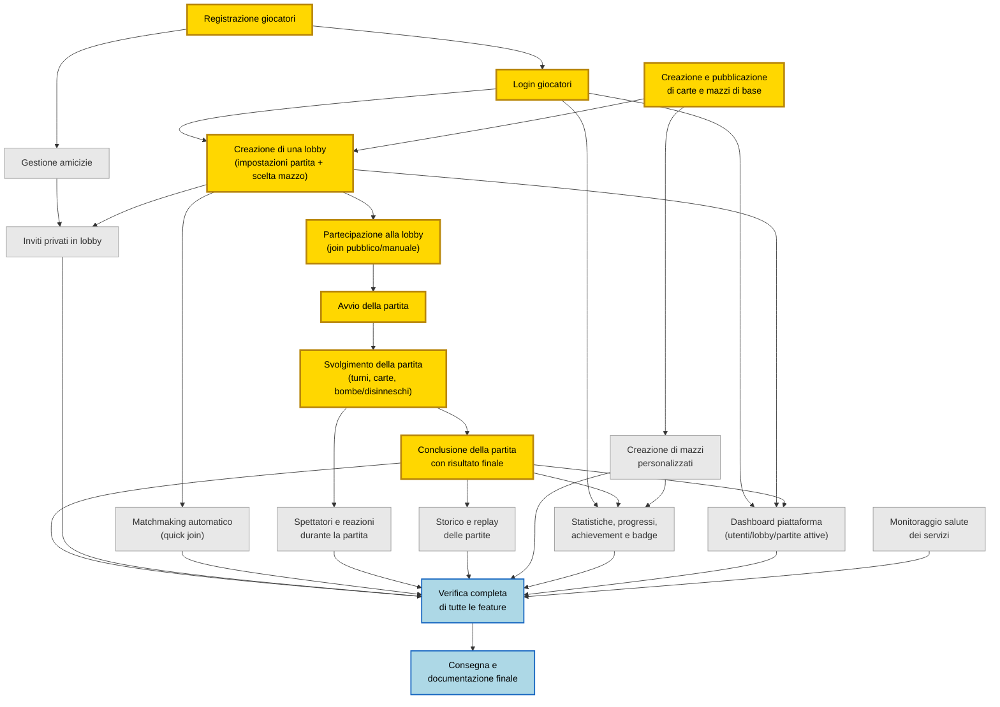

# Project Network Diagram (PND) — Bamboom

Diagramma di rete delle **feature** del progetto (non delle attività implementative), derivato dai bounded context già definiti. Le dipendenze indicano quali feature devono esistere prima che un'altra abbia senso dal punto di vista dell'utente/prodotto.

## Legenda

| Colore | Significato |
|---|---|
| 🟡 Oro / bordo spesso | **Percorso critico**: le feature minime indispensabili perché l'applicativo sia giocabile end-to-end (registrazione → lobby → partita fino alla fine) |
| ⚪ Grigio | Feature secondarie — arricchiscono il prodotto ma non bloccano il gioco base |
| 🔵 Azzurro | Chiusura del progetto: verifica completa e consegna |

## Diagramma



## Note sul percorso critico (oro)

```
Registrazione → Login
Creazione e pubblicazione carte/mazzi (almeno un mazzo base)
        ↓                    ↓
        └────────→ Creazione lobby ────────→ Partecipazione lobby
                                                      ↓
                                               Avvio partita
                                                      ↓
                                           Svolgimento partita
                                                      ↓
                                          Conclusione partita
```

Sono le uniche feature senza le quali l'app non è "un gioco funzionante": un utente deve potersi registrare, autenticare, avere a disposizione almeno un mazzo per creare/scegliere una lobby, entrarci, far partire la partita e giocarla fino alla fine.

Tutto il resto (amicizie, inviti, matchmaking automatico, spettatori/reazioni, replay, mazzi personalizzati, statistiche/achievement, dashboard, monitoraggio salute) migliora l'esperienza o copre requisiti dei singoli corsi, ma può essere sviluppato in parallelo senza bloccare la giocabilità di base — per questo sono feature secondarie (grigio) che confluiscono solo nella verifica finale.

## Prossimi passi

1. Confermare se la granularità va bene così o se preferisci spezzare ulteriormente qualche feature (es. separare "gioco delle carte" da "gestione bombe/disinneschi").
2. Assegnare durate stimate a ogni feature → genero il Gantt Mermaid con le stesse dipendenze.
3. Dallo stesso elenco, genero le issue + link di dipendenza per l'import in YouTrack.
