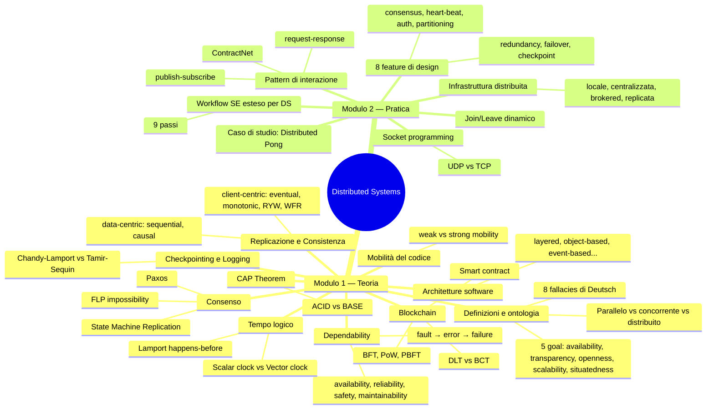
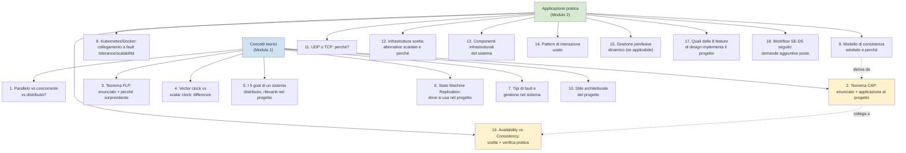
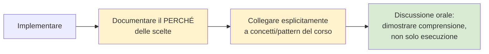

# Requisiti d'Esame — Tutti i Corsi

**Software Process Engineering · Applicazioni e Servizi Web · Distributed Systems (Mod. 1 + Mod. 2)**

> Documento di sintesi che unisce i requisiti d'esame dei tre corsi. Per Distributed Systems i contenuti dei due moduli sono stati fusi: i concetti teorici (Mod. 1) e la loro applicazione pratica (Mod. 2) sono presentati insieme dove si sovrappongono, evitando ripetizioni. Verificare sempre eventuali aggiornamenti su forum/Virtuale, poiché le regole d'esame possono cambiare.

## Indice

1. [Software Process Engineering](#1-software-process-engineering)
2. [Applicazioni e Servizi Web](#2-applicazioni-e-servizi-web)
3. [Distributed Systems (Modulo 1 + Modulo 2)](#3-distributed-systems-modulo-1--modulo-2)
4. [Quadro comparativo dei tre esami](#4-quadro-comparativo-dei-tre-esami)

---

## 1. Software Process Engineering

### 1.1 Informazioni generali sul corso

- **Docenti**: Danilo Pianini (danilo.pianini@unibo.it) e Giovanni Ciatto (giovanni.ciatto@unibo.it).
- **Crediti**: 6 CFU, primo semestre.
- **Modalità lezioni**: in laboratorio, con pratica immediata (hands-on). Orario: giovedì 11:00–14:00 (Aula 2.5) e venerdì 11:00–14:00 (Lab 4.2) — eventuali cambi pubblicati sul forum.
- **Canali di comunicazione**: priorità al forum di Virtuale per domande tecniche/non personali; via email includere sempre entrambi i docenti.
- **Materiali**: slide del corso (dovrebbero bastare), codice mostrato a lezione disponibile subito dopo (gran parte già su GitHub), nessun libro obbligatorio ma letture consigliate sulla pagina del corso.

### 1.2 Obiettivi del corso

1. Progettare sistemi software con approccio domain-, model- e/o test-driven.
2. Zero overhead dalla definizione del dominio al codice eseguibile.
3. Pratiche di sviluppo agile, filosofia DevOps.
4. Alta automazione + eccellenza tecnica.
5. Comprendere analogie e differenze tra piattaforme di programmazione.

### 1.3 Prerequisiti

- Conoscenza di **Java**; **Scala** è un plus.
- Conoscenza minima di **git**: repository, commit, branching/merging, fetch/push.
- Mentalità curiosa: "non fermarti quando funziona, fermati quando sai *perché* funziona" — ancora più importante "nell'era degli LLM".

### 1.4 Software necessario

| Tipo | Strumenti |
|---|---|
| Richiesto | Connessione internet, JDK funzionante (consigliato **Jabba** per le versioni), **Docker** |
| Consigliato | Kotlin, Gradle, IntelliJ IDEA / VS Code, shell **zsh** ben configurata, **ki-shell** |

I docenti forniscono un **container Docker** con tutto il software preinstallato (`danysk/linux-didattica` su Docker Hub, istruzioni su `github.com/DanySK/docker-linux-didattica`), convertibile in distribuzione **WSL2**. I PC di laboratorio hanno già l'immagine WSL2 pronta.

### 1.5 Requisiti obbligatori del progetto

L'esame consiste nella **discussione di un progetto di gruppo**, che deve obbligatoriamente includere:

1. **Domain-Driven Design**: identificazione del dominio, linguaggio ubiquo, building block (entity, value object, aggregate root, repository, factory, service, domain event), idealmente architettura a layer/esagonale.
2. **Un processo di sviluppo chiaro e pratiche DevOps**: workflow di versionamento ben definito (Gitflow, trunk-based, fork+PR), responsabilità condivise, automazione del processo.
3. **Automazione a tutto tondo**: Continuous Integration + Continuous Delivery.
4. **Automazione del deploy** tramite containerizzazione e/o orchestrazione (Docker, Docker Compose, Swarm, Kubernetes).
5. **Almeno 2 piattaforme target** (es. JVM, NodeJS, Python, C, C++, Rust, Go). Due target sono **diversi** se girano su runtime diversi (es. nativo + JVM); sono **probabilmente diversi** se usano build system diversi — ma con eccezioni (Scala/sbt + Java/Gradle **non** sono considerati diversi).

**Varianti di progetto accettate**: progetto condiviso con altri corsi (ciò che conta è la modellazione del dominio + tecniche DevOps, non l'originalità); progetto creato solo per SPE (i docenti aiutano a trovare un'idea); progetto che copre SPE + tesi; **"Project Work"** con azienda committente reale (il risultato deve essere open source, restano validi tutti i requisiti del progetto "normale").

### 1.6 Requisiti facoltativi per massimizzare il voto

Non esplicitamente richiesti, ma utili per dimostrare padronanza completa e puntare al massimo (30L):

| Area | Pratiche consigliate |
|---|---|
| Versionamento | Versionamento automatico (`git describe` o Conventional Commits + semantic-release); tag annotati, commit firmati GPG, rebase interattivo, cherry-picking, bisezione; modello di branching esplicito e motivato |
| Build & qualità | Gestione scope dipendenze, dependency locking, version catalog Gradle; QA oltre il testing (analizzatori statici, coverage, SonarCloud/Codecov/Codacy); CII Best Practices Badge; pubblicazione reale su Maven Central/npm |
| CI/CD | Pipeline multi-piattaforma/OS; secret gestiti correttamente; DRY in CI (composite/reusable workflow); vera Continuous Delivery/Deployment con rilascio progressivo (blue-green, canary); template issue/PR |
| Containerizzazione | Volumi e reti Docker gestiti correttamente, immagini multi-stage ottimizzate; vera orchestrazione (Compose, Swarm, **Kubernetes** con Deployment/Service/autoscaling) |
| DDD avanzato | Pattern di integrità del modello (Shared Kernel, Customer-Supplier, Conformist, Anti-corruption layer); Event Sourcing/CQRS; architettura esagonale in moduli Gradle separati |
| Model-driven / DSL | DSL interno in Kotlin (trailing lambda, infix, extension function); DSL esterno con Xtext |
| Multi-piattaforma | Motivare esplicitamente l'approccio scelto: Kotlin Multiplatform ("write once build anywhere") vs bridge come JPype ("write first wrap elsewhere") |
| Licensing & docs | Licenza open source esplicita e motivata; documentazione via GitHub Pages, README curato |

> **In sintesi**: il progetto "minimo" copre i 5 punti obbligatori. Per il voto massimo, ogni pratica extra va **scelta consapevolmente e motivata**, non solo applicata meccanicamente — saper spiegare *perché* in sede di discussione conta più della quantità di voci spuntate.

---

## 2. Applicazioni e Servizi Web

> Corso: Applicazioni e Servizi Web (magistrale) — Prof.ssa Silvia Mirri, A.A. 2025/26

### 2.1 Come funziona la valutazione

- **Progetto/elaborato**: fino a **27/30** — componente dominante del voto.
- **Prova orale**: aggiunge o toglie **fino a 5 punti** (demo + discussione scelte + domande di teoria su tutto il programma).

La qualità del progetto conta più di ogni altra cosa: meglio investire tempo extra lì piuttosto che cercare di "recuperare" tutto all'orale.

### 2.2 Requisiti obbligatori del progetto

**Gruppo e consegna**
- Gruppo di 2 o 3 persone.
- Repository GitHub o BitBucket condiviso con docente/tutor.
- Consegna almeno 1 settimana prima della prova orale.
- Relazione in LaTeX allegata (template fornito a lezione).
- Tema concordato con docente e tutor (o proposto autonomamente e poi approvato).

**Architettura e stack tecnico**
- Applicazione web-based con architettura client + server.
- Database documentale (coerente con stack MEAN/MEVN → MongoDB).
- Node.js + Express lato server, Vue.js lato client (variante MEVN), oppure motivare esplicitamente scelte alternative.
- Containerizzazione con Docker/Docker Compose — fortemente suggerita (non dichiarata "obbligatoria" nelle slide di Introduzione, ma trattata come standard de facto per consegna e valutazione; confermare con docente/tutor).

**Fasi obbligatorie di sviluppo**
1. **Design** — metodologie HCI (personas, scenari d'uso, storyboard/mockup).
2. **Implementazione** — sviluppo vero e proprio.
3. **Test con utenti** — almeno una metodologia di valutazione (Usability Test, Cognitive Walkthrough, questionario SUS o UEQ).

**Contenuti minimi della relazione** (dedotti dalla struttura del corso): descrizione del problema/dominio e requisiti; scelte architetturali motivate; processo di design (personas/scenari/mockup); descrizione implementazione (client/server, modello dati, componenti); descrizione test con utenti e risultati (es. punteggio SUS); istruzioni per deploy/esecuzione.

### 2.3 Requisiti/attività facoltative per punteggio extra

Non etichettate esplicitamente come "bonus", ma utili per la componente +/-5 dell'orale (verificare comunque con docente/tutor):

- **TypeScript** invece di JavaScript puro.
- **SCSS/SASS** al posto di CSS puro.
- Uso ragionato di **Flexbox** per layout responsive.
- Più di una metodologia HCI applicata (es. Focus Group + Usability Test).
- Questionario **sia SUS sia UEQ**.
- **Web Sustainability Guidelines** (lazy loading immagini, minimizzazione form, evitare dark pattern, mobile-first), con eventuale misurazione (Website Carbon Calculator, Ecograder).
- Confronto critico tra framework alternativi (es. Vue vs Angular/React) argomentato in relazione.
- Funzionalità avanzate Express/Vue (autenticazione, validazione form, gestione errori robusta).
- Deploy reale dell'applicazione (non solo locale).
- Documentazione tecnica curata (API, modello dati).

### 2.4 Idee di progetto

| Idea | Descrizione sintetica | Punto di forza |
|---|---|---|
| **1. Piattaforma Web per la Sostenibilità** | Tracker carbon footprint digitale, applicazione delle Web Sustainability Guidelines con auto-valutazione, catalogo progetti AI4SDGs | Tema suggerito dal docente, buona occasione per HCI + sostenibilità |
| **2. Strumento collaborativo Vue** | App gestionale (eventi, collezioni, bacheca condivisa) con componenti Vue ben strutturati, SCSS/Flexbox | Mostra padronanza tecnica dello stack MEVN |
| **3. App con HCI completa** | Qualsiasi dominio, ma con personas + scenario + mockup + Cognitive Walkthrough + Usability Test + SUS/UEQ | Copre a fondo l'intero Blocco C, ottimo materiale per l'orale |
| **4. IoT/robot companion app** | Interfaccia di controllo/monitoraggio per dispositivo robotico/IoT, eventualmente comandi in linguaggio naturale | Originale ma più rischiosa in termini di tempo/complessità |

Tutte le idee vanno comunque proposte e validate da docente e tutor prima di iniziare lo sviluppo.

### 2.5 Checklist riassuntiva

**Obbligatorio**: gruppo 2-3 persone · repo Git · relazione LaTeX · consegna 1 settimana prima · client+server+DB documentale (MEVN) · fasi design/implementazione/test utenti documentate · tema approvato.

**Fortemente raccomandato**: containerizzazione Docker/Docker Compose.

**Bonus possibili**: TypeScript, SCSS, Flexbox curato · più metodologie HCI · Web Sustainability Guidelines · deploy reale · funzionalità avanzate · documentazione tecnica.

---

## 3. Distributed Systems (Modulo 1 + Modulo 2)

> Il progetto finale è **unico per entrambi i moduli**: la discussione orale attinge indifferentemente a concetti teorici (Mod. 1) e pratici (Mod. 2). La valutazione premia soprattutto la capacità di collegare esplicitamente le scelte implementative ai concetti teorici di entrambi i moduli — è il filo conduttore ripetuto in tutto il materiale dei due moduli, qui unificato.

### 3.1 Come funziona l'esame

L'esame consiste nella **discussione orale di un progetto** (individuale o di gruppo). Prima della discussione, gli artefatti (documentazione + codice) devono superare un controllo preliminare di docenti/tutor. Il progetto:

- deve riguardare/derivare da un argomento specifico del corso (teorico, tecnologico o metodologico);
- va concordato con professore e/o tutor (pertinenza + fattibilità);
- deve dimostrare **comprensione dei sistemi distribuiti**, verificata in discussione.

Non esiste un programma "a domande chiuse": la valutazione è centrata sulla capacità di collegare il progetto ai concetti del corso e rispondere a fondo su di essi.

### 3.2 Mappa concettuale del corso

### 3.3 Requisiti obbligatori — concetti teorici (Modulo 1)

Concetti fondamentali da padroneggiare, con altissima probabilità richiesti in discussione indipendentemente dal tema del progetto, perché costituiscono l'ossatura teorica del corso.

**1. Definizioni di base e ontologia (M0, M2, M4)**
- Tre definizioni classiche di sistema distribuito (Tanenbaum & van Steen, "dell'ingegnere", Coulouris et al.).
- Distinzione formale tra **parallelo, concorrente e distribuito** (contesti temporale T e spaziale S) — concetto molto citato, da saper esporre con precisione.
- Le **8 fallacies** di Deutsch.
- I **5 goal**: resource availability, transparency (7 sottotipi: access, location, migration, relocation, replication, concurrency, failure), openness, scalability (3 tecniche: nascondere la latenza, distribuzione, replicazione), situatedness.

**2. Dependability (M1)**
- Modello fault → error → failure.
- Classificazioni dei fault (source, intent, duration, manifestation, reproducibility, relationship).
- Quattro attributi: availability, reliability, safety, maintainability — saper distinguere availability da reliability con un esempio.
- Formule: MTTF, MTTR, MTBF, Availability = MTTF/(MTTF+MTTR), Reliability = e^(−λΔt).
- Quattro mezzi (avoidance, detection, removal, tolerance) e tre tipi di ridondanza.

**3. Replicazione e Consistenza (M3)**
- Dilemma replicazione-consistenza: perché non si può avere consistenza forte "gratis".
- Modelli data-centric (sequential, causal) e client-centric (eventual, monotonic reads/writes, read-your-writes, writes-follow-reads) — saper distinguere e dare esempi.

**4. CAP Theorem (C1)**
- Enunciato preciso (C, A, P — al massimo due su tre) e dimostrazione (intuizione: modello asincrono, partizione, scrittura in una partizione vs lettura nell'altra).
- ACID vs BASE, perché molti sistemi reali scelgono BASE.
- Saper applicare il teorema a un caso concreto — quasi garantito se il progetto tocca database distribuiti o microservizi.

**5. Tempo logico e causalità (M6, C5)**
- Relazione **happens-before** di Lamport, eventi concorrenti.
- **Orologi scalari**: algoritmo, monotonicità, perché NON sono fortemente consistenti.
- **Vector clock**: algoritmo, perché garantiscono forte consistenza, confronto tra due timestamp.
- Materiale molto algoritmico — ripassare gli esempi con i diagrammi.

**6. Consenso distribuito (C3)**
- Problema dell'agreement (basic consensus, interactive consistency, generals problem, transaction commit).
- Teorema **FLP**: enunciato e perché è sorprendente (un solo crash failure in sistema asincrono basta a rendere impossibile il consenso).
- **Paxos**: ruoli (proposer, acceptor, learner), due fasi (prepare/promise, accept/commit), quorum, perché serve numero dispari di acceptor.
- State Machine Replication come ponte tra consenso e replicazione.

**7. Checkpointing e Logging (C2)**
- Stato globale consistente vs inconsistente vs non recuperabile (esempio bancario).
- Checkpointing bloccante (Tamir-Sequin) vs non bloccante (Chandy-Lamport).
- Tipi di logging (pessimistic, optimistic, causal) e problema dell'output commit.

**8. Mobilità del codice (C6)**
- Weak vs strong mobility (perché strong è più esigente).
- Sender-initiated vs receiver-initiated migration.
- Cloning vs migrating.

**9. Blockchain e Smart Contract (C4)** — sezione più estesa del corso (166 slide), probabile in discussione se il progetto ha componenti decentralizzate.
- DLT vs BCT (DLT ⊃ BCT).
- State Machine Replication applicata alla blockchain (la blockchain è "solo" un'istanza intelligente di SMR).
- Byzantine Fault Tolerance: esempio Alice/Bob/4ª replica, formula f ≥ N/3.
- Proof-of-Work: enigma computazionale, longest chain rule, incentivi economici.
- PBFT come alternativa "permissioned" al PoW.
- Smart contract: definizione di Szabo, 7 issue (specialmente re-entrancy, immutabilità, mancanza di pro-attività).

**10. Architetture software (M8)**
- 4-5 stili architetturali (layered, object-based, data-centred, event-based, shared data-space) — saperli riconoscere in un sistema reale.

### 3.4 Requisiti obbligatori — applicazione pratica (Modulo 2)

Il Modulo 2 mostra come tradurre il vocabolario teorico in scelte di design e codice, seguendo il percorso metodologico di **Distributed Pong** come caso di studio guida.

**1. Padronanza del socket programming**
- Differenza tra datagram socket (UDP) e stream socket (TCP) anche a livello di codice: bind, sendto/recvfrom (UDP); connect, listen/accept, sendall/recv (TCP).
- Perché UDP è "best effort" (perdite, duplicati, fuori ordine) mentre TCP garantisce consegna ordinata/affidabile a costo di latenza e complessità (flow control — vedi il deadlock dell'Attempt 1 dell'esempio TCP Echo).
- Saper motivare la scelta UDP/TCP per un caso d'uso — modello: UDP per Distributed Pong (bassa latenza, tollerando perdite occasionali, videogioco real-time).

**2. Workflow SE esteso per DS**
- Applicare concretamente i 9 passi (use case collection, requirements analysis, design, implementation, verification, release, deployment, documentation, maintenance), con le domande aggiuntive specifiche per DS viste in "Preliminaries". Raccomandato includere nella documentazione una sezione esplicita che ripercorra questi passi, come fatto per Distributed Pong.

**3. Discussione delle opzioni di infrastruttura distribuita**
- Presentare almeno 2-3 alternative architetturali (locale, centralizzata, brokered, replicata o equivalenti) con pro/contro e motivazione della scelta finale. Modello: l'analisi delle 4 opzioni per Distributed Pong, ognuna valutata su singoli punti di fallimento, complessità di deployment, trade-off CAP.

**4. Nomenclatura infrastrutturale**
- Uso corretto di: node/peer, client/server, proxy, load balancer, broker, queue, MOM/topic, database, master-worker. Identificare quali componenti sono presenti nel proprio progetto e il loro ruolo.

**5. Pattern di interazione**
- Riconoscere quale pattern (request-response, publish-subscribe, publish-subscribe con broker, ContractNet) è implementato, e rappresentarlo con almeno una notazione tra sequence diagram, message flow graph, state diagram.

**6. Collegare le 8 feature di design alle scelte del progetto**
- Per ciascuna feature (redundancy, failover, checkpoint/rollback, consensus, heart-beat/timeout/retry, authentication/authorization, data partitioning), saper dire esplicitamente se e come il progetto la implementa (anche "non la implementiamo, e questo è il motivo"). Elemento probabilmente più efficace per impressionare in discussione.

**7. Protocollo Join/Leave**
- Se il progetto prevede partecipanti dinamici, discutere come viene gestito il join/leave, casi limite (coordinator irraggiungibile, crash prima della notifica di uscita, distinzione crash/silenzio, slot già occupato) e come il progetto li affronta o li ignora consapevolmente.

**8. Availability vs Consistency, in pratica**
- Rispondere con un esempio concreto (idealmente un test pratico, sul modello dell'esperimento `UDP_DROP_RATE` su Distributed Pong) alla domanda "il tuo sistema privilegia availability o consistency in caso di problemi di rete?". **Collega direttamente il CAP theorem del Modulo 1 (C1)** alla pratica — una buona risposta copre contemporaneamente i requisiti di entrambi i moduli.

### 3.5 Requisiti facoltativi — per punteggio extra (teoria + pratica unificate)

| Area | Cosa fare |
|---|---|
| Collegamenti interdisciplinari | Collegare la **process algebra** (M7bis: CCS, CSP, ACP) a componenti concorrenti del progetto; mostrare conoscenza dello **spatial computing** (M7) se rilevante; distinguere causalità interna/esterna (C5) per eventi cross-confine |
| Approfondimenti tecnologici | Conoscere a fondo almeno una tecnologia concreta oltre Kubernetes: **Raft** (alternativa moderna a Paxos), etcd/ZooKeeper, Cassandra/DynamoDB (eventual consistency), Kafka (event-based). Se si usa **Kubernetes**: collegare esplicitamente self-healing/autoscaling/control-plane ai concetti di fault tolerance e scalabilità |
| Risultati di impossibilità | Conoscere altri risultati oltre FLP e CAP (Fich & Ruppert 2003) per mostrare comprensione più matura |
| Prospettiva critica | Trade-off Paxos vs Raft vs ZAB/Egalitarian Paxos; discutere criticamente le 7 issue degli smart contract; conoscere l'evoluzione del pensiero di Brewer sul CAP (2000 → 2012) |
| **Test sui casi limite** | Documentare esperimenti pratici (es. "cosa succede se il server non è disponibile all'avvio di un client?") — pochi lo fanno, ottima impressione di rigore metodologico |
| **Pattern MVC** | Se c'è interfaccia utente (anche CLI), collegare l'architettura del codice a Model-View-Controller (come per Pong), distinguendo model, controller (event/input handler), view |
| **Rappresentazione formale** | Sequence diagram o message flow graph nel report (PlantUML, Graphviz, yEd) per il protocollo di comunicazione |
| **Confronto UDP/TCP** | Anche usando un solo protocollo, mostrare di aver considerato l'alternativa e argomentarne lo scarto |
| **Esecuzione speculativa** | Se rilevante (app interattive real-time), discutere l'esecuzione speculativa lato client (da "Available Distributed Pong") come tecnica di mascheramento della latenza che privilegia l'availability percepita |
| **Documentazione mirata** | Per ogni scelta architetturale, documentare esplicitamente **quale concetto del corso** implementa (es. "il servizio X usa eventual consistency secondo M3 perché...") — probabilmente il modo più efficiente di guadagnare punti extra |
| Confronto tecnologico | Includere un confronto tra almeno due alternative per la stessa scelta di design (es. "Raft invece di Paxos perché...") |

### 3.6 Checklist finale unificata (Modulo 1 + Modulo 2)

Prima della discussione orale, è consigliabile poter rispondere con sicurezza, senza guardare gli appunti, a tutte le seguenti domande. La checklist integra entrambi i moduli, eliminando le sovrapposizioni presenti nei due file originali (es. CAP e availability/consistency comparivano in entrambe le liste — qui la domanda pratica rimanda esplicitamente a quella teorica).

> **Regola d'oro per Distributed Systems**: riuscire a collegare ogni risposta a uno specifico modulo/documento del corso (citandolo per nome, es. *"questo è il modello di M3..."* oppure *"qui applichiamo la scelta availability-vs-consistency discussa per Distributed Pong, coerentemente col teorema CAP di C1"*) è l'elemento singolo più efficace per dimostrare la comprensione richiesta e puntare al massimo del voto. Questo principio è ribadito identicamente in entrambi i moduli ed è il vero filo conduttore dell'intero esame.

---

## 4. Quadro comparativo dei tre esami

| Aspetto | Software Process Engineering | Applicazioni e Servizi Web | Distributed Systems |
|---|---|---|---|
| Formato esame | Discussione di progetto di gruppo | Progetto (27/30) + orale (±5) | Discussione orale di progetto (individuale o gruppo) |
| Dimensione gruppo | Non specificata nel materiale | 2-3 persone | Individuale o gruppo |
| Componente teorica in discussione | Centrata sul progetto (DDD, DevOps) | Demo + scelte + teoria generale | Molto ampia: l'intero programma teorico è potenzialmente in discussione |
| Stack/tecnologie richieste | ≥2 piattaforme target, containerizzazione | MEVN (Node/Express + Vue + MongoDB), Docker consigliato | Libera, ma va motivata e collegata alla teoria |
| Documento di consegna | Codice + pratiche DevOps documentate | Relazione LaTeX | Documentazione + codice, controllo preliminare prima della discussione |
| Elemento più premiante | Motivare consapevolmente ogni scelta avanzata | Cura del processo HCI (design → test utenti) | Collegare esplicitamente ogni scelta implementativa a un concetto teorico nominato |

### Filo conduttore comune ai tre corsi

In tutti e tre i corsi emerge lo stesso principio di fondo: il voto massimo non dipende dal numero di funzionalità o pratiche implementate, ma dalla capacità di **motivare esplicitamente** ogni scelta tecnica collegandola ai concetti visti a lezione (DDD/DevOps per SPE, metodologie HCI per Applicazioni Web, teoria dei sistemi distribuiti per Distributed Systems). La discussione orale, in tutti e tre i casi, è il momento in cui questa comprensione viene effettivamente verificata.
