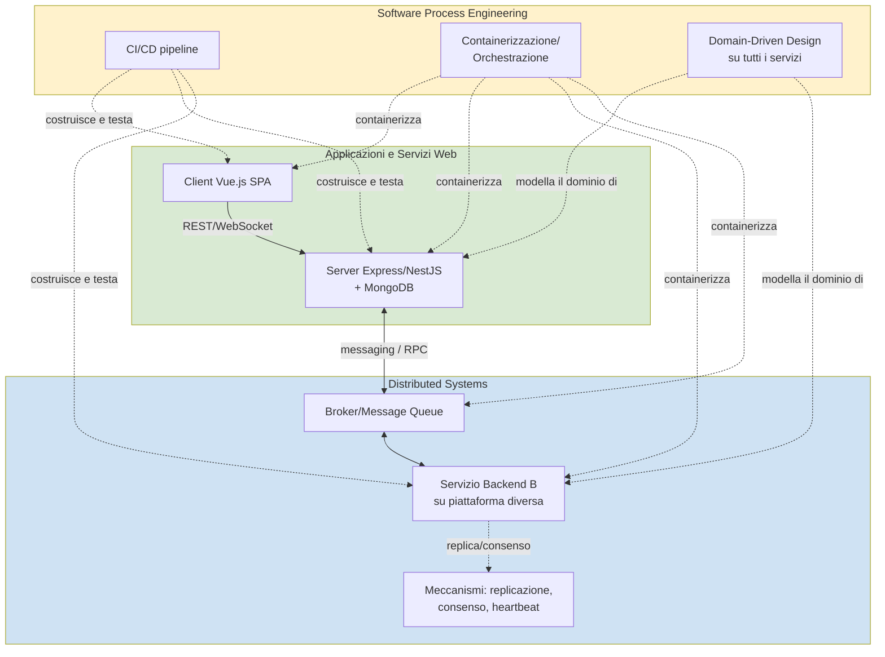
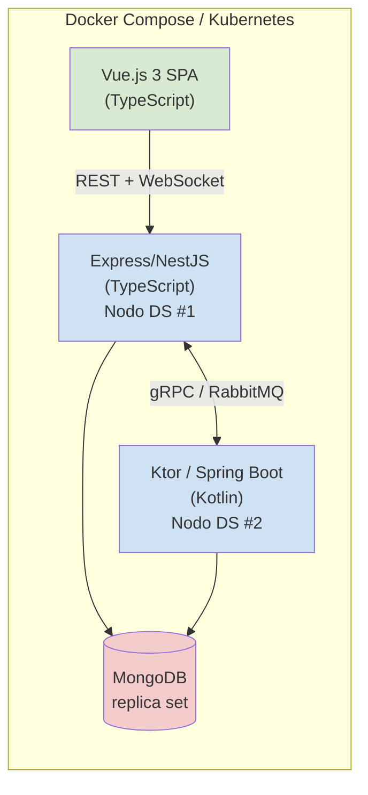

# Tecnologie, Librerie e Pattern per Requisito — Tutti i Corsi

**Software Process Engineering · Applicazioni e Servizi Web · Distributed Systems (Mod. 1 + Mod. 2)**

> Documento operativo: per ogni requisito di ogni corso elenca (a) le tecnologie/librerie disponibili che lo soddisfano, specificando sempre il **linguaggio** in cui sono disponibili, e (b) i **pattern migliori** applicabili. La Parte A tratta i tre corsi come elenchi indipendenti. La Parte B mostra come far convergere le scelte in un **progetto unico** che soddisfi contemporaneamente tutti e tre gli esami.
>
> Le tecnologie elencate sono opzioni **possibili**, non tutte vanno usate insieme: l'elenco è volutamente ampio per dare un quadro completo delle opportunità. La scelta finale va sempre concordata con i rispettivi docenti/tutor.

## Indice

**Parte A — Elenchi indipendenti per corso**
1. [Software Process Engineering](#1-software-process-engineering)
2. [Applicazioni e Servizi Web](#2-applicazioni-e-servizi-web)
3. [Distributed Systems (Modulo 1 + Modulo 2)](#3-distributed-systems-modulo-1--modulo-2)

**Parte B — Progetto unico per i 3 corsi**
4. [Strategia di convergenza](#4-strategia-di-convergenza)
5. [Stack tecnologico unificato proposto](#5-stack-tecnologico-unificato-proposto)
6. [Mappatura requisiti incrociati](#6-mappatura-requisiti-incrociati)
7. [Pattern architetturali unificati](#7-pattern-architetturali-unificati)
8. [Rischi e attenzioni nella convergenza](#8-rischi-e-attenzioni-nella-convergenza)

---

# Parte A — Elenchi indipendenti per corso

---

## 1. Software Process Engineering

### 1.1 Requisito: Domain-Driven Design

**Tecnologie e librerie disponibili**

| Tecnologia/Libreria | Linguaggio | Note |
|---|---|---|
| **Kotlin** (sealed class, data class, value class) | Kotlin | Ottimo per modellare value object e aggregate immutabili in modo conciso; è il linguaggio enfatizzato dal corso |
| **Java Records + sealed interfaces** (Java 17+) | Java | Alternativa JVM più verbosa ma equivalente concettualmente a Kotlin per DDD |
| **Scala 3** (case class, enum, opaque type) | Scala | Ottimo supporto a value object tramite opaque type; affine a Kotlin per chi conosce Scala (citato esplicitamente nel corso) |
| **jMolecules** | Java/Kotlin | Libreria di annotazioni/interfacce per esprimere esplicitamente i building block DDD (Entity, ValueObject, AggregateRoot) nel codice e validarli con ArchUnit |
| **ArchUnit** | Java/Kotlin | Test di architettura: verifica automaticamente che le regole DDD/esagonali (es. dominio non dipende da infrastruttura) siano rispettate |
| **Axon Framework** | Java/Kotlin | Framework completo per DDD + CQRS + Event Sourcing su JVM |
| **TypeScript** (interface, branded types, classes) | TypeScript | Per modellare value object/entity anche lato Node.js, utile se la piattaforma 2 è Node |
| **Pydantic** | Python | Validazione e modellazione di value object/entity con type hints, comodo se una piattaforma target è Python |
| **NestJS** (decoratori, moduli) | TypeScript (Node.js) | Struttura modulare che si presta bene a separare bounded context |

**Pattern migliori per questo requisito**

- **Layered Architecture / Hexagonal Architecture (Ports & Adapters)**: separa dominio, applicazione e infrastruttura; è il pattern più citato esplicitamente nei requisiti del corso.
- **Aggregate Pattern**: ogni aggregate root protegge gli invarianti del proprio cluster di entity/value object.
- **Repository Pattern**: astrae la persistenza dietro un'interfaccia definita nel dominio, implementata nell'infrastruttura.
- **Factory Pattern**: per la creazione di aggregate complessi con invarianti da rispettare alla creazione.
- **Domain Event Pattern**: per notificare cambiamenti di stato significativi senza accoppiare i bounded context.
- **Anti-Corruption Layer**: se il sistema integra servizi/legacy esterni con un modello concettuale diverso.

---

### 1.2 Requisito: Processo di sviluppo chiaro e pratiche DevOps

**Tecnologie e librerie disponibili**

| Tecnologia/Strumento | Linguaggio/Ambito | Note |
|---|---|---|
| **Git** | Agnostico | Base per qualsiasi workflow |
| **GitHub Flow / GitLab Flow / Gitflow** | Agnostico (workflow, non libreria) | Modelli di branching da scegliere e motivare |
| **Conventional Commits** | Agnostico (convenzione su messaggi commit) | Standard per messaggi di commit leggibili da tool automatici |
| **semantic-release** | JavaScript/Node.js (ma utilizzabile in pipeline per qualsiasi linguaggio) | Versionamento automatico basato sui Conventional Commits |
| **gitversion** | .NET (ma agnostico nell'uso in CI) | Alternativa per versionamento automatico basato su git describe/branching |
| **Husky** | JavaScript/Node.js | Git hook per validare commit/lint prima del commit/push |
| **commitlint** | JavaScript/Node.js | Validazione automatica del formato dei messaggi di commit |

**Pattern migliori per questo requisito**

- **Trunk-Based Development**: ideale per team piccoli e affiatati (2-4 persone), riduce overhead di merge.
- **GitHub Flow**: alternativa semplice con feature branch + PR + review, buon compromesso per progetti universitari.
- **Gitflow completo**: se si vuole mostrare gestione esplicita di release/hotfix branch, più pertinente per progetti con rilasci versionati frequenti.
- **Trunk + Feature Flag**: pattern avanzato che disaccoppia deploy da release, dimostra maturità DevOps.

---

### 1.3 Requisito: Automazione (Continuous Integration + Continuous Delivery)

**Tecnologie e librerie disponibili**

| Tecnologia | Linguaggio/Ambito | Note |
|---|---|---|
| **GitHub Actions** | YAML (agnostico rispetto al linguaggio del progetto) | Soluzione più diretta data l'integrazione nativa con GitHub, richiesto come repository dal corso |
| **GitLab CI/CD** | YAML | Alternativa se si usa GitLab come da regolamento Sistemi Distribuiti (workflow GitLab flow menzionato) |
| **Jenkins** | Groovy (Jenkinsfile) | Soluzione self-hosted più tradizionale, più complessa da gestire per un progetto universitario |
| **CircleCI / Travis CI** | YAML | Alternative cloud, meno usate ma valide |
| **Gradle** (task `test`, `check`, `build`) | Kotlin DSL / Groovy DSL | Build system consigliato esplicitamente dal corso per JVM |
| **npm scripts / Turborepo** | JavaScript/Node.js | Automazione build per la piattaforma Node, utile se una delle due piattaforme target è Node.js |
| **JaCoCo** | Java/Kotlin (JVM) | Coverage testing su JVM |
| **Scoverage** | Scala | Coverage testing per Scala |
| **SonarCloud / SonarQube** | Multi-linguaggio (analisi statica) | Quality gate automatico in pipeline CI |
| **Codecov / Codacy / CodeFactor** | Multi-linguaggio (servizio SaaS) | Reportistica di coverage/qualità integrata in CI |
| **Dependabot / Renovate** | Agnostico (configurazione YAML) | Aggiornamento automatico delle dipendenze, buona pratica DevOps |

**Pattern migliori per questo requisito**

- **Pipeline a stadi (build → test → quality gate → package → deploy)**: pattern standard CI/CD, da implementare esplicitamente come job sequenziali/paralleli.
- **Matrix Build**: eseguire la pipeline su più versioni di JDK/OS contemporaneamente (richiesto implicitamente se si vuole multipiattaforma robusta).
- **Reusable Workflow / Composite Action** (GitHub Actions): evitare duplicazione YAML tra i job delle diverse piattaforme target — pattern DRY in CI.
- **Fail Fast**: ordinare gli stage della pipeline per individuare errori il prima possibile (lint/test rapidi prima di step costosi).
- **Trunk-based CI**: build automatica ad ogni push su branch principale, con gate di qualità obbligatorio prima del merge.

---

### 1.4 Requisito: Automazione del deploy (containerizzazione e/o orchestrazione)

**Tecnologie e librerie disponibili**

| Tecnologia | Linguaggio/Ambito | Note |
|---|---|---|
| **Docker** | Dockerfile (sintassi propria, agnostico rispetto al linguaggio dell'app) | Base per containerizzare qualunque piattaforma target |
| **Docker Compose** | YAML | Orchestrazione locale multi-container, adatto a un progetto universitario |
| **Docker Swarm** | YAML (compose-compatible) | Orchestrazione più semplice di Kubernetes, buon compromesso |
| **Kubernetes (k8s)** | YAML (manifest) | Orchestrazione completa, esplicitamente citata come argomento avanzato del corso |
| **Helm** | YAML + Go templating | Package manager per Kubernetes, utile per gestire deployment complessi in modo dichiarativo |
| **Minikube / kind** | Agnostico (tool locale) | Cluster Kubernetes locale per sviluppo/demo senza cloud reale |
| **Jib** | Java/Kotlin (plugin Gradle/Maven) | Costruisce immagini Docker per app JVM senza Dockerfile, ottimizzando i layer |
| **ko** | Go | Equivalente di Jib per applicazioni Go |
| **BuildKit / Buildx** | Dockerfile (feature di Docker) | Build multi-stage e multi-architettura ottimizzata |

**Pattern migliori per questo requisito**

- **Multi-stage Build**: immagine finale minimale separando fase di build da fase di runtime — best practice quasi obbligatoria per immagini pulite.
- **Sidecar Pattern**: se serve un componente di supporto (es. proxy, logging agent) accanto al container principale.
- **Init Container Pattern**: per task di setup prima dell'avvio del container principale (es. migrazioni DB).
- **Service + Deployment + Horizontal Pod Autoscaler** (Kubernetes): pattern standard per dimostrare scalabilità automatica.
- **ConfigMap + Secret** (Kubernetes): separazione configurazione/credenziali dal codice, buona pratica 12-factor.

---

### 1.5 Requisito: Coinvolgimento di almeno 2 piattaforme target

**Tecnologie e librerie disponibili (combinazioni tipiche)**

| Piattaforma A | Piattaforma B | Perché sono "diverse" | Linguaggi coinvolti |
|---|---|---|---|
| JVM (Kotlin/Gradle) | Node.js (TypeScript/npm) | Runtime diverso | Kotlin + TypeScript |
| JVM (Kotlin/Gradle) | Nativo (Rust/Cargo) | Runtime diverso | Kotlin + Rust |
| JVM (Kotlin/Gradle) | Python (pip/Poetry) | Runtime diverso | Kotlin + Python |
| Scala/sbt | Java/Gradle | **Eccezione esplicita: NON considerati diversi** dal corso | — |
| Kotlin/JVM | Kotlin Native | Runtime diverso (anche stesso linguaggio sorgente) | Kotlin (compilato per target diversi) |
| Go | JVM (Kotlin) | Runtime diverso, build system diverso | Go + Kotlin |
| C++ (CMake) | JVM (Gradle) | Runtime e build system diversi | C++ + Kotlin/Java |

**Pattern migliori per questo requisito**

- **Kotlin Multiplatform (KMP)**: "write once, build anywhere" — condividere logica di dominio tra JVM, Native e JS, mantenendo target effettivamente diversi a runtime.
- **Polyglot Microservices**: ogni piattaforma target implementa un microservizio separato comunicante via API/messaging — pattern naturale se combinato con i requisiti di Distributed Systems.
- **Bridge/Wrapper Pattern** (es. JPype, GraalVM Polyglot): "write first, wrap elsewhere", da motivare esplicitamente nella discussione se scelto invece del multiplatform nativo.
- **API Gateway**: se le piattaforme comunicano via HTTP/gRPC, un gateway unificato semplifica l'integrazione multi-piattaforma.

---

## 2. Applicazioni e Servizi Web

### 2.1 Requisito: Architettura web-based client + server

**Tecnologie e librerie disponibili**

| Tecnologia | Linguaggio | Note |
|---|---|---|
| **Express.js** | JavaScript/Node.js | Framework server consigliato esplicitamente dal corso (stack MEVN) |
| **NestJS** | TypeScript (Node.js) | Alternativa più strutturata a Express, con DI e moduli, ottima se si vuole TypeScript lato server (requisito facoltativo) |
| **Fastify** | JavaScript/TypeScript (Node.js) | Alternativa più performante a Express, API simile |
| **Koa** | JavaScript/Node.js | Alternativa minimale a Express, dagli stessi creatori |
| **Vue.js 3** (Composition API) | JavaScript/TypeScript | Framework client consigliato esplicitamente (stack MEVN) |
| **Vite** | JavaScript/TypeScript | Build tool moderno per progetti Vue, sostituisce Vue CLI |
| **Pinia** | JavaScript/TypeScript | State management ufficiale per Vue 3 (successore di Vuex) |
| **Vue Router** | JavaScript/TypeScript | Routing client-side per SPA Vue |
| **Axios** | JavaScript/TypeScript | Client HTTP per comunicazione client-server, alternativa a fetch nativo |

**Pattern migliori per questo requisito**

- **Client-Server Pattern classico**: separazione netta tra SPA (Vue) e API REST (Express) — è l'architettura implicita richiesta dallo stack MEVN.
- **MVC lato server**: Express organizzato in Model-View-Controller (o Model-Route-Controller, dato che le view sono gestite lato client).
- **Component-Based Architecture** lato client: scomposizione Vue in componenti riutilizzabili con props/eventi/slot (esplicitamente citato come requisito facoltativo per punteggio extra).
- **BFF (Backend for Frontend)**: se si vuole un livello intermedio che adatta le risposte API alle esigenze specifiche del client Vue.

---

### 2.2 Requisito: Database documentale (stack MEAN/MEVN)

**Tecnologie e librerie disponibili**

| Tecnologia | Linguaggio | Note |
|---|---|---|
| **MongoDB** | Multi-linguaggio (server NoSQL, query in linguaggio proprio tipo JSON) | Database documentale richiesto esplicitamente dallo stack MEVN |
| **Mongoose** | JavaScript/TypeScript (Node.js) | ODM (Object Document Mapper) per MongoDB, standard de facto in stack MEVN/MEAN |
| **MongoDB Node.js Driver** | JavaScript/TypeScript | Driver ufficiale a basso livello, alternativa a Mongoose per chi vuole controllo diretto |
| **Prisma** (con connector MongoDB) | TypeScript | ORM/ODM moderno con type-safety, alternativa più recente a Mongoose |
| **MongoDB Atlas** | Servizio cloud (agnostico) | Hosting MongoDB gestito, utile per deploy reale (requisito facoltativo sezione 2.3) |
| **Mongo Express** | JavaScript/Node.js | UI di amministrazione per MongoDB, utile in fase di sviluppo/debug |

**Pattern migliori per questo requisito**

- **Repository Pattern**: incapsulare le query Mongoose/driver dietro un'interfaccia, separando logica di accesso dati dalla business logic.
- **Document Embedding vs Referencing**: scegliere consapevolmente quando embeddare sotto-documenti (dati letti sempre insieme) e quando referenziare (dati condivisi/grandi) — decisione di modellazione tipica del NoSQL documentale, da motivare in relazione.
- **Schema Validation Pattern** (Mongoose Schema / JSON Schema MongoDB): pur essendo NoSQL, definire schemi espliciti per garantire consistenza dei dati.
- **Aggregation Pipeline Pattern**: per query complesse lato MongoDB invece di elaborazione lato applicazione.

---

### 2.3 Requisito: Containerizzazione (Docker/Docker Compose)

**Tecnologie e librerie disponibili**

| Tecnologia | Linguaggio/Ambito | Note |
|---|---|---|
| **Docker** | Dockerfile | Containerizzazione di client (build statico), server (Node.js) e MongoDB |
| **Docker Compose** | YAML | Orchestrazione locale dei 3 servizi (client/server/db), fortemente suggerito dal Seminario 5 del corso |
| **nginx** (come immagine per servire il client buildato) | Configurazione nginx (agnostico) | Serve i file statici Vue compilati in produzione dentro un container dedicato |
| **multi-stage Dockerfile per Node** | Dockerfile | Build + runtime separati, immagine finale leggera |
| **dockerode** | JavaScript/Node.js | Libreria per controllare Docker da codice Node, utile solo per casi avanzati (non necessaria di base) |

**Pattern migliori per questo requisito**

- **Multi-Container Compose Pattern**: tre servizi separati (client, server, db) collegati da una rete Docker dedicata — pattern standard per stack MEVN containerizzato.
- **Multi-stage Build**: per il client Vue, uno stage di build (npm run build) e uno stage finale nginx che serve solo i file statici.
- **Volume Pattern per persistenza**: volume Docker dedicato per i dati MongoDB, per non perdere i dati al riavvio dei container.
- **Environment Variable Injection**: configurazione (URL del DB, porte, secret) iniettata via variabili d'ambiente/`.env`, mai hardcoded nelle immagini.

---

### 2.4 Requisito: Fase di Design (metodologie HCI)

**Tecnologie e librerie disponibili (strumenti, non librerie di codice)**

| Strumento | Tipo | Note |
|---|---|---|
| **Figma** | Tool di design (web-based) | Standard de facto per mockup/wireframe ad alta fedeltà, gratuito per studenti |
| **Balsamiq** | Tool di design (wireframe) | Specializzato in wireframe a bassa fedeltà, esplicitamente citato nel corso |
| **Adobe XD** | Tool di design | Alternativa a Figma, meno diffusa ora |
| **Miro / FigJam** | Tool collaborativo | Utile per costruire personas e customer journey map in gruppo |
| **draw.io (diagrams.net)** | Tool diagrammi | Per scenari d'uso e flow diagram |

**Pattern migliori per questo requisito**

- **Persona Pattern**: costruzione di 2-4 personas rappresentative degli utenti target, basate su dati/assunzioni esplicitate.
- **Scenario-Based Design**: scrivere scenari d'uso narrativi prima di disegnare le interfacce, per guidare le decisioni di design con casi concreti.
- **Storyboard Pattern**: sequenza visiva delle azioni dell'utente attraverso l'interfaccia, utile per flussi multi-step.
- **Low-fidelity → High-fidelity progression**: partire da wireframe (Balsamiq) e arrivare a mockup dettagliati (Figma) solo dopo validazione del flusso.
- **Atomic Design**: organizzare il design system in atomi/molecole/organismi/template/pagine, si traduce naturalmente nei componenti Vue.

---

### 2.5 Requisito: Test con utenti

**Tecnologie e librerie disponibili (strumenti/metodologie)**

| Strumento/Metodologia | Tipo | Note |
|---|---|---|
| **System Usability Scale (SUS)** | Questionario standardizzato | Citato esplicitamente, 10 domande, punteggio 0-100 |
| **User Experience Questionnaire (UEQ)** | Questionario standardizzato | Citato esplicitamente, valuta 6 dimensioni (attractiveness, perspicuity, efficiency, dependability, stimulation, novelty) |
| **Google Forms / Typeform / LimeSurvey** | Tool per somministrare questionari | Per raccogliere SUS/UEQ digitalmente |
| **Cognitive Walkthrough** | Metodologia di valutazione (no tool specifico) | Valutazione esperta passo-passo senza utenti reali, citata esplicitamente |
| **Usability Test moderato** | Metodologia (no tool specifico) | Osservazione diretta di utenti che svolgono task, citata esplicitamente |
| **OBS Studio / Loom** | Tool di screen recording | Per registrare le sessioni di usability test (con consenso dei partecipanti) |
| **Hotjar** | Tool di analytics comportamentale | Per heatmap/session recording su deploy reale (opzionale, va oltre il minimo) |

**Pattern migliori per questo requisito**

- **Think-Aloud Protocol**: chiedere all'utente di verbalizzare i pensieri durante il task — arricchisce enormemente i dati qualitativi dello Usability Test.
- **Task-Based Evaluation**: definire task concreti e misurabili (tempo, successo/fallimento, errori) invece di una semplice esplorazione libera.
- **Before/After Comparison**: applicare SUS/UEQ prima e dopo eventuali iterazioni di design per dimostrare miglioramento misurabile.
- **Triangolazione metodologica**: combinare almeno due metodologie (es. Cognitive Walkthrough prima dell'implementazione + Usability Test dopo) — esplicitamente indicato come requisito facoltativo per punteggio extra.

---

### 2.6 Requisiti facoltativi: TypeScript, SCSS, Flexbox, Sustainability

**Tecnologie e librerie disponibili**

| Tecnologia | Linguaggio | Requisito facoltativo coperto |
|---|---|---|
| **TypeScript** | TypeScript (superset di JavaScript) | Type-safety lato client/server invece di JS puro |
| **ts-node / tsx** | TypeScript (tooling Node.js) | Esecuzione diretta di TypeScript lato server senza pre-compilazione |
| **Zod** | TypeScript | Validazione runtime con inferenza di tipi, ottimo complemento a TypeScript per validare input API |
| **Sass/SCSS** | SCSS (preprocessore CSS) | Fogli di stile con variabili, nesting, mixin |
| **PostCSS + Autoprefixer** | CSS (tooling) | Compatibilità cross-browser automatica per il CSS generato |
| **CSS Flexbox / CSS Grid** | CSS nativo | Layout responsive, nessuna libreria necessaria |
| **Tailwind CSS** | CSS (utility-first, configurabile via JS) | Alternativa moderna a SCSS puro, accelera lo sviluppo dei layout |
| **Website Carbon Calculator** | Tool web (no codice) | Misurazione impatto carbonio della web app |
| **Ecograder** | Tool web (no codice) | Analisi sostenibilità/performance del sito |
| **Lighthouse (Chrome DevTools)** | Tool integrato browser | Audit performance/accessibilità/best practice/SEO, utile anche per le Web Sustainability Guidelines |

**Pattern migliori per questi requisiti**

- **Strict Type-Checking**: abilitare `strict: true` in TypeScript end-to-end, per dimostrare uso rigoroso e non superficiale.
- **BEM (Block Element Modifier)**: convenzione di naming CSS/SCSS che rende il foglio di stile manutenibile e leggibile in relazione.
- **Mobile-First Design**: scrivere le media query partendo dal layout mobile e aggiungendo breakpoint per schermi più grandi — citato esplicitamente tra le Web Sustainability Guidelines.
- **Lazy Loading Pattern**: per immagini/componenti, riduce il carico iniziale e il consumo energetico percepito.
- **Code Splitting** (nativo in Vite/Vue Router): caricare solo il codice necessario per la route corrente, in linea con le linee guida di sostenibilità.

---

## 3. Distributed Systems (Modulo 1 + Modulo 2)

> Nota: per Distributed Systems molti requisiti del Modulo 1 sono **concetti teorici da dimostrare di comprendere**, non librerie da installare. Per questi, l'elenco indica le tecnologie/librerie che **implementano o rendono visibile a runtime** quel concetto, così da poterlo discutere concretamente nel progetto.

### 3.1 Requisito: Comunicazione di rete (socket programming, Mod. 2)

**Tecnologie e librerie disponibili**

| Tecnologia | Linguaggio | Tipo |
|---|---|---|
| **socket (modulo standard)** | Python | UDP e TCP a basso livello, ottimo per mostrare bind/connect/sendto/recvfrom esplicitamente |
| **net (modulo standard)** | Node.js (JavaScript/TypeScript) | TCP/IPC a basso livello |
| **dgram (modulo standard)** | Node.js (JavaScript/TypeScript) | UDP a basso livello |
| **java.net.Socket / DatagramSocket** | Java/Kotlin | API standard JVM per TCP/UDP |
| **Ktor (ktor-network)** | Kotlin | Libreria coroutine-based per socket asincroni su JVM |
| **std::net (TcpStream, UdpSocket)** | Rust | API standard per socket, con garanzie di memory-safety |
| **Boost.Asio** | C++ | Libreria asincrona per socket TCP/UDP, molto usata in ambito sistemi distribuiti in C++ |
| **net (package standard)** | Go | API standard per TCP/UDP, particolarmente ergonomica grazie alle goroutine |
| **WebSocket (ws library)** | Node.js (JavaScript/TypeScript) | Comunicazione full-duplex sopra TCP, utile se si vuole un protocollo applicativo più semplice |
| **gRPC** | Multi-linguaggio (Go, Java/Kotlin, Python, Node.js, C++, Rust...) | Costruito su HTTP/2 (TCP), astrae il socket programming ma è discutibile come scelta "alto livello" rispetto al requisito esplicito di padronanza dei socket grezzi |

**Pattern migliori per questo requisito**

- **Best-Effort Messaging (UDP)**: da motivare esplicitamente quando la bassa latenza conta più dell'affidabilità (es. dati real-time, gaming, sensori).
- **Reliable Streaming (TCP)**: da motivare quando l'ordine e la consegna garantita sono prioritari (es. transazioni, file transfer).
- **Connection Pooling**: per TCP, riutilizzo delle connessioni invece di aprirne una nuova per ogni richiesta.
- **Heartbeat/Keepalive Pattern**: per rilevare la disconnessione di un peer in entrambi i protocolli (collega anche al requisito 3.6 "feature di design").
- **Message Framing Pattern**: per TCP (che è uno stream, non a messaggi), definire un framing esplicito (length-prefix o delimiter) per ricostruire i messaggi applicativi.

---

### 3.2 Requisito: Modelli di consistenza e replicazione (Mod. 1 — M3, C1)

**Tecnologie e librerie disponibili**

| Tecnologia | Linguaggio | Modello di consistenza implementato |
|---|---|---|
| **MongoDB** (con write/read concern configurabili) | Multi-linguaggio (driver per quasi ogni linguaggio) | Eventual consistency di default, tunable verso consistenza più forte |
| **Apache Cassandra** | Multi-linguaggio (driver Java/Kotlin, Python, Node.js...) | Eventual consistency, tunable consistency (quorum read/write) — esempio da manuale per discutere il CAP theorem |
| **Amazon DynamoDB / DynamoDB Local** | Multi-linguaggio (SDK AWS) | Eventual + strong consistency selezionabile per singola query |
| **Redis** (con replica asincrona) | Multi-linguaggio (client per ogni linguaggio) | Eventual consistency tra master e replica, utile anche come cache distribuita |
| **PostgreSQL** (con replica sincrona/asincrona) | SQL + driver multi-linguaggio | Esempio di sistema che privilegia consistenza forte (lato CP del CAP) |
| **etcd** | Go (server), client per quasi ogni linguaggio | Consistenza forte basata su Raft, ottimo esempio pratico da citare |

**Pattern migliori per questo requisito**

- **Quorum-based Replication**: lettura/scrittura che richiede l'accordo di N/2+1 repliche — pattern concreto per dimostrare comprensione del trade-off CAP.
- **Read-Your-Writes Pattern**: instradare le letture di un client verso la replica che ha servito la sua ultima scrittura.
- **Eventual Consistency con Conflict Resolution**: last-write-wins o CRDT (Conflict-free Replicated Data Type) per risolvere conflitti tra repliche.
- **Primary-Replica (Master-Slave) Pattern**: un nodo primario gestisce le scritture, le repliche servono le letture — pattern classico da poter implementare anche "a mano" per dimostrare comprensione profonda.

---

### 3.3 Requisito: CAP Theorem applicato al progetto (Mod. 1 — C1)

**Tecnologie e librerie disponibili (per costruire esperimenti dimostrativi)**

| Tecnologia | Linguaggio | Uso |
|---|---|---|
| **Toxiproxy** | Go (tool standalone, controllabile via API HTTP da qualsiasi linguaggio) | Simula partizioni di rete, latenza, perdita di pacchetti tra i componenti del sistema — ideale per "dimostrare" il CAP theorem con un esperimento reale |
| **tc (traffic control, Linux)** | Tool di sistema (agnostico) | Iniezione di latenza/perdita pacchetti a livello di interfaccia di rete |
| **Docker network disconnect/connect** | Comando Docker CLI (agnostico) | Simulare la disconnessione di un container per testare comportamento in caso di partizione |
| **Chaos Monkey / Pumba** | Pumba: Go (tool standalone per container Docker) | Chaos engineering: termina/disturba container a runtime per testare resilienza |

**Pattern migliori per questo requisito**

- **Partition Tolerance Test Pattern**: esperimento esplicito e documentato (sul modello dell'`UDP_DROP_RATE` di Distributed Pong) che mostra il comportamento del sistema sotto partizione di rete.
- **Circuit Breaker Pattern**: per gestire automaticamente l'indisponibilità di un nodo durante una partizione, evitando cascading failure.
- **Graceful Degradation**: il sistema continua a fornire un servizio (parziale) anche durante una partizione, invece di fallire del tutto — dimostra una scelta consapevole su availability.

---

### 3.4 Requisito: Tempo logico, causalità, vector clock (Mod. 1 — M6, C5)

**Tecnologie e librerie disponibili**

| Tecnologia/Libreria | Linguaggio | Note |
|---|---|---|
| Implementazione propria di Lamport clock | Qualsiasi linguaggio | Concetto semplice da implementare da zero (contatore + regola di update), spesso preferibile a librerie esterne per dimostrare comprensione |
| Implementazione propria di Vector Clock | Qualsiasi linguaggio | Idem: un array/mappa di contatori per nodo, semplice da implementare e molto efficace da discutere |
| **CRDT.tech / Automerge** | JavaScript/TypeScript | Libreria di CRDT che usa internamente concetti di tempo logico/causale per la convergenza automatica dei dati distribuiti |
| **Yjs** | JavaScript/TypeScript | Libreria CRDT per editing collaborativo, usa vector clock/version vector internamente |
| **HLC (Hybrid Logical Clock) — librerie varie** | Go, Rust, Java | Combina tempo fisico e logico, usato in sistemi reali come CockroachDB |

**Pattern migliori per questo requisito**

- **Lamport Timestamp Pattern**: implementazione manuale consigliata per mostrare la regola di incremento e l'ordinamento totale derivato.
- **Vector Clock Pattern**: implementazione manuale per mostrare il confronto parziale tra eventi (concorrenti vs causalmente ordinati).
- **Causal Broadcast**: garantire che i messaggi vengano consegnati nell'ordine causale corretto usando i vector clock — applicazione pratica diretta del concetto teorico.

---

### 3.5 Requisito: Consenso distribuito — FLP, Paxos, SMR (Mod. 1 — C3)

**Tecnologie e librerie disponibili**

| Tecnologia | Linguaggio | Algoritmo implementato |
|---|---|---|
| **etcd** | Go (server), client multi-linguaggio | Raft (alternativa moderna a Paxos, esplicitamente citata come requisito facoltativo) |
| **Apache ZooKeeper** | Java (server), client multi-linguaggio (Java, Python, Node.js, Go...) | ZAB (Zookeeper Atomic Broadcast), variante di consenso simile a Paxos |
| **HashiCorp Consul** | Go (server), API HTTP multi-linguaggio | Raft per consenso e service discovery |
| **hashicorp/raft** | Go | Libreria Raft riutilizzabile per costruire sistemi custom con consenso |
| **Apache Kafka (con KRaft)** | Java/Scala (broker), client multi-linguaggio | Kafka usa Raft (KRaft) per il proprio metadata consensus dalle versioni recenti |
| Implementazione propria di Paxos/Raft semplificato | Qualsiasi linguaggio | Un'implementazione "didattica" minimale può essere più efficace per la discussione orale di un uso a scatola chiusa di una libreria |

**Pattern migliori per questo requisito**

- **Leader Election Pattern**: elezione di un nodo coordinatore per semplificare il consenso (sia Paxos multi-leader che Raft single-leader lo richiedono in pratica).
- **State Machine Replication Pattern**: applicare lo stesso log di operazioni in ordine identico su tutte le repliche — collegare esplicitamente questo pattern a dove viene (anche implicitamente) usato nel progetto.
- **Quorum Pattern**: maggioranza di nodi (N/2+1) per garantire consistenza nelle decisioni — alla base sia di Paxos che di Raft.
- **Log Replication Pattern**: tipico di Raft, un log ordinato di comandi replicato su tutti i nodi.

---

### 3.6 Requisito: Feature di design (redundancy, failover, checkpoint, heart-beat, auth, partitioning — Mod. 2)

**Tecnologie e librerie disponibili**

| Feature | Tecnologia/Libreria | Linguaggio |
|---|---|---|
| **Redundancy** | Repliche multiple di un servizio dietro un load balancer (es. nginx, HAProxy) | Configurazione (agnostico) |
| **Failover** | Keepalived, Kubernetes liveness/readiness probe | Configurazione YAML / agnostico |
| **Checkpoint/rollback** | Implementazione propria di snapshot periodici su file/DB; **CRIU** (Checkpoint/Restore In Userspace) per snapshot a livello processo | Linux tool (agnostico rispetto al linguaggio dell'app) |
| **Consensus** | Vedi sezione 3.5 (etcd, Raft, ZooKeeper) | Vedi sopra |
| **Heart-beat/timeout/retry** | Implementazione propria con timer; **node-cron** (Node.js), **ScheduledExecutorService** (Java/Kotlin) per scheduling periodico | JavaScript/TypeScript, Java/Kotlin |
| **Authentication/Authorization** | **Passport.js** (Node.js), **Spring Security** (Java/Kotlin), **JWT** (libreria multi-linguaggio: jsonwebtoken per Node, jjwt per JVM) | JavaScript/TypeScript, Java/Kotlin |
| **Data partitioning (sharding)** | MongoDB sharding nativo, Cassandra partitioning nativo (consistent hashing) | Configurazione DB (agnostico rispetto al client) |

**Pattern migliori per questo requisito**

- **Health Check Pattern**: endpoint dedicato (`/health`) interrogato periodicamente per rilevare nodi non funzionanti — base per failover automatico.
- **Retry with Exponential Backoff**: per le richieste fallite, invece di retry immediato e martellante.
- **Circuit Breaker Pattern**: interrompe temporaneamente le chiamate verso un servizio che fallisce ripetutamente, per evitare di aggravarne il sovraccarico.
- **Consistent Hashing Pattern**: per il data partitioning, minimizza il re-shuffling dei dati quando si aggiungono/rimuovono nodi.
- **Token-Based Authentication (JWT)**: pattern standard per autenticazione stateless in sistemi distribuiti, evita stato di sessione condiviso tra nodi.

---

### 3.7 Requisito: Pattern di interazione (request-response, pub-sub, ContractNet — Mod. 2)

**Tecnologie e librerie disponibili**

| Tecnologia | Linguaggio | Pattern implementato |
|---|---|---|
| **Express.js / Fastify / Spring Boot / Ktor** | JavaScript/TypeScript, Java/Kotlin | Request-Response su HTTP REST |
| **gRPC** | Multi-linguaggio | Request-Response (unary) + streaming bidirezionale |
| **RabbitMQ** (+ libreria amqplib) | Erlang (server), client multi-linguaggio (Node.js: amqplib, Java/Kotlin: Spring AMQP, Python: pika) | Publish-Subscribe con broker, supporta anche topic/routing avanzato |
| **Apache Kafka** (+ kafkajs/kafka-node) | Scala/Java (server), client multi-linguaggio (Node.js: kafkajs, Java/Kotlin: client ufficiale, Python: confluent-kafka) | Publish-Subscribe con broker, event streaming distribuito |
| **MQTT (Mosquitto broker + libreria mqtt.js)** | C (broker), client multi-linguaggio | Publish-Subscribe leggero, tipico per IoT |
| **Socket.IO** | JavaScript/TypeScript (Node.js) | Comunicazione bidirezionale event-based, può implementare sia request-response che pub-sub applicativo |
| **Redis Pub/Sub** | Multi-linguaggio (client Redis per ogni linguaggio) | Publish-Subscribe semplice e leggero, senza garanzie di persistenza dei messaggi |

**Pattern migliori per questo requisito**

- **Request-Response sincrono**: il pattern più semplice, adatto a operazioni CRUD dirette.
- **Publish-Subscribe puro (broadcast)**: un publisher, N subscriber, nessuna risposta diretta attesa — utile per notifiche/eventi.
- **Publish-Subscribe con broker e topic**: instradamento selettivo dei messaggi per categoria (topic/routing key), più scalabile del broadcast puro.
- **ContractNet Protocol**: un manager pubblica un task, più contractor fanno offerte (bid), il manager assegna il task al migliore — pattern utile se il progetto coinvolge negoziazione/allocazione distribuita di compiti tra agenti/nodi.
- **Event-Driven Architecture**: combinazione di pub-sub + reazione asincrona, da rappresentare con un sequence diagram o message flow graph nel report.

---

### 3.8 Requisito: Infrastruttura distribuita (locale, centralizzata, brokered, replicata — Mod. 2)

**Tecnologie e librerie disponibili**

| Topologia | Tecnologie tipiche | Linguaggio |
|---|---|---|
| **Centralizzata (client-server)** | Express/Spring Boot/Ktor come server unico | JavaScript/TypeScript, Java/Kotlin |
| **Brokered** | RabbitMQ, Kafka, Redis (vedi 3.7) | Vedi sopra |
| **Replicata** | MongoDB replica set, Cassandra, Redis Sentinel/Cluster | Configurazione DB (agnostico) |
| **Peer-to-peer / decentralizzata** | **libp2p** (usato anche in IPFS/Ethereum) | Go, JavaScript/TypeScript, Rust |
| **Service Mesh** (per infrastrutture complesse multi-servizio) | **Istio**, **Linkerd** | YAML/configurazione (agnostico rispetto ai servizi) |
| **Service Discovery** | Consul, etcd, Kubernetes DNS nativo | Vedi sezione 3.5 |

**Pattern migliori per questo requisito**

- **Comparative Trade-off Analysis**: documentare esplicitamente almeno 2-3 alternative scartate (sul modello delle 4 opzioni di Distributed Pong) con motivazioni legate a single point of failure, complessità di deployment, trade-off CAP.
- **Service Discovery Pattern**: se l'infrastruttura è dinamica (nodi che entrano/escono), un meccanismo di discovery automatico (DNS-based o tramite registry come Consul/etcd) evita configurazioni hardcoded.
- **API Gateway Pattern**: punto di ingresso unico per un'infrastruttura centralizzata/brokered con più servizi backend.
- **Decentralized P2P Pattern**: se si sceglie un'infrastruttura realmente peer-to-peer, ogni nodo è sia client che server (rilevante se si vuole un progetto particolarmente ambizioso e originale).

---

### 3.9 Requisito: Workflow SE esteso per DS, documentazione, rappresentazione formale (Mod. 2)

**Tecnologie e strumenti disponibili**

| Strumento | Tipo | Note |
|---|---|---|
| **PlantUML** | DSL testuale per diagrammi (renderizzabile da plugin/CLI in qualsiasi linguaggio) | Sequence diagram, citato esplicitamente nel corso |
| **Mermaid** | DSL testuale (Markdown-friendly, renderizzato nativamente da GitHub) | Alternativa moderna a PlantUML, ottima se la documentazione vive su GitHub/README |
| **Graphviz (dot)** | DSL testuale per grafi | Message flow graph, citato esplicitamente |
| **yEd** | Tool grafico standalone | Editor visuale per diagrammi, citato esplicitamente come alternativa GUI |
| **MkDocs / Docusaurus** | Python / JavaScript (generatori di siti di documentazione statici) | Per pubblicare la documentazione del progetto (workflow 9 passi, decisioni architetturali) come sito navigabile |
| **Architecture Decision Records (ADR)** | Markdown (template, nessun tool obbligatorio) | Per documentare ogni scelta architetturale con contesto, decisione e conseguenze |

**Pattern migliori per questo requisito**

- **9-step SE Workflow documentato esplicitamente**: dedicare una sezione del report a ciascun passo (use case collection, requirements analysis, design, implementation, verification, release, deployment, documentation, maintenance), seguendo il modello di Distributed Pong.
- **ADR (Architecture Decision Record) Pattern**: un file per ogni decisione architetturale importante, con motivazione esplicita — si lega direttamente al consiglio del corso di "documentare quale concetto del corso ogni scelta implementa".
- **Living Documentation**: diagrammi (Mermaid/PlantUML) generati da codice/testo versionato insieme al progetto, sempre aggiornati invece di immagini statiche scollegate dal repository.

---

# Parte B — Progetto unico per i 3 corsi

---

## 4. Strategia di convergenza

L'idea di base è scegliere uno **scenario applicativo** che si presti naturalmente ad avere più componenti distribuiti comunicanti (per soddisfare Distributed Systems), realizzati su almeno due piattaforme/runtime diversi (per soddisfare SPE), uno dei quali è una web app con interfaccia utente curata e testata (per soddisfare Applicazioni e Servizi Web).

**Logica della convergenza**: il server Express/NestJS richiesto da Applicazioni e Servizi Web diventa anche una delle "≥2 piattaforme target" richieste da SPE e uno dei nodi del sistema distribuito richiesto da Distributed Systems. Un secondo servizio backend, scritto in un linguaggio/runtime diverso (es. Kotlin/JVM oppure Python), copre sia la seconda piattaforma di SPE sia il secondo nodo distribuito necessario per rendere "vero" (non simulato) il sistema distribuito. Il tutto viene containerizzato e orchestrato con Docker Compose/Kubernetes (requisito SPE) e comunica tramite un pattern di interazione esplicito — request-response o publish-subscribe — discutibile sia per Distributed Systems che come scelta architetturale in generale.

---

## 5. Stack tecnologico unificato proposto

Tabella di un possibile stack coerente (una delle tante combinazioni valide nell'elenco ampio della Parte A) che soddisfa contemporaneamente tutti e tre i corsi:

| Livello | Tecnologia scelta | Linguaggio | Corso che lo richiede |
|---|---|---|---|
| Client web | Vue.js 3 + Vite + Pinia | TypeScript | Web |
| Server "primario" (API + dominio) | Express.js o NestJS + Mongoose | TypeScript | Web + SPE (piattaforma 1) + DS (nodo 1) |
| Database documentale | MongoDB (eventualmente in replica set) | — (server NoSQL) | Web + DS (replicazione/consistenza) |
| Server "secondario" (piattaforma diversa, stesso dominio) | Ktor o Spring Boot, con DDD esplicito (jMolecules) | Kotlin | SPE (piattaforma 2, runtime diverso) + DS (nodo 2) |
| Comunicazione tra i due server | gRPC oppure RabbitMQ/Kafka | Multi-linguaggio | DS (pattern di interazione, consenso/messaging) |
| Containerizzazione | Docker + Docker Compose (eventualmente Kubernetes) | Dockerfile/YAML | SPE (obbligatorio) + Web (consigliato) |
| CI/CD | GitHub Actions | YAML | SPE (obbligatorio) |
| Qualità/coverage | SonarCloud + JaCoCo (JVM) + Jest/Vitest coverage (Node) | Multi-linguaggio | SPE (facoltativo, punteggio extra) |
| Test client (HCI) | Figma/Balsamiq + SUS/UEQ | Tool/questionario | Web (obbligatorio) |
| Documentazione architetturale | Mermaid + ADR in Markdown | Markdown | DS (obbligatorio) + SPE (consigliato) |

---

## 6. Mappatura requisiti incrociati

Questa tabella mostra, per ogni componente tecnico dello stack proposto, **quali requisiti di quali corsi copre simultaneamente** — è lo strumento principale per "non sprecare" lavoro nel progetto.

| Componente / scelta tecnica | SPE | Applicazioni Web | Distributed Systems |
|---|---|---|---|
| Server Express/NestJS in TypeScript | Piattaforma target 1 | Server MEVN richiesto | Nodo distribuito 1 (request-response) |
| Server Ktor/Spring Boot in Kotlin | Piattaforma target 2 (runtime diverso) | — | Nodo distribuito 2 |
| MongoDB in replica set | — | Database documentale richiesto | Replicazione + modelli di consistenza (M3, CAP) |
| Comunicazione gRPC/RabbitMQ tra i 2 server | Automazione/integrazione nei test CI | — | Pattern di interazione (request-response o pub-sub) |
| Docker Compose / Kubernetes | Automazione deploy (obbligatorio) | Containerizzazione (fortemente consigliata) | Infrastruttura distribuita (centralizzata/brokered/replicata) |
| GitHub Actions (CI/CD) | CI/CD obbligatorio | — | Verifica artefatti prima della discussione (workflow SE-DS) |
| Domain-Driven Design su entrambi i server | Obbligatorio (DDD) | Contenuto naturale della relazione (scelte architetturali) | Architetture software (stile a layer/esagonale, M8) |
| Health check + retry/backoff tra i server | — | Robustezza percepita dall'utente (UX) | Feature di design: heart-beat/timeout/retry, failover |
| JWT per autenticazione | — | Funzionalità avanzata Express/Vue (facoltativo) | Feature di design: authentication/authorization |
| Esperimento di partizione di rete (Toxiproxy/Docker network) | Test automatizzati in CI (facoltativo) | — | CAP theorem applicato, availability vs consistency (obbligatorio) |
| Mermaid/PlantUML per sequence diagram | Documentazione del processo (facoltativo) | — | Rappresentazione formale dei pattern di interazione (facoltativo) |
| Vector clock o Lamport clock per ordinamento eventi tra i 2 server | — | — | Tempo logico e causalità (obbligatorio, M6/C5) |
| Test con utenti (SUS/UEQ) sul client Vue | — | Obbligatorio | — |
| Kubernetes con autoscaling | Facoltativo (punteggio extra) | — | Scalabilità (uno dei 5 goal, M2) + feature di design redundancy |

---

## 7. Pattern architetturali unificati

I seguenti pattern, applicati una sola volta nell'architettura complessiva, soddisfano contemporaneamente requisiti di più corsi — sono il modo più efficiente di "non duplicare lavoro" nella progettazione.

```mermaid
graph TD
    P1["Hexagonal Architecture<br/>(per ciascun server)"] --> SPE1[SPE: Domain-Driven Design]
    P1 --> WEB1[Web: organizzazione MVC lato server]

    P2["Repository Pattern"] --> SPE2[SPE: separazione dominio/infrastruttura]
    P2 --> WEB2[Web: accesso a MongoDB via Mongoose]
    P2 --> DS2[DS: astrazione sopra la persistenza replicata]

    P3["Event-Driven / Pub-Sub<br/>tra i due server"] --> DS3[DS: pattern di interazione]
    P3 --> SPE3[SPE: comunicazione push real-time]
    P3 --> WEB3["Web: notifiche server→client<br/>(via WebSocket sul client primario)"]

    P4["Health Check + Circuit Breaker"] --> DS4[DS: feature di design failover/heartbeat]
    P4 --> SPE4[SPE: readiness/liveness probe Kubernetes]

    P5["Quorum-based Replication<br/>(MongoDB replica set)"] --> DS5[DS: CAP theorem, consistenza]
    P5 --> WEB5[Web: database documentale richiesto]

    P6["ADR — Architecture Decision Record"] --> SPE6[SPE: documentare il processo]
    P6 --> DS6["DS: collegare ogni scelta<br/>a un concetto teorico nominato"]

    style P1 fill:#fff2cc
    style P2 fill:#fff2cc
    style P3 fill:#fff2cc
    style P4 fill:#fff2cc
    style P5 fill:#fff2cc
    style P6 fill:#fff2cc
```

**Dettaglio dei 6 pattern chiave**

1. **Hexagonal Architecture su ciascun servizio**: dominio al centro, adapter per HTTP/gRPC/MongoDB attorno. Soddisfa il DDD di SPE, l'organizzazione MVC implicita richiesta da Web, ed è anche uno degli "stili architetturali" da saper riconoscere e discutere per Distributed Systems (M8).

2. **Repository Pattern**: usato sia per MongoDB (Mongoose) sia per qualunque storage del secondo servizio Kotlin. Disaccoppia il dominio (SPE) dalla persistenza concreta (Web) e si presta a essere "raddoppiato" in versione replicata per discutere consistenza (DS).

3. **Event-Driven / Publish-Subscribe tra i due server**: un singolo meccanismo (es. RabbitMQ) copre contemporaneamente il requisito DS sui pattern di interazione, il requisito SPE/Web di sfruttare comunicazione push lato server, e può essere esteso con WebSocket verso il client Vue per notifiche in tempo reale.

4. **Health Check + Circuit Breaker tra i due server**: implementazione unica riusabile sia come liveness/readiness probe in Kubernetes (SPE) sia come feature di design heartbeat/failover (DS).

5. **Quorum-based Replication su MongoDB**: configurare un replica set invece di un'istanza singola trasforma il database "richiesto e basta" da Applicazioni Web in un esperimento concreto di CAP theorem e modelli di consistenza per Distributed Systems, senza aggiungere componenti software extra.

6. **Architecture Decision Record (ADR)**: pratica di documentazione che, applicata in modo sistematico, soddisfa contemporaneamente il bisogno di processo documentato di SPE e il consiglio esplicito (ripetuto in entrambi i moduli di DS) di collegare ogni scelta implementativa a un concetto teorico nominato.

---

## 8. Rischi e attenzioni nella convergenza

- **Scope creep**: un progetto che prova a soddisfare 3 esami rischia di diventare enorme. È importante concordare con tutti e tre i docenti/tutor fin dall'inizio che si tratta di un progetto condiviso (esplicitamente permesso da SPE; da verificare la fattibilità con i tutor degli altri due corsi).
- **Bilanciamento del carico**: SPE richiede 2 piattaforme reali (non solo 2 linguaggi), Distributed Systems richiede più nodi comunicanti, Web richiede cura del client e test utente — sono lavori abbastanza diversi tra loro, da pianificare con attenzione se il gruppo è piccolo (2-3 persone, vincolo comune a tutti e tre i corsi).
- **Relazioni separate**: anche con un progetto tecnico unico, ciascun corso richiede una propria relazione (LaTeX, in lingue ed enfasi diverse: SPE su DevOps, Web su HCI, DS su teoria dei sistemi distribuiti) — non basta scrivere un solo report.
- **Forum/approvazione separati**: ciascun corso richiede approvazione autonoma del tema (Web: forum elaborati; DS: Forum dei Progetti con naming convention specifica; SPE: accordo via email/forum) — vanno aperte tre proposte distinte anche se il progetto tecnico è condiviso.
- **Coerenza del dominio applicativo**: per evitare che il progetto sembri "tre progetti incollati", conviene scegliere fin da subito un dominio applicativo che renda naturali sia la distribuzione (es. un sistema con più attori che devono coordinarsi: due servizi che gestiscono parti diverse ma collegate di un dominio reale) sia l'interazione utente (qualcosa che valga la pena testare con utenti reali).
