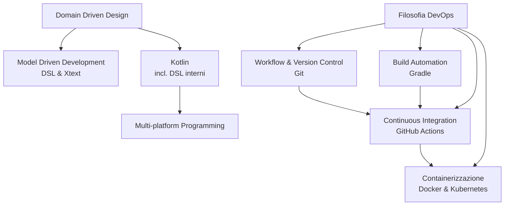

# Software Process Engineering — Indice dei riassunti

Riassunto completo (in italiano) delle slide del corso di **Software Process Engineering** (laurea magistrale, docenti: Danilo Pianini, Giovanni Ciatto), a partire dal PDF fornito (999 pagine). I contenuti duplicati tra le varie lezioni (richiami a inizio lezione, recap di concetti già visti) sono stati uniti in un'unica trattazione organica per ciascun argomento, senza ripetizioni — ma senza omettere alcun contenuto unico.

## Come è organizzato questo materiale

| # | File | Argomento |
|---|---|---|
| 1 | `01-devops.md` | Filosofia DevOps: Development vs Operations, cultura DevOps, principi/pratiche/strumenti, due casi di studio reali (Maggioli S.p.A. e progetto "DIR") |
| 2 | `02-kotlin.md` | Kotlin per sviluppatori Scala: dalle basi (101) alla programmazione funzionale (202) e ai DSL interni (203) |
| 3 | `04-build-automation-gradle.md` | Build automation in generale e Gradle in dettaglio: lifecycle, dipendenze, task, plugin, toolchain, QA, pubblicazione |
| 4 | `05-versioning-e-licensing.md` | Versioning del software (SemVer, conventional commits, semantic-release) e licensing (copyleft/copyright, licenze FOSS principali) |
| 5 | `06-continuous-integration.md` | Continuous Integration con GitHub Actions: struttura, espressioni, secret, DRY, automazione avanzata, template issue/PR |
| 6 | `07-git-avanzato-e-workflow.md` | Git avanzato (rebase, squash, bisezione, submodule, hook...) e modelli di workflow (trunk-based, Gitflow, fork) |
| 7 | `08-containerizzazione-docker.md` | Containerizzazione con Docker (immagini, volumi, reti) e orchestrazione con Docker Compose/Swarm |
| 8 | `09-domain-driven-design.md` | Domain Driven Design: building block, bounded context, architettura esagonale, Event Sourcing, CQRS |
| 9 | `10-model-driven-development.md` | Model Driven Development: meta-modelling, DSL, esempio guidato con Xtext (linguaggio "Sheduler") |
| 10 | `11-multiplatform-programming.md` | Programmazione multi-piattaforma: Kotlin Multiplatform ("write once build anywhere") e JPype ("write first wrap elsewhere") |
| 11 | `12-kubernetes.md` | Kubernetes: architettura, Pod/Deployment/Service, autoscaling pratico con Minikube |
| 12 | `13-complementi-pratici.md` | Complementi: basi di Git, esempi pratici di QA, delivery targets, struttura ufficiale del corso |

## Mappa concettuale del corso

## Cosa NON è incluso (e perché)

- Le **slide ripetute come richiamo** a inizio lezione (es. la presentazione "DEVELOPMENT + OPERATIONS" che riappare identica prima di Kubernetes e prima del modulo "Programming and Development Paradigms") sono state fuse nella trattazione del modulo DevOps, senza ripeterle.
- La **Performance Engineering**, elencata tra i temi del corso nelle slide introduttive, non ha contenuti dedicati nel PDF fornito: vedi nota in `13-complementi-pratici.md`.
- Codice sorgente molto verboso ripetuto identico su più slide (es. lo stesso file YAML/Kotlin mostrato progressivamente pezzo per pezzo) è stato condensato nella sua forma finale completa, mantenendo tutte le informazioni.

Per i requisiti d'esame e del progetto, vedi il file separato **`REQUISITI_ESAME.md`**.
