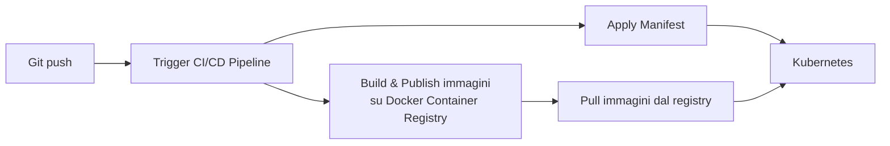
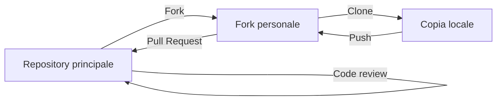

# Modulo 1 — Development + Operations (DevOps)

> Nota: questo argomento è presente nel materiale del corso in **due versioni delle slide** quasi sovrapposte (una più sintetica con il caso di studio "Maggioli S.p.A.", una più estesa con dettagli aggiuntivi sulle pratiche e un secondo caso di studio "DIR"). Questo modulo le unisce in un'unica trattazione completa, senza ripetizioni.

## 1.1 Development vs. Operations

- **Development**: analisi del dominio, design della soluzione, implementazione, testing.
- **Operations**: infrastruttura IT, deployment, mantenimento.

Storicamente questi due mondi sono stati separati da una **mentalità a silos**: gli sviluppatori "lanciano oltre il muro" il software e il team operations se ne deve occupare in produzione, senza una reale collaborazione (da cui il gioco di parole "Dev | Ops" separati da un muro). L'approccio **DevOps** elimina i silos: Dev e Ops collaborano come un unico team lungo tutto il ciclo di vita del prodotto.

## 1.2 Cultura DevOps

- **Maggiore collaborazione**: Dev e Ops devono scambiarsi informazioni e lavorare insieme.
- **Responsabilità condivisa**: un team è responsabile del (sotto)prodotto per tutta la sua vita, senza passaggi di consegna da dev a ops.
- **Team autonomi**: processo decisionale leggero.
- **Focus sul processo, non solo sul prodotto**: promuovere cambiamenti piccoli e incrementali, automatizzare quanto più possibile, usare lo strumento giusto per il compito giusto.

### Perché preoccuparsene (Why bother?)
1. **Gestione del rischio**: ridurre la probabilità di fallimento, individuare i difetti prima che arrivino sul mercato, reagire rapidamente ai problemi.
2. **Sfruttamento delle risorse**: usare le risorse umane per lavoro "umano" (non ripetitivo), ridurre il time-to-market, abbracciare l'innovazione, sfruttare le tecnologie emergenti.

## 1.3 Principi, pratiche e strumenti

DevOps si articola su tre livelli: **principi** → ispirano le **pratiche** → che richiedono **strumenti**.

**Principi** (lista non esaustiva): collaborazione, riproducibilità, automazione, incrementalità, robustezza.

**Pratiche**: organizzazione del workflow, build automation, self-testing code, controllo qualità del codice, integrazione continua, delivery continua, deployment continuo, monitoring continuo.

### Dettaglio delle pratiche

**Organizzazione del workflow** — processi leggeri e responsabilità condivisa: i partecipanti devono avere ruoli chiari e le fasi del ciclo di vita devono essere mappate nel workflow. Strumenti: sistemi di controllo di versione (storia riproducibile del progetto, abilitano diversi workflow come *Gitflow* o *fork + pull request*) e piattaforme di gestione del workflow (tracciamento di progresso/issue/proposte, collegate al codice).

**Self-testing code** — il codice include i test: più livelli di test (unit, acceptance, integration, ecc.), testing interamente automatizzato, risolvere un bug implica creare un test di regressione, i test vengono eseguiti a ogni cambiamento. Strumenti: build automator (compilano, testano ed eseguono la QA sul software).

**Controllo qualità del codice** — il codice è coerente e comprensibile: stile del codice consistente in tutto il progetto (migliora leggibilità, rende i diff più puliti, migliora bisection/regression tracking), codice molto pulito riduce il bisogno di documentazione (i nuovi arrivati diventano produttivi più in fretta), gran parte della QA del codice può essere automatizzata. Strumenti: build automator, analizzatori statici (verificano metriche e regole senza eseguire il codice).

**Continuous Integration** — il codice non deve divergere: le copie di lavoro restano sincronizzate con la mainline (le modalità dipendono dall'organizzazione del workflow), build e test automatici su una macchina "fresca", build e test su tutte le piattaforme target, intercettare rapidamente (feedback) fallimenti e problemi, fare il deploy degli artefatti riusciti con successo. Strumenti: piattaforme di CI (eseguono la pipeline di automazione su ambienti di riferimento, promuovono l'infrastructure-as-code almeno per la fase di build/test/check).

**Continuous Delivery** — ogni build funzionante dovrebbe produrre una release potenziale: la pipeline di CI deve produrre l'artefatto finale, gli artefatti devono essere disponibili per un deployment rapido. Strumenti: build automator, piattaforme di CI.

**Continuous Deployment** — il deployment effettivo dovrebbe essere automatico: serve una strategia perché il codice consegnato entri in produzione, in modo reversibile (es. *blue-green deployment*) e graduale (es. *canary release*); l'infrastruttura dovrebbe essere definita via software; la "deliverability" viene prima delle nuove funzionalità. Strumenti: piattaforme di CI, software di configuration management (abilitano la *continuous configuration automation*, definiscono l'infrastruttura via software senza intervento umano).

## 1.4 DevOps in azione: due casi di studio

### Caso 1 — Maggioli S.p.A. (microservice-ificazione)

Il caso, presentato alla 37th International Conference on Software Maintenance and Evolution (ICSME 2021), riguarda l'applicazione di DevOps (e della "microservice-ificazione") a un progetto software esistente, con misurazione delle metriche prima e dopo l'intervento.

**Il target**: Maggioli S.p.A., multinazionale italiana (~2000 collaboratori), team IT/Operations interno di 5 persone. **Architettura precedente**: applicazione client-server stand-alone, frontend Delphi, backend Microsoft SQL Server; redattori esperti di diritto (pagati da Maggioli) inseriscono informazioni lato client, che vengono poi esposte su un portale (ad accesso pagato) con informazioni legali aggiornate, tramite un export notturno verso una piattaforma di pubblicazione.

**Nuova architettura**: microservizi, con una pipeline CI che fa build delle immagini Docker e le pubblica su un Container Registry; un push su Gitlab attiva la pipeline CI/CD, che applica i manifest su un cluster Kubernetes che effettua il pull delle immagini dal registry.

**Risultati misurati** (prima → dopo, variazione):

| Metrica | Prima | Dopo | Variazione |
|---|---|---|---|
| Frequenza di rilascio (release/giorno) | 0.071 | 2.7 | **+3700%** |
| Tempo da commit a release (ore) | 8–24 | 0.19 | **≈ −98.5%** |
| Commit al giorno | 2 | 7.1 | **+255%** |
| MTTR – Mean Time To Repair (ore) | 36 | 0.5 | **−98.6%** |
| Setup ambiente di produzione (ore lavorative) | 16 | 0.35 | **−97.8%** |
| Setup ambiente di sviluppo (minuti) | 120 | 9 | **−92.5%** |
| Downtime notturno | 30 | 0 | **−100%** |
| Frequenza dei ticket di supporto | 40 | 19 | **−52.5%** |
| Tempo di risoluzione issue (giorni) | 4 | 3 | **−25%** |

**Benefici**: molta meno manutenzione nel senso tradizionale ("tempo passato a mantenere il sistema in condizioni nominali") — niente più problemi con gli aggiornamenti Windows, niente più downtime per manutenzione di rete/elettrica/infrastrutturale, sicurezza migliorata, niente più fallimenti critici causati da test di stored procedure fatti per errore direttamente in produzione. Allo stesso tempo, più manutenzione nel senso dell'evoluzione del software — applicazione (o verifica dell'applicazione automatica) di aggiornamenti, audit di sicurezza, manutenzione e aggiornamento della pipeline.

**Lezioni apprese**: i team devono essere autonomi; le pratiche vanno adattate al team; le procedure ripetitive, lunghe e scomode vanno automatizzate; le pratiche obsolete vanno rimosse; la comunicazione è fondamentale, bisogna diffondere nel team la consapevolezza dei benefici attesi. La timeline del progetto mostra come l'evoluzione sia stata graduale: dall'approvazione strategica della modernizzazione, attraverso containerizzazione, pipeline embrionale, IaC, fino al passaggio completo a Kubernetes e alla messa in produzione con testing E2E (Cypress) e monitoraggio/alerting operativi.

### Caso 2 — Progetto interno "DIR" (DevOps at work)

Un secondo progetto interno mostra le tecniche DevOps applicate concretamente: repository di "verità" (truth repository), branch, fork, esempio di pull request, esempio di aggiornamento automatico, pipeline CI/CD, infrastructure-as-code per la build. Particolarità notevole: **le slide stesse del corso sono gestite in CI/CD** (ogni versione pubblicata è "l'ultima build" prodotta automaticamente dalla pipeline) — un esempio dimostrativo di dogfooding delle pratiche insegnate.

Da questo progetto derivano tre macro-aree di applicazione pratica (DevOps "for DIR"):
- **Version control**: basi del version control distribuito (incluso il "reeducation" per chi viene da SVN), creazione e gestione locale del repository, basi della collaborazione (branching, merging), gestione multi-repo (fork, review, pull request), workflow agile a seconda delle necessità specifiche, e version control distribuito avanzato (alterazione della storia con rebase/squash, bisection, cherry-picking, sub-modularizzazione del DVCS).
- **Automation**: organizzazione del ciclo di vita del software e build automation, "dal source a testato e deployabile in un solo comando", con Gradle come strumento di riferimento (basi, organizzazione della build, customizzazione e funzionalità avanzate, sviluppo di plugin personalizzati); automazione avanzata (richiede CI funzionante e test esaustivi, altrimenti "brucia"): aggiornamenti automatici del software e dell'infrastruttura di build.
- **CI/CD**: aggiungere CI a progetti esistenti (richiede impegno verso la filosofia DevOps), testing multi-piattaforma (tipo e versione del SO, versione della piattaforma JDK/CLR/interprete Python, multi-stage), continuous deployment ("un click dalla produzione"), continuous delivery (dal codice alla produzione in modo automatico).

## 1.5 Workflow di collaborazione: Gitflow e Fork/Pull Request (cenni)

Tra gli strumenti che abilitano l'organizzazione del workflow:
- **Gitflow**: modello di branching strutturato con branch dedicati per feature, release e hotfix (approfondito nel modulo su Git e versionamento avanzato).
- **Fork + Pull Request**: un collaboratore clona (fork) la repository, lavora su una propria copia, fa il push delle modifiche e apre una pull request; il codice viene rivisto (code review) prima di essere "pull-ato" (unito) nella repository principale.

