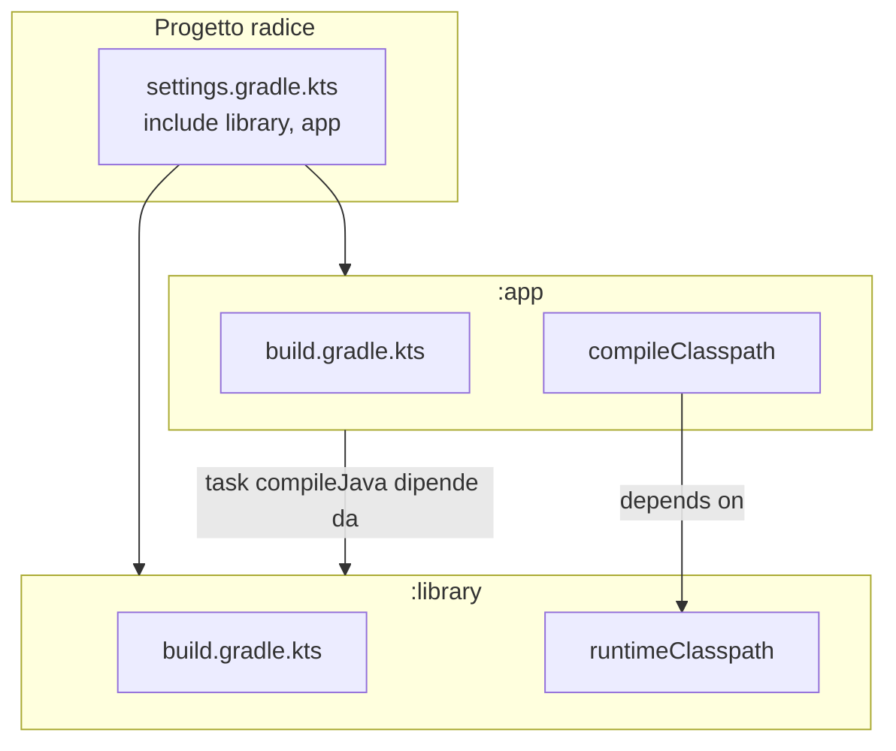

# Modulo 4 — Build Automation (con Gradle come caso di studio)

## 4.1 Il "ciclo di vita" della build

(Da non confondere con il *System Development Life Cycle*, SDLC). È il processo di creazione di artefatti software testati e deployabili a partire dal codice sorgente. Può includere, a seconda del sistema: manipolazione/generazione del codice sorgente, quality assurance del sorgente, gestione delle dipendenze, compilazione/linking, quality assurance del binario, manipolazione del binario, esecuzione dei test, QA dei test (es. coverage), documentazione delle API, packaging, delivery, deployment.

**Build automation** = automatizzare questo ciclo di vita: in teoria potrebbe essere eseguito manualmente, ma il tempo è preziosa e la ripetizione è noiosa — quindi si crea software che automatizza la costruzione di altro software (e tutte le considerazioni valide per la creazione di software valgono anche per la creazione di sistemi di build).

### Stili di automazione

- **Imperativo/Custom**: si scrive uno script che dice al sistema cosa fare per arrivare dal codice all'artefatto (es. `make`, `cmake`, Apache Ant). Pro: altamente configurabile e flessibile. Contro: gap di abstrazione (verboso, ripetitivo), logica di configurazione (dichiarativa) e azione (imperativa) mischiate insieme, difficile adattare/portare tra progetti.
- **Dichiarativo/Standard**: si segue una convenzione, personalizzando alcune impostazioni (es. Apache Maven, Python Poetry). Pro: separazione tra "cosa fare" e "come farlo" (decide il sistema di build), facile adattare/portare tra progetti. Contro: configurazione limitata dalle opzioni fornite.
- **Automatori ibridi**: creano un'infrastruttura dichiarativa sopra una base imperativa, dando facile accesso al meccanismo sottostante. Le DSL aiutano a "nascondere" l'imperatività senza eliminarla del tutto. Restano sfide aperte: come riusare la logica di build (dentro e tra progetti)? come strutturare parti multiple, logicamente interdipendenti?

## 4.2 Dipendenze nel software

Citando Bernardo di Chartres (*"nanos gigantium humeris insidentes"*): tutto il software moderno dipende da altro software (sistema operativo, runtime, librerie base, librerie di terze parti, risorse esterne). Le applicazioni hanno quindi un **albero delle dipendenze**.

- **Dipendenze transitive**: le dipendenze delle dipendenze. Nei progetti non banali sono la maggioranza — è facile superare le 50 dipendenze, e la complessità sfugge rapidamente di mano. Serve uno strumento che trovi, scarichi e includa le librerie in un path raggiungibile — ma per farlo serve conoscere repository, nomi e versioni: non esiste uno standard universale, ogni ecosistema ha le proprie convenzioni (alcune nate col linguaggio stesso, es. Rust/Cargo; altre evolute successivamente, es. Maven per Java, npm per JavaScript).
- **Conflitti tra dipendenze transitive**: quando due librerie richiedono versioni diverse della stessa libreria (A richiede B v1, C richiede B v2) — non c'è una soluzione ovvia ("prendo la più recente e spero bene"? "la più vecchia"?).
- **Range di versione**: per ridurre il rischio di conflitti, si possono specificare intervalli accettabili (un vincolo "rilassato"):
  - Maven: `[1.2,2.0)` = da 1.2 incluso a 2.0 escluso; `(,1.3]` = fino a 1.3 incluso; `[1.2,)` = da 1.2 in poi.
  - Gradle: stessa sintassi di Maven, più le "rich version" — `1.2+` = qualsiasi versione 1.2.x.
  - npm/pnpm/yarn: `^1.2.3` = compatibile con 1.2.3 (`>=1.2.3 <2.0.0`); `~1.2.3` = approssimativamente 1.2.3 (`>=1.2.3 <1.3.0`); `1.2.x` = qualsiasi 1.2.
  - Python (PEP440): `>=1.2, <2.0`, ecc.
  - **Risoluzione dei range**: il risolutore costruisce un grafo delle dipendenze (nodi = dipendenze, archi = "depende da"), lo attraversa dalle radici riducendo i range escludendo le versioni incompatibili; se un nodo finisce con un range vuoto c'è un conflitto irrisolvibile, altrimenti si sceglie una versione per ciascun nodo (di solito la più recente nel range).
- **Dependency locking**: i range fanno esplodere lo spazio delle combinazioni possibili — testarle tutte è impossibile, e test diversi potrebbero risolvere a versioni diverse (risultati inconsistenti). Il *locking* fissa le versioni di tutte le dipendenze (incluse le transitive) a un insieme noto e funzionante, salvato in un file dedicato, mentre il manifesto principale continua a usare i range. **C'è un trade-off tra flessibilità e riproducibilità**: i pin esatti (versioni fisse) riducono il rischio di manutenzione nel breve periodo ma costano caro nel lungo periodo e si adattano male all'ecosistema — le librerie diventano "non componibili" (se due librerie fissano transitive diverse, il risolutore non trova un grafo comune), e i pin non "congelano" comunque le transitive a valle senza un lock.

| | Range, senza lock | Range + lock | Versioni fisse (pin esatti) |
|---|---|---|---|
| Aggiornamenti | Istantanei | Manuali (rigenerare il lock file) | Manuali (cambiare versione) |
| Riproducibilità | Bassa | Massima (transitive bloccate) | Alta (ma resta drift transitivo) |
| Affidabilità | Bassa (aggiornamenti incontrollati) | Media (testare tutti i range è impossibile) | Alta (aggiornamenti controllati, ma drift transitivo) |

- **Scope delle dipendenze**: dipendenze diverse servono in contesti diversi — **compile-time** (servono a compilare, es. tipi usati nelle firme dei metodi), **runtime** (servono per eseguire, es. tipi usati nei corpi dei metodi — di solito un superset delle compile-time, ma non sempre, es. driver JDBC o alcuni componenti di ANTLR4), **test** (compilare ed eseguire i test, es. framework di test), **test runtime** (eseguire i test, es. framework di mocking), **build time** (generatori di codice, linter, tool di documentazione). Gli scope sono di solito predefiniti nei sistemi dichiarativi e definiti manualmente in quelli imperativi (con eccezioni); gli automatori ibridi spesso offrono scope predefiniti più la possibilità di definirne di custom.

### Esempio imperativo: CMake
Strumento di build imperativo molto usato (specialmente in C/C++): configurazione imperativa in `CMakeLists.txt` con linguaggio di scripting proprio; cross-platform (genera file di build nativi: Makefile, progetti Visual Studio, ecc.); supporta ricerca/linking di librerie esterne; permette più target di build (eseguibili, librerie) nello stesso progetto; supporta comandi/script custom. Esempio (semplificato): si dichiara la versione minima e il nome progetto (dichiarativo), si cercano i file sorgente con `file(GLOB_RECURSE ...)` (imperativo — la ricerca è manuale), si definisce l'eseguibile con `add_executable`, si gestiscono le dipendenze con `find_package(Boost ...)` + `target_link_libraries`, si configurano i test con GoogleTest, e il packaging con CPack (parzialmente dichiarativo).

### Esempio dichiarativo: Python Poetry
Strumento di build e gestione dipendenze dichiarativo e moderno per Python: tutta la configurazione (metadati, dipendenze, istruzioni di build) sta in `pyproject.toml` (gli strumenti dichiarativi tendono a preferire file di markup a script: XML per Maven, TOML per Poetry/Cargo, JSON per npm, YAML per Amper); supporta script custom, risoluzione e locking delle dipendenze (`poetry.lock`), gestisce automaticamente ambienti virtuali isolati per progetto, e supporta build/publish verso PyPI o altri repository.

**Il problema degli standard in conflitto nell'ecosistema Python**: in assenza di un sistema standard originario, sono proliferati molti strumenti — la *Python Packaging Authority* (PyPA) è inconsistente nei suoi suggerimenti (raccomanda `venv`, ma anche `Pipenv` che usa `virtualenv`, e approva anche Poetry); molti sviluppatori usano `PyEnv`, molti data scientist usano Anaconda. Due problemi di fondo: (1) per default Python è installato a livello di sistema (un solo interprete) — due progetti non possono usare versioni diverse di Python; (2) `pip` installa i package a livello di sistema — due progetti non possono usare versioni diverse dello stesso package. `PyEnv` risolve il problema 1 (gestisce installazioni Python multiple); `virtualenv`/`venv` (built-in da Python 3.3) risolvono il problema 2 (creano installazioni Python virtuali). Poetry verifica che si usi la versione Python corretta (ma non la gestisce) e crea/gestisce automaticamente un virtual environment per progetto.

Struttura canonica di un progetto Poetry: cartella del package principale, cartella `test/`, `pyproject.toml` (metadati e dipendenze), `poetry.toml` (configurazione di Poetry), `poetry.lock` (generato automaticamente, **da non editare manualmente**), `README.md` — da notare: **niente** `requirements.txt`/`requirements-dev.txt`.

**Ciclo di vita di Poetry**: via comando `poetry install` (valida il progetto, verifica la versione Python, risolve le dipendenze o usa quelle nel lock, le scarica, crea/usa il virtualenv, le installa) e `poetry run <comando>` (esegue un comando nel virtualenv). **Tranne `install`, Poetry non fornisce un ciclo di vita predefinito**: le fasi successive sono gestite con comandi custom via `poetry run`.

### Ciclo di vita strutturato: Apache Maven
Tipico degli automatori dichiarativi: una serie di fasi, dove **selezionare una fase implica eseguire tutte quelle precedenti**: `validate` → `compile` → `test` → `package` (formato distribuibile, es. JAR) → `verify` (controlli sui risultati dei test di integrazione) → `install` (nel repository locale, per uso come dipendenza locale) → `deploy` (copia nel repository remoto per la condivisione). Le fasi sono composte da *goal* dei plugin; l'esecuzione richiede il nome di una fase o di un goal (i goal dipendenti vengono eseguiti); filosofia *convention over configuration* con default sensati. Domanda aperta: cosa si fa se non esiste un plugin per qualcosa di peculiare del progetto?

### Un meta-ciclo di vita: un ciclo di vita per i cicli di vita
1. **Inizializzazione**: capire cosa fa parte della build.
2. **Configurazione**: creare le fasi/goal necessari e configurarli — definire i goal (task), configurare le opzioni, definire le dipendenze tra i task (formando un grafo aciclico direzionato, DAG).
3. **Esecuzione**: eseguire i task necessari per raggiungere l'obiettivo di build.

Invece di far rientrare dichiarativamente la build in un ciclo di vita predefinito, si definisce dichiarativamente *un* ciclo di vita di build — tipico degli automatori ibridi.

## 4.3 Gradle — esempio paradigmatico di automatore ibrido

Scritto principalmente in Java, con uno strato/DSL esterno in Groovy e, più recentemente, uno strato/DSL in Kotlin. **Approccio del corso**: non si impara semplicemente "come usare Gradle", ma si esplora come *guidare* Gradle da zero — Gradle è flessibile abbastanza da permettere di esplorare i suoi concetti core, fungendo da caso esemplare per la maggior parte degli automatori ibridi (gli altri si possono guidare in modo simile una volta comprese le basi).

### Concetti principali
- **Project**: insieme di file che compongono il software (il project radice può contenere sotto-project).
- **Build file**: file speciale con le informazioni di build, nella root del progetto, che istruisce Gradle sull'organizzazione del progetto.
- **Dependency**: una risorsa richiesta da qualche operazione, che può avere a sua volta dipendenze (transitive).
- **Configuration**: un gruppo di dipendenze con tre ruoli: dichiarare le dipendenze, risolvere le dichiarazioni in artefatti/risorse concrete, e presentarle ai consumatori in un formato adeguato.
- **Task**: un'operazione atomica sul progetto, che può avere file di input/output, dipendere da altri task (eseguibile solo se quelli sono completati) — i task fanno da ponte tra il mondo dichiarativo e quello imperativo.

### Gradle da zero
Partendo da una cartella vuota con un `build.gradle.kts` vuoto, `gradle tasks` mostra già task built-in (`init`, `wrapper`, e task informativi come `tasks`, `dependencies`, `help`, `properties`, ecc.) — Gradle usa un *daemon* in background per velocizzare le operazioni cacheable.

### Configurazione vs esecuzione
Punto cruciale e fonte di errori comuni:
```kotlin
tasks.register("brokenTask") { // SBAGLIATO!
    println("eseguito a tempo di CONFIGURAZIONE!")
}
```
Questo codice viene eseguito **ogni volta** che Gradle viene invocato (anche con `gradle tasks`, che non dovrebbe eseguire `brokenTask`!), perché lo script di build viene eseguito a tempo di **configurazione**, configurando task e dipendenze; solo successivamente, quando un task viene effettivamente invocato, il suo blocco di azione viene eseguito. La forma corretta usa `doLast` (o `doFirst`):
```kotlin
tasks.register("helloWorld") {
    doLast { println("Hello, World!") } // eseguito a tempo di ESECUZIONE
}
```
La configurazione della build avviene sempre prima (i task e le loro dipendenze sono il risultato della configurazione); l'esecuzione avviene dopo. Ritardare l'esecuzione permette configurazioni più flessibili (utile soprattutto quando si modifica un comportamento esistente, tramite il metodo `configure` per configurazione tardiva di un task già registrato).

**Configuration avoidance**: mentre l'esecuzione avviene solo per i task effettivamente invocati (o le loro dipendenze), la *configurazione* avviene per **tutti** i task dichiarati nello script — il che può causare problemi di performance in build grandi. Gradle registra i task in modo *lazy*, e permette configurazione lazy con `configure`/`configureEach` (es. su `tasks.withType<Task>()`), in modo che la configurazione avvenga solo quando un task è effettivamente necessario.

### Tipi di task
Gradle offre facility per scrivere nuovi task più facilmente: ad esempio il tipo `org.gradle.api.Exec` rappresenta un comando da eseguire sulla linea di comando sottostante. Il tipo di task si specifica alla registrazione (`tasks.register<Exec>("printJavaVersion") { ... }`); ogni classe `open` che implementa `org.gradle.api.Task` può essere istanziata; i task senza tipo specificato sono `DefaultTask` semplici.

### Compilare da zero: lazy configuration, input/output
Per compilare un sorgente Java bisogna: trovare il compilatore, trovare i sorgenti, invocare `javac -d destination <file>`. Domanda chiave: quale logica va in configurazione e quale in esecuzione? **Regola generale: spostare quanto più possibile verso l'esecuzione** — meno si fa a tempo di configurazione, più veloce è la build quando il task non viene eseguito, e si ottiene maggiore flessibilità di configurazione.

**Input e output dei task**: servono a determinare le dipendenze implicite tra task (se l'input di un task è l'output di un altro, il primo dipende dal secondo) e a determinare se un task è "**UP-TO-DATE**" (può essere saltato perché i suoi input non sono cambiati dall'ultima esecuzione) — questa è la **build incrementale**, che può accelerare significativamente build di grandi dimensioni.

**Provider e Property nell'API Gradle**: permettono di "collegare" i componenti senza preoccuparsi dei valori concreti, conoscendo solo il loro *provider* (la configurazione avviene prima dell'esecuzione, quando alcuni valori non sono ancora noti, ma il loro fornitore lo è).
- **`Provider`**: valore solo interrogabile, non modificabile; trasformabile con `map`; creabile con `project.provider { ... }`.
- **`Property`**: sottotipo di `Provider`, interrogabile **e** modificabile; impostabile passando un valore o un `Provider`; creabile con `project.objects.property<Tipo>()`.

```kotlin
tasks.register<Exec>("compileJava") {
    val sourceDir = projectDir.resolve("src")
    inputs.dir(sourceDir)
    val outputDir = layout.buildDirectory.dir("bin").get().asFile.absolutePath
    outputs.dir(outputDir)
    executable(Jvm.current().javacExecutable.absolutePath)
    doFirst { // calcolo dei sorgenti il più tardi possibile
        val sources = sourceDir.walkTopDown().filter { it.isFile && it.extension == "java" }.toList()
        args("-d", outputDir, *sources.toTypedArray())
    }
}
```

### Gestione delle dipendenze in Gradle
Si basa su due concetti fondamentali: **Dependency** (risorsa, eventualmente con altre dipendenze transitive) e **Configuration** (insieme risolvibile/mappabile su risorse concrete di dipendenze — da non confondere con la fase di "configurazione"!). Per compilare un sorgente Java con una dipendenza serve una configuration che rappresenti il classpath di compilazione e una dependency per ogni libreria necessaria:
```kotlin
val compileClasspath: Configuration by configurations.creating // delegazione!
dependencies {
    compileClasspath(files(/* jar trovati */))
}
```
Si può costruire una piccola DSL custom per trovare file per estensione (`AllFiles.inFolder("libs").withExtension("jar")`), sfruttando il fatto che `Configuration` overloada l'operatore `invoke`.

### Dipendenze tra task
Una configuration `runtimeClasspath` può "estendere" (`extendsFrom`) `compileClasspath` e includere anche la cartella di output della compilazione (a runtime può servire altro, es. cose caricate via reflection). Un task `runJava` deve dichiarare `dependsOn(compileJava)`: se la dipendenza viene rimossa, Gradle segnala un errore di validazione (l'input richiesto — la cartella di output della compilazione — non esiste, perché il task che la produce non è dichiarato come dipendenza). Le dipendenze permeano il mondo della build automation a tutti i livelli: a livello di task (dipendenze di compilazione, di runtime), a livello di build (le fasi/configuration dipendono da altre fasi, i task da altri task), e a livello globale (non c'è garanzia che un'automazione scritta con uno strumento alla versione X funzioni anche alla versione Y).

### Il Gradle wrapper
Una dipendenza globale dal tool di build è difficile da "catturare" (spesso diventa un prerequisito espresso in linguaggio naturale, es. "serve Maven 3.6.1"), causando problemi critici quando parti diverse dello stesso sistema dipendono da versioni diverse del build tool. Gradle propone una soluzione (parziale) col **Gradle wrapper**: un programma minimale che scarica la versione di Gradle scritta in un file di configurazione, generabile col task built-in `wrapper` (`gradle wrapper --gradle-version=<VERSIONE>`), che prepara gli script `gradlew`/`gradlew.bat`. **Il wrapper è il modo corretto di usare Gradle.**

## 4.4 Isolare l'imperatività

Anche i sistemi "puramente dichiarativi" come Maven nascondono la loro imperatività dietro un sipario (nel caso di Maven, i plugin configurati nel `pom.xml` ma implementati altrove). Usabilità, comprensibilità e mantenibilità aumentano quando: l'imperatività è nascosta "sotto il cofano"; la maggior parte (se non tutte) le operazioni si possono configurare piuttosto che scrivere; la configurazione può essere minimale per i task comuni (*convention over configuration*); resta comunque possibile ricorrere all'imperatività in caso di necessità.

### Definizione di un nuovo tipo di task
Si fattorizza una gerarchia di task "java-correlati": tutti hanno un classpath, un eseguibile che dipende dall'operazione, uno ha una directory di output/input sorgenti, un altro ha una "main class" come input. Si definiscono interfacce (`TaskWithClasspath`, `JavaCompileTask`, `JavaRunTask`) e poi classi astratte che ereditano da `Exec` (`AbstractJvmExec`, da cui derivano `JavaCompile` e `JavaRun`).

In Gradle, un nuovo tipo di task deve implementare l'interfaccia `Task` (di solito eredita da `DefaultTask`), deve essere **abstract** (Gradle genera sottoclassi al volo e inietta metodi), e un metodo pubblico marcato `@TaskAction` viene invocato per eseguire il task.

**Annotazioni di input/output**: nelle versioni recenti di Gradle è obbligatorio annotare ogni getter pubblico di proprietà di un task con un marker (`@Input`, `@InputFile(s)`, `@InputDirectory(ies)`, `@Classpath`, `@OutputFile(s)`, `@OutputDirectory(ies)`, `@Internal` per proprietà non riflesse sul filesystem) — in Kotlin si scrivono come `@get:Input` ecc. (altrimenti Kotlin genererebbe l'annotazione sul campo, non sul getter, e Gradle la ignorerebbe). Perché serve: (1) **performance** — Gradle cache i risultati intermedi usando i marker di input/output per capire se un task è up-to-date (il tempo di build può scendere da decine di minuti a secondi); (2) **continuous build** — con l'opzione `-t`, i marker permettono di capire cosa ri-eseguire dopo una modifica.

### `buildSrc` ed estensione dell'API a livello di progetto
Gradle offre la cartella speciale `buildSrc` per definire un'API di build a livello di progetto: richiede un proprio file di configurazione Gradle (`buildSrc/build.gradle.kts`, tipicamente con il plugin `kotlin-dsl` e `mavenCentral()` come repository). Tutti i tipi definiti in `buildSrc/src/main/kotlin/` diventano utilizzabili nel `build.gradle.kts` principale del progetto.

**Convenzioni a livello di progetto**: la logica di build "convenzionale" si può definire in `buildSrc/src/main/kotlin/nome-convenzione.gradle.kts` e importarla nel build script principale con `plugins { id("nome-convenzione") }` — un modo elegante per condividere una configurazione standard (es. "questo è un progetto Java" con compilazione, classpath e task `runJava` già pronti) tra tutti i sotto-progetti.

### Gerarchie di build (sotto-progetti)
I progetti modulari (un modulo = un sotto-progetto con identità chiara, eventualmente riusabile altrove) semplificano la manutenzione e migliorano la comprensibilità; i moduli possono dipendere da altri moduli, e alcuni task di un modulo possono richiedere il completamento di task di un altro modulo. Gradle supporta i progetti gerarchici nativamente (limitato a due livelli; altri strumenti come Maven non hanno questo limite):
1. I sotto-progetti si elencano in `settings.gradle.kts` (`include(":library")`, `include(":app")`) — è anche dove si specifica il nome del progetto.
2. Il blocco `allprojects { }` configura la parte comune a tutti i progetti (incluso quello radice).
3. Il blocco `subprojects { }` configura la parte comune solo ai sotto-progetti.
4. Ogni sotto-progetto ha il proprio `build.gradle.kts` per ulteriori personalizzazioni.
5. Si collegano le configuration tra loro: `compileClasspath(project(":library")) { targetConfiguration = "runtimeClasspath" }`.
6. Si dichiarano le dipendenze tra task dei sotto-progetti: `tasks.compileJava { dependsOn(project(":library").tasks.compileJava) }` — altrimenti i task possono fallire se eseguiti nell'ordine sbagliato.



## 4.5 Plugin Gradle

### Il concetto di plugin
Avere un'infrastruttura locale per costruire ed eseguire progetti Java è utile, ma copiare/incollare lo stesso file tra progetti diversi va evitato. Gradle (come molti altri build system) supporta l'estensibilità tramite **plugin**: un componente software che estende l'API del sistema base. Un plugin tipicamente include: un insieme di **Task**; un'**Extension** (oggetto che incapsula le opzioni di configurazione globali, sfruttando una DSL appropriata); un oggetto **Plugin** che implementa una funzione `apply(Project)` (l'applicazione deve creare l'extension, i task e il resto della parte imperativa); un file manifest che dichiara quale classe che implementa `Plugin` è l'entry point del plugin dichiarato (situato in `META-INF/gradle-plugins/<nome-plugin>.properties`).

### Approccio generale: divide, conquer, encapsulate, adorn
Metodologia generale per affrontare un nuovo problema di build automation (non molto diversa da quanto si fa in un buon sviluppo software):
- **Divide**: identificare i passi base, che possono diventare i propri task (o qualunque concetto il build system esponga per modellare operazioni atomiche).
- **Conquer**: esprimere chiaramente le dipendenze tra essi, costruire una pipeline, implementarli fornendo un'API pulita.
- **Encapsulate**: confinare la logica imperativa, renderla un dettaglio implementativo.
- **Adorn**: fornire una DSL che renda la libreria facile e intuitiva da usare.

### Usare un plugin
I plugin vengono caricati dall'ambiente di build (il classpath usato per questi task è esplorabile col task built-in `buildEnvironment`); se un plugin non viene trovato localmente ma è disponibile a una certa versione, viene recuperato da repository remoti (default: il Gradle Plugin Portal). I plugin devono essere **applicati** (= chiamare la funzione `apply(Project)`); per i progetti gerarchici l'applicazione non è automatica (si potrebbe voler applicare il plugin solo in alcuni sotto-progetti):
```kotlin
plugins {
    pluginName // carica un plugin dal classpath di "buildEnvironment"
    `plugin-name` // sintassi per nomi di plugin non compatibili con Kotlin
    id("plugin2-name") // alternativa alla precedente
    id("some-custom-plugin") version "1.2.3" // se non trovato localmente, scaricato dal Gradle Plugin Portal
}
// In caso di progetti non gerarchici, anche i plugin sono "applicati" automaticamente
// Altrimenti vanno applicati manualmente:
allprojects {
    apply(plugin = "pluginName")
}
```

La distribuzione Gradle di default include numerosi plugin built-in: `java` (applicazioni Java), `java-library` (librerie Java senza main class), `scala`, `cpp` (C++), `kotlin` (Kotlin con target multipli: JVM, JavaScript, nativo).

### Costruire un plugin "Greeting" — esempio guidato
Obiettivo: un plugin che aggiunge un task `greet` configurabile tramite una piccola DSL:
```kotlin
plugins {
    id("org.danilopianini.template-for-gradle-plugins")
}
hello {
    author.set("Danilo Pianini")
}
```

**Setup del build Kotlin per scrivere il plugin:**
```kotlin
plugins {
    kotlin("jvm") version "2.2.20" // la versione è necessaria
}
repositories {
    mavenCentral()
}
dependencies {
    implementation(gradleApi())     // dependency verso la versione corrente di Gradle
    api(gradleKotlinDsl())          // dependency verso la libreria Gradle Kotlin DSL
}
```

**Nome del plugin e entry point**: l'entry point (la classe che implementa `Plugin`) va dichiarato in un file di properties in `META-INF/gradle-plugins/<nome-plugin>.properties`. Il nome è di solito una "reverse url" (come i package Java), es. `it.unibo.spe.greetings`; il contenuto del file punta alla classe: `implementation-class=it.unibo.spe.firstplugin.GreetingPlugin`.

**Struttura dell'implementazione** (API pulita + task che incapsulano la logica imperativa + extension con la DSL + plugin che crea extension/task e li collega):
```kotlin
// HelloTask: incapsula la logica imperativa
@DisableCachingByDefault(because = "The template task only logs a message")
open class HelloTask : DefaultTask() {
    @get:Input
    val author: Property<String> = project.objects.property()
    @get:Internal
    val message: Provider<String> = author.map { "Hello from $it" }
    @TaskAction
    fun printMessage() { logger.quiet(message.get()) }
}

// HelloExtension: entry point della DSL
open class HelloExtension(objects: ObjectFactory) {
    // qui si scrive la DSL per controllare il plugin
}

// HelloGradle: entry point del plugin, apply() viene chiamato all'applicazione
open class HelloGradle : Plugin<Project> {
    override fun apply(target: Project) {
        val extension = target.extensions.create<HelloExtension>("hello") // abilita hello { ... }
        target.tasks.register<HelloTask>("hello") {
            author.set(extension.author)
        }
    }
}
```

**Reazione all'applicazione di altri plugin**: i plugin possono forzare l'applicazione di altri plugin (es. il plugin Kotlin applica dietro le quinte `java-library`), anche se è generalmente preferibile *reagire* all'applicazione di altri plugin (es. per abilitare funzionalità extra o compatibilità) tramite la proprietà `plugins` di `Project`:
```kotlin
project.plugins.withType(JavaPlugin::class.java) {
    // codice da eseguire solo se qualcuno abilita il plugin Java per il progetto corrente
}
```

### Testare un plugin
Procedura: (1) inserire il plugin nel classpath di build; (2) preparare un workspace Gradle; (3) lanciare i task di interesse; (4) verificare il successo/fallimento del task o l'output del programma. Gradle fornisce un **test kit** per lanciare Gradle programmaticamente e ispezionare i risultati:
```kotlin
dependencies {
    implementation(gradleApi())
    implementation(gradleKotlinDsl())
    testImplementation(gradleTestKit())
}
```
Iniezione del plugin nel classpath (oggi built-in nel test kit):
```kotlin
val runner = GradleRunner.create()
    .withProjectDir()
    .withPluginClasspath(classpath) // serve sia Gradle che il nostro plugin
    .withArguments(":tasks", "...")
    .build() // esegue effettivamente Gradle
runner.task(":someExistingTask")?.outcome shouldBe TaskOutcome.SUCCESS
runner.output shouldContain "Hello from Gradle"
```

### DRY nella dichiarazione delle dipendenze: i catalog
Dichiarare manualmente versioni ripetute per moduli collegati è ripetitivo e fragile (cosa succede se cambia la versione di un singolo modulo?). Una funzione factory locale (es. `fun kotest(module: String) = "io.kotest:kotest-$module:$kotestVersion"`) riduce la ripetizione ma resta una soluzione custom, difficile da capire perché non standard, e può ostacolare automazioni esterne (es. bot di aggiornamento automatico delle dipendenze che non conoscono la soluzione custom).

Gradle 7 ha introdotto i **catalog**, modo standardizzato per raccogliere e raggruppare dipendenze, dichiarabili nel `build.gradle.kts` oppure (default) in un file TOML `gradle/libs.versions.toml`:
```toml
[versions]
kotlin = "2.4.0"
kotest = "6.2.0"

[libraries]
apache-commons-lang3 = "org.apache.commons:commons-lang3:3.20.0"
kotest-junit5-jvm = { module = "io.kotest:kotest-runner-junit5-jvm", version.ref = "kotest" }

[bundles]
kotlin-testing = [ "kotest-junit5-jvm", "kotest-assertions-core-jvm" ]

[plugins]
dokka = { id = "org.jetbrains.dokka", version.ref = "dokka" }
kotlin-jvm = { id = "org.jetbrains.kotlin.jvm", version.ref = "kotlin" }
```
Gradle genera accessor type-safe per queste definizioni, usabili sia per le dipendenze (`testImplementation(libs.apache.commons.lang3)`, `testImplementation(libs.bundles.kotlin.testing)`) sia per i plugin (`alias(libs.plugins.kotlin.jvm)`).

### Toolchain di build, compilazione e test
In un progetto convivono (almeno) tre runtime distinti, che dovrebbero essere controllati indipendentemente: uno o più **target di compilazione** (es. la versione di bytecode target per JVM, il target .NET, OS/architettura per progetti nativi); uno o più **target di runtime** (es. le VM da supportare); un **runtime di build** (per Gradle, la JVM che esegue il build system stesso). Esempio: si può voler usare Java 17 per eseguire Gradle, compilare in bytecode compatibile Java 8, e testare su Java 11. Per default Gradle usa la stessa JVM in cui è in esecuzione sia come build runtime sia come target di compilazione/test — supportare toolchain multiple non è semplice (serve gestire cross-compiler, recupero automatico degli ambienti runtime, eventuali emulatori); puntare a un runtime portabile come la JVM aiuta molto.

```kotlin
java {
    toolchain {
        languageVersion.set(JavaLanguageVersion.of(11))
        vendor.set(JvmVendorSpec.ADOPTOPENJDK)      // opzionale
        implementation.set(JvmImplementation.J9)     // opzionale
    }
}
// task di test su una JVM specifica diversa dal toolchain di compilazione
val testWithJVM17 by tasks.registering<Test> {
    javaLauncher.set(javaToolchains.launcherFor { languageVersion.set(JavaLanguageVersion.of(17)) })
}
tasks.findByName("check")?.configure { it.dependsOn(testWithJVM17) } // entra nella suite di QA
```

### Pubblicare il plugin: versioning, licensing, packaging
Prima di pubblicare un plugin sul Gradle Plugin Portal occorre scegliere un **numero di versione** e una **licenza**.

**Versioning automatico basato su DVCS**: anziché impostare manualmente `version = "0.1.0"` (gestione manuale, soggetta a errori), si può affidare il calcolo della versione, conforme a SemVer, alla cronologia Git, tramite plugin dedicati (es. quello creato dal docente):
```kotlin
plugins {
    id("org.danilopianini.git-sensitive-semantic-versioning") version "<ultima versione>"
}
// ./gradlew printGitSemVer → Version computed by GitSemVer: 0.1.0-archeo+cf5b4c0
```

**Scelta della licenza** (esempio): per un esempio didattico senza particolari esigenze di protezione si sceglie una licenza permissiva come MIT (alternativa valida: BSD) — si crea un file `LICENSE`, si copia il testo della licenza MIT, e se necessario si personalizzano i dettagli (titolare del copyright, anno).

**Packaging in stile Maven**: gli artefatti JVM si distribuiscono tipicamente come archivi jar seguendo la convenzione ereditata da Maven: ogni distribuzione ha un `groupId`, un `artifactId` e una `version` (es. `com.google.guava:guava:29.0-jre`); ulteriori metadati risiedono in un file `pom.xml`; artefatti multipli nella stessa distribuzione si distinguono con un *classifier* (es. `guava-29.0-jre.jar`, `-javadoc.jar`, `-sources.jar`). Si imposta il groupId con `group = "it.unibo.firstplugin"` (molti repository richiedono la registrazione del gruppo e l'associazione di identità di sviluppatori); il nome del progetto in `settings.gradle.kts` viene usato come artifactId (nei progetti gerarchici, ogni sotto-progetto è un artefatto separato).

**Plugin per la pubblicazione**: Gradle fornisce due plugin per semplificare assemblaggio e upload dei plugin:
```kotlin
plugins {
    `java-gradle-plugin`
    id("com.gradle.plugin-publish") version "2.0.0"
}
gradlePlugin {
    plugins {
        website.set(info.website)
        vcsUrl.set(info.vcsUrl)
        create("") {
            id = "$group.${project.name}"
            displayName = info.longName
            implementationClass = info.pluginImplementationClass
        }
    }
}
```
Questo aggiunge il task `publishPlugins`. Per pubblicare serve autenticazione (di solito token, più raramente username/password), configurabile in `~/.gradle/gradle.properties` (`gradle.publish.key`/`gradle.publish.secret`) o via riga di comando con flag `-P`.

### Qualità oltre il testing: static analysis e coverage
La **static analysis** è l'ispezione automatica del codice sorgente per individuare potenziali problemi senza eseguirlo (se invece si esegue il codice si parla di *dynamic analysis*, più spesso chiamata testing). Gli strumenti di **test coverage** misurano quanta parte del codice viene eseguita durante i test — aiutano a identificare parti non testate, ma la coverage non dice nulla sulla qualità del codice coperto, può solo individuare i frammenti scoperti.

In Gradle, se il *lifecycle plugin* è applicato (lo è automaticamente dalla maggior parte dei plugin specifici per linguaggio), è disponibile un task `check`, pensato per eseguire tutti i task di controllo qualità (ogni task di QA aggiuntivo dovrebbe diventare una dipendenza di `check`; per default `check` dipende da `test`). I task di QA producono tipicamente report ispezionabili (di norma sotto `build/reports/`, es. i risultati dei test in `$buildDir/reports/tests`); per scrivere un task di reporting custom si estende `AbstractReportTask`.

**Strumenti utili per Kotlin+Gradle**: il compilatore Kotlin può essere impostato in modalità aggressiva "warning come errori"; lo strumento di coverage preferito è **Kover** (anche Jacoco supporta Kotlin); **Ktlint** è uno style checker opinionato originario di Pinterest; **Detekt** esegue ulteriori verifiche (es. pattern di programmazione sub-ottimali noti). Per DRY, si possono factorizzare queste configurazioni in plugin riusabili pubblicati (es. `org.danilopianini.gradle-kotlin-qa` pre-configura jacoco, detekt e ktlint; `org.danilopianini.gradle-java-qa` pre-configura jacoco, Spotbugs, PMD e checkstyle).

### Documentazione del codice
È buona pratica automatizzare la generazione della documentazione API: il plugin `java[-library]` aggiunge un task `javadoc`; il plugin `scala` include un task di tipo `ScalaDoc`; per Kotlin la documentazione si genera con **Dokka** (plugin Gradle dedicato disponibile). In generale i task di generazione documentazione producono artefatti spedibili insieme all'artefatto principale; quasi tutti i linguaggi forniscono strumenti per questo, è meglio usare plugin ben mantenuti già esistenti piuttosto che scriverne di nuovi.

### Creazione e firma degli artefatti
I prodotti software si distribuiscono di solito come archivi (eventualmente eseguibili). Nel mondo JVM il formato de facto è il jar: Gradle fornisce un task di tipo `Jar`; i plugin `java-library`/`java` (applicati anche dietro le quinte dal plugin `kotlin-jvm`) creano automaticamente un task `assemble` che genera un jar non eseguibile col contenuto del progetto. Jar eseguibili si creano col plugin di terze parti **shadowJar**; software eseguibile che include l'intero runtime Java si crea con **JPackage**.

Molti repository richiedono che gli artefatti siano firmati: si crea una chiave con `gpg --gen-key`, si elenca con `gpg --list-keys`, si distribuisce con `gpg --keyserver keyserver.ubuntu.com --send-keys <KEY-ID>`. Una volta creata la chiave, il plugin di signing di Gradle può generare le firme automaticamente, impostando in `~/.gradle/gradle.properties` i valori `signing.keyId`, `signing.password`, `signing.secretKeyRingFile`.

### Repository software
I repository software sono servizi che ospitano artefatti per la distribuzione (file hosting + gestione metadati in un formato compatibile con qualche build tool); tipicamente esiste un servizio di riferimento (de jure o de facto) per ogni linguaggio/ecosistema. È importante conoscere le politiche di retrazione e aggiornamento/yanking prima di pubblicare.

| Repository | Ecosistema | Politica di retrazione |
|---|---|---|
| Maven Central | JVM (e altri artefatti in formato jar) | Nessuna retrazione/yanking: gli errori restano per sempre; richiede sources e Javadoc; gli artefatti dovrebbero dipendere solo da altri artefatti su Central |
| npm | JavaScript | Retrazione entro 72 ore se nessun dipendente; dopo, solo se nessun dipendente, meno di 300 download nell'ultima settimana e un singolo proprietario; le versioni retratte sono bandite |
| PyPI | Python | Supporta lo *yanking* (preferito); la cancellazione è in discussione; i resolver delle dipendenze devono ignorare le versioni "yanked" quando una versione non yanked soddisfa i vincoli |
| RubyGems.org | Ruby | `gem yank` retrae un package |

**Pubblicare su Maven Central** richiede: una firma pubblica valida; un groupId registrato (i domini GitHub `io.github.tuousername` hanno registrazione semi-automatica tramite verifica dell'identità con creazione di un repository nominato come token; i domini custom richiedono contatto manuale col servizio); metadati di progetto completi in un `pom.xml` (sviluppatori, url, descrizione, ecc.). La procedura, semplificata di recente: creare gli artefatti in un layout compatibile Maven, firmarli, creare un archivio zip col layout del repository, caricarlo sul Maven Central Portal (sono disponibili plugin Gradle per automatizzare tutto questo).

### Ispezionare le dipendenze e i task
Nei progetti ricchi, molti problemi di build derivano da conflitti tra dipendenze (conflitti transitivi: la dipendenza A richiede B in versione 1, C richiede B in versione 2; nomi multipli per lo stesso artefatto; differenze inattese tra configuration). Gradle permette di ispezionare le dipendenze: `./gradlew dependencies` stampa l'albero delle dipendenze per ogni configuration; `./gradlew dependencyInsight --dependency <NomeDip>` (opzionalmente filtrabile con `--configuration <NomeConf>`) per un'ispezione puntuale.

Anche le dipendenze tra task possono diventare un problema nello sviluppo di plugin/build complesse: Gradle non fornisce strumenti grafici nativi per ispezionare il grafo dei task, ma esiste un plugin (`com.dorongold.task-tree`) che genera un task `taskTree` per stampare l'albero dei task.

### Build scan
Build complesse necessitano di strumenti di ispezione ricchi (problemi di performance, test anomalamente lenti, alberi di dipendenze difficili da analizzare in terminale, comportamenti inattesi dei plugin). Gradle supporta un sistema di reportistica chiamato **build scan**, eseguibile aggiungendo `--scan` al comando di build (richiede interazione da terminale, oppure l'uso del plugin enterprise); è possibile configurare scan automatiche senza il flag `--scan` impostando in `settings.gradle.kts` il blocco `develocity { buildScan { ... } }` con accettazione dei termini di servizio.
