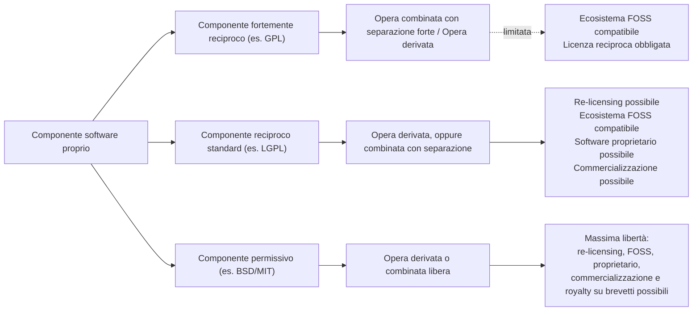

# Modulo 5 — Scegliere un numero di versione e Licensing del software

## 5.1 Il versioning del software

Il **versioning** è il processo di assegnare un identificatore univoco a uno stato univoco del software. Serve a distinguere e a fare riferimento a stati diversi dello stesso prodotto. L'identificatore è di solito una sequenza alfanumerica separata da punti, slash o trattini, e se assegnato in modo predicibile permette di ricavare informazioni sul software stesso (es. quanto è "vecchio", se è stabile, ecc.).

### Livelli di versioning
Il versioning può avvenire a livelli diversi:
- **Versioning automatico del sistema di controllo versione**: granulare, automatico, non progressivo, non lineare (le versioni non sono ordinabili tra loro in modo naturale).
- **Versione di sottoprogetto/feature**: spesso basata su codenaming, non lineare (es. le JSR di Java, le KEEP di Kotlin).
- **Release del software**: di solito manuale e lineare — è il livello che interessa di più dal punto di vista commerciale/di processo.

### Scope del versioning
- **Interno**: identifica un punto nello sviluppo, i cambiamenti non hanno impatto sul mondo esterno.
- **Esterno**: è una release pubblicamente visibile, i cambiamenti sono "dirompenti" (impattano gli utenti).

Per i progetti open source, versioning interno ed esterno spesso coincidono.

## 5.2 Approcci al versioning

| Approccio | Descrizione | Pro/Contro |
|---|---|---|
| **Codenaming** | Versione rappresentata da una parola/frase pronunciabile (es. *Project Longhorn* → Windows Vista, Ubuntu 18.04 *Bionic Beaver*, macOS 10.13.5 *Sierra*) | Non dà informazioni dirette sul progetto (spesso di proposito), usato per motivi politici/commerciali, separa pre-release da release finale |
| **Date-based** | La versione è la data di rilascio | Non sempre corrisponde al ritmo di sviluppo; utile per progetti molto rapidi o come informazione aggiuntiva (es. Windows 98, Office 2003) |
| **Numerazione unaria** | La stringa cresce a ogni versione | Utile solo per progetti maturissimi, rischio di "esplosione" della lunghezza della versione, oggi quasi inutilizzata |
| **Grado di retro-compatibilità** | Una o più sequenze incrementate separatamente per riflettere cambiamenti via via più ampi | Spesso usato male (vedi il kernel Linux); esistono metodologie formali (es. SemVer) |

### Casi reali di versioning
- **Microsoft Windows**: combina tutte le tecniche — date (Windows 9x, 2001), codename (NT, Vista, XP, Millennium Edition), codename di pre-rilascio (Longhorn), incrementi su più livelli (Windows 95 = MS-DOS 7.0 = Windows 4.00), e una separazione tra versione "commerciale" e versione "reale" (Windows 7 è in realtà Windows 6.1, Windows 10 è Windows 6.4) — da cui derivano inconsistenze (es. l'assenza di un "Windows 9" per evitare conflitti con controlli su stringhe legacy "Windows 9x").
- **Ubuntu**: combina una data in formato `YY.MM` con un codename a due parole *Aggettivo AnimaleAnimale*, dove entrambe le parole iniziano con la stessa lettera, in ordine alfabetico crescente (con possibile suffisso *LTS*). Due versioni sono comparabili sia per data sia per iniziale del codename, ma essendo le lettere limitate il ciclo si ripete (es. *Bionic Beaver* è più recente di *Xenial Xerus* e *Zesty Zapus*, nonostante B preceda X e Z alfabeticamente).
- **Wine**: inizialmente versionato con la data in formato ISO senza trattini (es. `20040505`), poi passato a `major.minor`. Il passaggio crea problemi ai gestori di dipendenze, perché `20040505` è numericamente più grande di `3.9` e delle versioni successive — con il senno di poi un prefisso `0.` per le versioni iniziali avrebbe evitato il problema.
- **TeX**: numerazione unaria convergente verso π (versione attuale `3.14159265`, da gennaio 2004): a ogni nuova versione si aggiunge una cifra di π. Sostenibile solo perché TeX è estremamente stabile e lo sviluppo è quasi fermo (Donald Knuth ha disposto che, dopo la sua morte, l'ultima versione diventi "π" e tutti i bug rimanenti diventino "feature" permanenti).
- **PEP440 (Python)**: schema flessibile ma complesso, con un ordine di segmenti imposto: `[N!]N(.N)*[{a|b|rc}N][.postN][.devN]` (epoch, release, pre-release, post-release, development release).

## 5.3 Semantic Versioning (SemVer)

È lo schema **fortemente raccomandato** dal corso. Codifica nel numero di versione un significato preciso su cosa è cambiato rispetto alla versione precedente.

**Formato:** `X.Y.Z[-P][+B]`
- `X` = **Major**
- `Y` = **Minor**
- `Z` = **Patch**
- `P` = **Pre-release** (opzionale)
- `B` = **Build metadata** (opzionale)

Regole principali (stile RFC, con MUST/SHOULD/MAY):
- Il software DEVE dichiarare una **API pubblica** precisa e comprensiva (nel codice o nella documentazione).
- Una volta rilasciata una versione, il contenuto di quella versione non può più essere modificato (**no-retract**): ogni modifica richiede una nuova versione.
- `X.Y.Z` devono essere interi non negativi senza zeri iniziali; ognuno aumenta numericamente.
- **Patch (Z)**: incrementata per bug fix retrocompatibili (un bug fix è un cambiamento interno che corregge un comportamento sbagliato).
- **Minor (Y)**: incrementata per nuove funzionalità retrocompatibili sull'API pubblica; DEVE essere incrementata se una funzionalità pubblica viene marcata come deprecata; PUÒ includere cambi di livello patch; quando Y aumenta, Z torna a 0.
- **Major (X)**: incrementata per cambiamenti che rompono la retrocompatibilità dell'API pubblica; quando X aumenta, Y e Z tornano a 0.
- **Major zero (`0.y.z`)**: sviluppo iniziale, tutto può cambiare in ogni momento, l'API pubblica non è considerata stabile.
- **`1.0.0`** definisce formalmente l'API pubblica: da quel momento il modo in cui la versione viene incrementata dipende da come cambia quell'API.
- **Pre-release**: aggiunta opzionale di un trattino seguito da identificatori separati da punti (solo alfanumerici ASCII e trattino, non vuoti, niente zeri iniziali nei numerici); indica una versione instabile.
- **Build metadata**: aggiunta opzionale di un `+` seguito da identificatori (stesse regole di formato del pre-release).

### Scegliere uno schema
- SemVer è caldamente raccomandato, e si integra bene con il DVCS (git).
- I codename si possono usare informalmente (per sotto-progetti interni o per scopi commerciali/di marketing).
- Le date possono avere senso per progetti a sviluppo rapido e costante, anche come componente aggiuntiva di uno schema SemVer (es. nel pre-release o nel build-metadata).

## 5.4 Versioning automatico basato sul DVCS

Lo stato del repository git può essere usato per derivare automaticamente la versione del software. Pratica tipica:
1. I tag manuali identificano le versioni nel formato `X.Y.Z`.
2. Un sistema automatico cerca il tag più recente raggiungibile `T` (se non esiste alcun tag, `T = 0.1.0`).
3. Se il commit corrente è taggato, la versione è semplicemente `T`.
4. Altrimenti, con `C` = numero di commit intermedi e `H` = hash del commit corrente, la versione diventa `T-C+H`.

Questo genera automaticamente una stringa compatibile con SemVer.

### `git describe`
Comando che assegna un nome leggibile a un oggetto basandosi sul tag più recente raggiungibile da un commit:
- se il tag punta esattamente al commit, mostra solo il tag;
- altrimenti, aggiunge come suffisso il numero di commit aggiuntivi sopra il tag e l'hash abbreviato dell'ultimo commit.

Se non esiste alcun tag il comando fallisce; si può usare la data dell'ultimo commit come fallback:
```bash
git describe || echo "0.1.0-$(git log -n1 --date=format:'%Y-%m-%dT%H%M%S' --format=%cd)"
```

## 5.5 Versioning basato sui messaggi di commit

**Idea:** i messaggi di commit servono già a identificare cosa è cambiato — esattamente quello di cui si occupa il semantic versioning. Si può quindi scrivere i commit in modo standardizzato e lasciare a uno strumento automatico il compito di determinare se e quale nuova versione rilasciare, togliendo dal processo la componente umana/soggettiva.

### Conventional Commits
Standard (https://www.conventionalcommits.org/, ispirato alla *Angular convention*) per scrivere commit in modo strutturato:

```
type[(scope)][!]: description

[body]

[BREAKING CHANGE: <breaking change description>]
```

- **type**: cosa introduce il commit (può differire tra progetti); `fix` (bug fix, nessun cambio di API) e `feat` (nuova funzionalità) sono sempre presenti; altri tipi comuni opzionali: `build`, `chore`, `ci`, `docs`, `style`, `refactor`, `perf`, `test`.
- **scope** (opzionale): il modulo del software interessato dal cambiamento.
- I **breaking change** si segnalano con un `!` prima dei due punti e/o con una riga `BREAKING CHANGE:` nel footer del commit.

### Semantic Release
**Idea:** partendo da commit scritti in modo convenzionale, automatizzare la decisione su quando e come rilasciare.

**Pratica:**
1. Si decide quale branch osservare per scatenare le release.
2. Si definisce quale tipo di release corrisponde a quale tipo di commit (regole personalizzabili per progetto, purché consistenti — tipicamente `fix`/`docs` → PATCH, `feat` → MINOR, breaking change → MAJOR).
3. Si scansionano tutti i commit dall'ultimo tag, cercando il cambiamento di versione "più grande" richiesto.
4. Se viene trovato almeno un cambiamento di versione, ed è ancora l'ultimo commit sul branch che scatena le release, si crea un tag di release e si esegue la procedura di rilascio.

**`semantic-release`** (https://github.com/semantic-release/semantic-release) è un'implementazione concreta: basata sulla convenzione Angular e su JavaScript, ma configurabile; determina il numero di versione, genera le note di rilascio basate sui commit ed esegue gli step di pubblicazione. È usabile anche per progetti non-JS (es. configurazione vista per Alchemist).

---

## 5.6 Licensing del software

Una **licenza** è uno strumento legale per regolare accesso, uso e redistribuzione del software. In genere si vogliono mantenere alcune garanzie: essere riconosciuti come autore originale, decidere se altri possono ridistribuire il software, decidere sotto quali condizioni può essere usato, eventualmente essere pagati per il suo utilizzo. La legge cambia molto da paese a paese: **se non si è un avvocato (o non si può pagarne uno), è sconsigliato scrivere una licenza personalizzata** — meglio usarne una già consolidata.

### Copyright vs. Copyleft
- **Copyright**: diritto legale che garantisce all'autore di un'opera originale diritti esclusivi sul suo uso e sulla sua (ri)distribuzione.
- **Copyleft**: è una *prassi* (non un diritto legale) con cui l'autore rinuncia volontariamente ad alcuni (non tutti) i diritti garantiti dal copyright.
  - **Forte (strong)**: tutte le opere derivate devono ereditare la licenza copyleft.
  - **Debole (weak)**: alcune opere derivate possono non ereditarla.
  - **Totale (full)**: tutte le parti dell'opera sono distribuite secondo i termini della licenza copyleft.
  - **Parziale (partial)**: solo alcune parti sono coperte dalla licenza copyleft.

### Ownership vs. Licensing
- **Ownership** (possesso): possedere una copia del software implica il diritto di usarla, anche se ciò viola tecnicamente la licenza (es. per modificarla o farne copie incidentali).
- **Licensing**: il software non viene "venduto" ma concesso in uso secondo le condizioni di un EULA (*End-User License Agreement*).

### Spettro Proprietary ↔ Free
Lo spettro dei diritti di copyright, dal più restrittivo al meno restrittivo, comprende: **Trade Secret** (tutti i diritti riservati) → **Licenza proprietaria** (più diritti riservati) → **Licenza FOSS protettiva** (più diritti concessi) → **Licenza FOSS non-protettiva** → **Dominio pubblico** (tutti i diritti rilasciati).
- **Proprietario**: l'editore concede il diritto d'uso di un certo numero di copie secondo un EULA, senza trasferire la proprietà delle copie; l'uso può essere subordinato all'accettazione dell'EULA.
- **Free**: l'editore concede diritti estesi di modifica e redistribuzione, spesso impedendo che questi diritti vengano "tolti" in futuro (copyleft forte).

### Free as in beer vs. Free as in speech
Distinzione più chiara in italiano:
- **free as in beer = gratuito** (a costo zero).
- **free as in speech = libero**: l'utente riceve il codice sorgente ed è autorizzato a modificarlo e redistribuirlo. Si può comunque chiedere un pagamento per ottenere una copia o per accedere al codice sorgente — ma non un importo eccessivo (es. chiedere un miliardo di dollari renderebbe il software *de facto* proprietario).

### Free vs. Open Source
Di solito vanno insieme, ma concettualmente sono diversi:
- **Open source**: focus sulla disponibilità del codice sorgente e sul diritto di modificarlo/condividerlo.
- **Free**: focus sulla libertà di usare, modificare e condividere il programma.

Esistono licenze **open source ma non free** (es. *Apple Public Source License 1.0*, troppo generica; *Artistic License 1.0*, troppo vaga; *NASA Open Source Agreement*) e licenze **free ma non open source** (es. *WTFPL* — il concetto di "dominio pubblico" non è definito nella legislazione UE; *Netscape Public License*; *OpenSSL License*).

### Software non licenziato
- **Segreti industriali/commerciali interni**: il rilascio non è voluto, restano non divulgati, non disponibili, non licenziati.
- **Software distribuito senza alcuna licenza**: è protetto interamente da copyright e quindi legalmente inutilizzabile da terzi.
- **Dominio pubblico**: alla scadenza del copyright, il software non licenziato diventa di dominio pubblico (liberamente usabile, modificabile, ridistribuibile) — per il software rilasciato dopo il 2008 ci vogliono più di 100 anni.

### Vincoli tipici delle licenze proprietarie
- **Closed volume**: il cliente si impegna ad acquistare un certo numero di licenze in un periodo fisso (tipicamente due anni); la licenza può essere limitata per utente, CPU, utilizzo concorrente, ecc.
- **Maintenance & support**: di solito incluso nelle licenze proprietarie.
- **Warranty (garanzia)**: spesso inclusa, tipicamente a tempo limitato e con estensioni acquistabili.

### Le licenze open source principali

| Licenza | Copyleft | Compatibile con GPL | Note |
|---|---|---|---|
| **GNU GPLv3** | Forte | — | Non permette il linking da software con licenza non compatibile con la GPL: se si vuole che il proprio software sia usato come dipendenza di software proprietario, **non usare questa licenza** |
| **GNU LGPLv3** | Forte (ma con eccezione di linking) | — | Permette il linking da codice con licenza diversa, ma l'opera combinata deve permettere la modifica della libreria collegata e il reverse engineering/debug dell'opera combinata — requisiti spesso inaccettabili per le aziende |
| **GPL with linking exception** | Forte (con eccezione manuale) | — | Si costruisce sopra la GPL aggiungendo manualmente un'eccezione per il linking; l'opera combinata può essere ridistribuita anche sotto licenze non compatibili con la GPL |
| **MIT** | Nessuno | Sì | Estremamente permissiva; l'opera derivata può essere ridistribuita con qualsiasi altra licenza; non protegge marchi né rivendicazioni di brevetto |
| **Apache License 2.0** | Nessuno | Sì | Più restrittiva della MIT; protegge i marchi, permette di porre una garanzia, protegge le rivendicazioni di brevetto, obbliga a dichiarare i cambiamenti significativi fatti nelle opere derivate; se è presente un file NOTICE con gli autori, va incluso nella redistribuzione (con eventuali aggiunte) |
| **WTFPL** | Nessuno | — | Permissiva ma problematica: *free* ma non *open source*; buon esempio di cosa può andare storto scrivendo licenze senza competenza legale — meglio evitarla |

### Compatibilità tra licenze FOSS
La compatibilità dipende dal grado di reciprocità del componente che si vuole combinare:



In sintesi: più il componente che si integra è permissivo (BSD/MIT) più si conservano libertà a valle (re-licensing, uso proprietario, commercializzazione); più è "reciproco" (GPL) più l'opera risultante è vincolata a restare in un ecosistema compatibile con quella licenza.

### Creative Commons
Famiglia di licenze a copyleft crescente, **non pensate per il software** ma per dati, documentazione e risorse in genere. Diritti disponibili (combinabili):
- **BY** (Attribution) — le opere derivate devono citare l'autore originale.
- **SA** (Share-alike) — abilita il copyleft.
- **NC** (Non-commercial) — l'opera derivata può essere usata solo per scopi non commerciali.
- **ND** (No derivative works) — distribuzione e copia libere, ma le derivazioni sono vietate.

Combinazioni valide: `CC0` (dominio pubblico — per il software è preferibile usare la MIT per una protezione simile), `CC-BY`, `CC-BY-SA`, `CC-BY-NC`, `CC-BY-NC-SA`, `CC-BY-ND`, `CC-BY-NC-ND`.

### Come applicare una licenza al proprio progetto
1. Creare un file `LICENSE` o `COPYING` in formato testo semplice nella repository, con il testo completo della licenza (facilmente reperibile online), modificando titolare e anno di copyright.
2. Applicare un header con la notifica di copyright a ogni file sorgente — meglio con uno strumento automatico (la maggior parte degli IDE lo supporta); i template degli header sono di solito disponibili dove la licenza è pubblicata.

A questo punto il software è formalmente licenziato.
