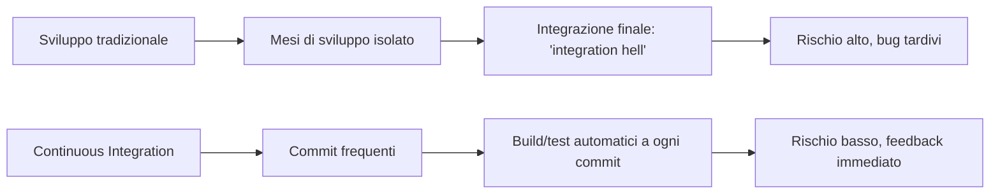
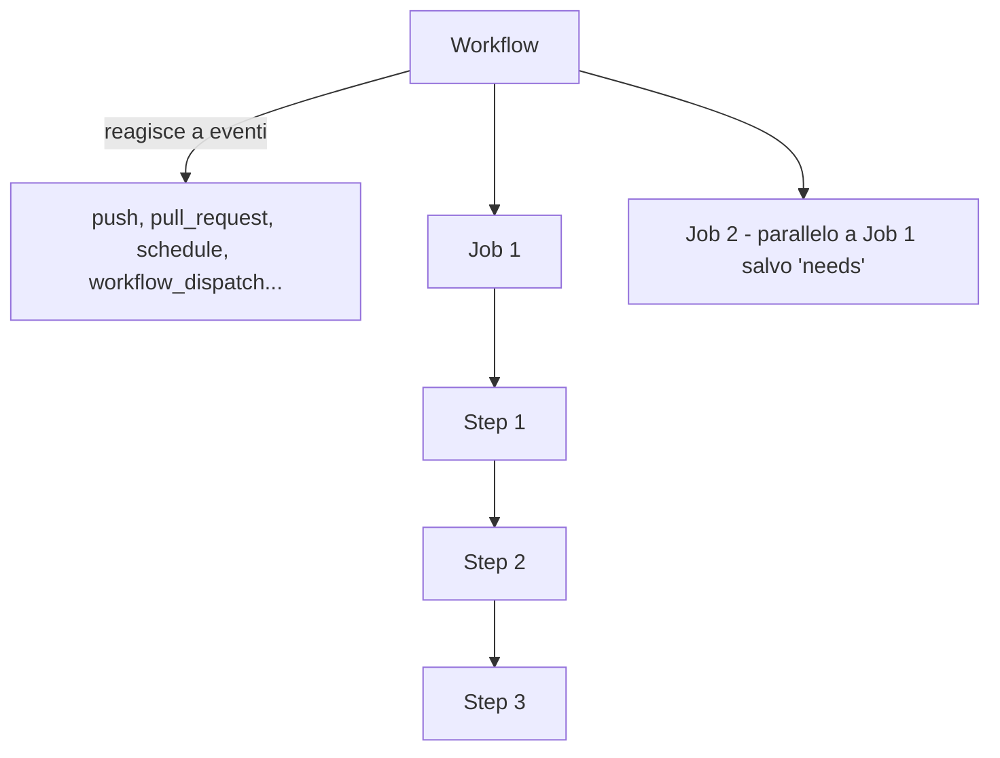

# Continuous Integration

## Cos'è la Continuous Integration

La **Continuous Integration (CI)** è la pratica di integrare continuamente il codice con la linea di sviluppo principale, verificando che la build resti intatta. Richiede che siano già in atto build automation e testing, ed è il punto cardine (*pivot point*) delle pratiche DevOps. È stata introdotta storicamente dalla comunità dell'Extreme Programming (XP), ed è oggi ampiamente diffusa nella più ampia comunità DevOps.

### Integrazione tradizionale vs CI: l'"integration hell"
Nello sviluppo software tradizionale, l'integrazione di anche solo un paio d'anni di sviluppo può richiedere diversi mesi: più tempo passa senza un progetto integrato, più alto è il rischio (bug nascosti, conflitti di codice difficili da risolvere, regressioni scoperte tardi). La CI inverte questo schema: integrazione ad altissima frequenza, idealmente a ogni commit.



### Microrelease e "protoduction"
Un'integrazione ad alta frequenza può portare a release ad alta frequenza, potenzialmente una per commit (a patto che il versioning sia gestito in modo appropriato). Il termine *protoduction* indica tradizionalmente un prototipo finito in produzione, storicamente con connotazione negativa (software incompleto, non rifinito, mal progettato — fenomeno purtroppo comune). In un ambiente continuamente integrato la situazione è diversa: l'incrementalità è favorita e le funzionalità parziali restano comunque aggiornate con la mainline, riducendo il divario tra "prototipo" e "prodotto".

Le operazioni intensive (che richiedono molto tempo) dovrebbero essere automatizzate ed eseguite altrove rispetto ai PC degli sviluppatori, mantenendo il processo di build ricco ma veloce.

### Requisiti di un sistema di CI
Il software che promuove pratiche di CI dovrebbe: fornire ambienti puliti per compilazione/test; offrire un'ampia gamma di ambienti (per coprire le specifiche dei target reali); avere un alto grado di configurabilità, possibilmente dichiarativa; includere un sistema di notifica per allertare su fallimenti o problemi; supportare autenticazione e deploy verso servizi esterni. Sul mercato esistono numerosi integratori: CircleCI, Travis CI, Werker, done.io, Codefresh, Codeship, Bitbucket Pipelines, GitHub Actions, GitLab CI/CD Pipelines, JetBrains TeamCity, ecc.

## Concetti fondamentali

La nomenclatura varia tra piattaforme, ma in generale: una o più **pipeline** sono associate a degli eventi (un nuovo commit, l'aggiornamento di una pull request, un timeout...); ogni pipeline è composta da una sequenza di operazioni; ogni operazione può essere composta da sotto-operazioni sequenziali o parallele; il numero di livelli gerarchici disponibili dipende dalla piattaforma specifica (GitHub Actions: workflow → job → step; Travis CI: build → stage → job → phase). L'esecuzione avviene su un sistema "pulito" (macchina virtuale o container, spesso container dentro macchine virtuali); il punto preciso della gerarchia in cui viene istanziata la VM/container dipende dalla piattaforma di CI.

### Progettare una pipeline
In sostanza, progettare un sistema di CI significa progettare una pipeline di costruzione, verifica e delivery del software usando le abstraction fornite dal provider scelto:
1. Pensare a tutte le operazioni richieste partendo da una o più VM vuote (configurazione OS, installazione software, checkout del progetto, compilazione, testing, configurazione dei segreti, delivery...).
2. Organizzarle in un grafo di dipendenze.
3. Modellare il grafo con gli strumenti di CI forniti.

La configurazione può crescere in complessità ed è solitamente memorizzata in un file YAML (con eccezioni: JetBrains TeamCity usa una DSL Kotlin).

## GitHub Actions: struttura e configurazione

I **workflow** reagiscono a eventi, lanciando dei **job**; più workflow in esecuzione contemporanea girano in parallelo (a meno di restrizioni esplicite). I job dello stesso workflow eseguono una sequenza di **step**; più job dello stesso workflow girano in parallelo a meno che non sia dichiarata esplicitamente una dipendenza tra essi (è possibile imporre limiti di concorrenza tra workflow); i job possono comunicare tramite output. Gli step dello stesso job vengono eseguiti in sequenza e possono comunicare tramite output.

I workflow sono configurati in file YAML posizionati nel branch di default del repository, nella cartella `.github/workflows`: un file di configurazione corrisponde a un workflow. Per motivi di sicurezza, i workflow potrebbero richiedere un'attivazione manuale dalla tab "Actions" dell'interfaccia web di GitHub.



### I runner
Gli esecutori delle GitHub Actions si chiamano **runner**: macchine virtuali (ospitate da GitHub) con installata l'applicazione "GitHub Actions runner". L'applicazione è open source e può essere installata localmente, creando "runner self-hosted"; runner self-hosted e ospitati da GitHub possono lavorare insieme. Alla creazione, i runner hanno un ambiente di default che dipende dal loro sistema operativo (documentazione: pagina ufficiale sui runner ospitati da GitHub).

### Convention over configuration
Diversi sistemi di CI ereditano il principio "convention over configuration": ad esempio, di default (con un file di configurazione vuoto) Travis CI compila un progetto Ruby usando rake. GitHub Actions non adotta questo principio: se lasciato senza configurazione, il runner non fa nulla (non clona nemmeno il repository in locale) — probabile motivo: Actions è un sistema di automazione generale del repository su GitHub, non solo una "semplice" pipeline CI/CD (può reagire a molti eventi diversi, non solo a cambiamenti nella storia del repository git).

### Struttura base di un workflow
```yaml
name: Workflow Name           # nome obbligatorio
on:                            # eventi che attivano il workflow
jobs:
  Job-Name:                    # ogni job va nominato
    runs-on: runner-name       # il tipo di runner che esegue il job, di solito l'OS
    steps:                     # lista di comandi o "azioni"
      - # primo step
      - # secondo step
  Another-Job:                 # gira in parallelo con Job-Name
    runs-on: '...'
    steps: [ ... ]
```

### DRY con YAML
Le pipeline di automazione/integrazione sono parte del software, quindi soggette agli stessi (o anche più elevati) standard di qualità: si applicano tutti i buoni principi di ingegneria del software. YAML è spesso usato dai sistemi di CI come linguaggio di configurazione preferito perché abilita alcune forme di DRY tramite **anchor** (`&`/`*`) e **merge key** (`<<:`):
```yaml
hey: &ref
  look: at
  me: [ "I'm", 'dancing' ]
merged:
  foo: *ref
  <<: *ref
  look: to
```
equivalente a:
```yaml
hey: { look: at, me: [ "I'm", 'dancing' ] }
merged: { foo: { look: at, me: [ "I'm", 'dancing' ] }, look: to, me: [ "I'm", 'dancing' ] }
```
GitHub Actions ha aggiunto (di recente, e dopo molto tempo) il supporto per gli anchor YAML, ma non supporta le merge key (esiste un workaround, ma molto custom). GHA ottiene riuso tramite: le **"actions"**, step riusabili e parametrizzabili (in JavaScript, funzionante su qualsiasi OS; basate su container Docker, solo Linux; composite, assemblaggio di altre actions); i **"reusable workflow"**, job riusabili e parametrizzabili. Molte azioni sono fornite direttamente da GitHub, molte altre dalla community.

### Esempio minimale di workflow
```yaml
name: Example workflow
on:
  push:
    tags: '*'
    branches-ignore:
      - 'autodelivery**'
      - 'bump-**'
      - 'renovate/**'
    paths-ignore:
      - 'README.md'
      - 'CHANGELOG.md'
      - 'LICENSE'
  pull_request:
    branches:
      - master
  workflow_dispatch: # consente l'esecuzione manuale dalla tab Actions

jobs:
  Default-Example:
    runs-on: macos-latest
    steps:
      - uses: actions/checkout@0c366fd6a839edf440554fa01a7085ccba70ac98
      - name: Run a one-line script
        run: echo Hello from a ${{ runner.os }} machine!
      - name: Run a multi-line script
        run: |
          echo Add other actions to build,
          echo test, and deploy your project.

  Conclusion:
    runs-on: windows-latest
    needs: [ Default-Example ] # i job possono richiedere altri job
    if: always() # normalmente gli step dopo un fallimento non vengono eseguiti, a meno di always()
    steps:
      - name: Run something on powershell
        run: echo By default, ${{ runner.os }} runners execute with powershell
      - name: Run something on bash
        shell: bash
        run: echo it is allowed to force the shell type
```

## Espressioni in GitHub Actions

GitHub Actions permette di includere espressioni nei file di workflow con sintassi `${{ <espressione> }}` (regola speciale: i condizionali `if:` vengono valutati automaticamente come espressioni, quindi `if: <espressione>` funziona già senza `${{ }}`). Il linguaggio è piuttosto limitato e applica un'uguaglianza "loose": tipi uguali vengono confrontati direttamente, tipi diversi vengono coercizzati a interi nel confronto; quando è richiesta una stringa, qualsiasi tipo viene coercizzato a stringa (il confronto tra stringhe ignora il maiuscolo/minuscolo).

| Tipo | Literal | Coercizione a numero | Coercizione a stringa |
|---|---|---|---|
| Null | `null` | 0 | `''` |
| Boolean | `true`/`false` | true→1, false→0 | `'true'`/`'false'` |
| String | `'...'` (apici singoli obbligatori) | parseInt di JS, eccetto `''`→0 | nessuna |
| JSON Array | non disponibile come literal | NaN | errore |
| JSON Object | non disponibile come literal | NaN | errore |

Array e oggetti esistono e possono essere manipolati, ma non creati direttamente nelle espressioni. Operatori disponibili: raggruppamento `( )`, accesso ad array per indice `[ ]`, dereferenziazione di oggetti `.`, operatori logici (`!`, `&&`, `||`), operatori di confronto (`==`, `!=`, `<`, `<=`, `>`, `>=`).

**Funzioni built-in** (non è possibile definirne di proprie) per il controllo dello stato del job: `success()` (vero se nessuno step precedente è fallito — ogni step ha implicitamente questo condizionale); `always()` (sempre vero, forza la valutazione dello step anche se il precedente è fallito, ma supporta combinazioni come `always() && <espressione>`); `cancelled()` (vero se l'esecuzione del workflow è stata annullata); `failure()` (vero se un qualsiasi step precedente di un qualsiasi job precedente è fallito).

**Contesto GHA**: oggetti utili a cui le espressioni possono fare riferimento: `github` (info sul contesto del workflow: `.event_name`, `.repository`, `.ref`); `env` (variabili d'ambiente); `steps` (info sugli step precedenti, `.<step id>.outputs.<output name>` per lo scambio di informazioni tra step); `runner` (`.os`); `secrets` (accesso ai segreti); `matrix` (accesso alle variabili della build matrix).

## Checkout del repository

Per default, i runner di GitHub Actions non eseguono il checkout del repository (alcune azioni potrebbero non aver bisogno di accedere al codice, es. azioni che automatizzano issue/project). Trattandosi di un'operazione comune e non banale (la versione fatta checkout deve corrispondere a quella che ha originato il workflow), GitHub fornisce un'azione dedicata:
```yaml
- name: Check out repository code
  uses: actions/checkout@v6
```
Poiché tipicamente non serve l'intera storia del progetto, l'azione di default esegue il checkout solo del commit che ha originato il workflow (`--depth=1`): lo *shallow cloning* ha performance migliori, ma può rompere operazioni che dipendono dall'intera storia (es. il versioning semantico sensibile a git). Anche i tag non vengono fatti checkout di default.

Per il checkout completo della storia:
```yaml
- name: Checkout with default token
  uses: actions/checkout@v6.0.3
  with:
    fetch-depth: 0
    submodules: recursive
- name: Fetch tags
  shell: bash
  run: git fetch --tags -f
```

## Scrivere output e comunicare con il runner

La comunicazione con il runner avviene tramite *workflow command*: il modo più semplice è stampare su standard output un messaggio nella forma `::workflow-command parameter1={data}::{command value}`. In particolare, le azioni possono impostare output tramite (sintassi moderna): `echo "{name}={value}" >> "$GITHUB_OUTPUT"` (la vecchia sintassi `::set-output name={name}::{value}` è deprecata).
```yaml
jobs:
  Build:
    runs-on: ubuntu-latest
    steps:
      - id: output-from-shell
        run: ruby -e 'puts "dice=#{rand(1..6)}"' >> $GITHUB_OUTPUT
      - run: echo "The dice roll resulted in number ${{ steps.output-from-shell.outputs.dice }}"
```

## Build matrix

Molti prodotti software sono pensati per essere portabili (tra sistemi operativi, framework e linguaggi, configurazioni di runtime). Una buona pipeline di CI dovrebbe testare tutte le combinazioni supportate (o un campione, se le performance fossero altrimenti insostenibili). La soluzione è l'adozione di una **build matrix**: si specificano variabili di build e i loro valori ammessi, e l'integratore di CI genera il prodotto cartesiano dei valori, lanciando una build per ogni combinazione. Non esiste una funzionalità built-in per escludere combinazioni specifiche: va fatto manualmente con condizionali `if`.

```yaml
jobs:
  Build:
    strategy:
      matrix:
        os: [windows, macos, ubuntu]
        jvm_version: [8, 11, 15, 16]
    runs-on: ${{ matrix.os }}-latest
    steps:
      - uses: actions/setup-java@v5
        with:
          distribution: 'adopt'
          java-version: ${{ matrix.jvm_version }}
```

## Dati privati e CI: i secret

La CI deve poter firmare gli artefatti e fare delivery/deploy verso target remoti; entrambe le operazioni richiedono la condivisione di informazioni private, che ovviamente non possono essere condivise in chiaro (un attaccante potrebbe rubare l'identità, compromettere i deploy, o nel caso di progetti open, sfruttare le pull request facendo fork del progetto e stampando il valore di un segreto, es. con `printenv`).

I **secret** possono essere memorizzati su GitHub a livello di repository o di organizzazione, e sono accessibili dal contesto `secrets.<nome secret>` — l'accesso è consentito solo per workflow generati da eventi locali (nessun secret per le pull request, per evitare l'attacco descritto sopra). I secret si possono aggiungere dall'interfaccia web o via API GitHub.

### Firme in memoria
Firmare in CI è più semplice se la chiave può essere mantenuta in memoria (l'alternativa è installare una chiave privata sul runner). Procedura: (1) esportare la chiave privata GPG in formato "armored" con `gpg --armor --export-secret-key <key id>` (l'armoring non è cifratura, serve solo per leggibilità/elaborazione con strumenti testuali); (2) esportare la chiave come secret di CI (per chiavi più grandi che non entrano in un secret: cifrarla con una chiave simmetrica più corta, memorizzare quest'ultima come secret, tracciare il file cifrato nel repo, e decifrarlo solo al momento della firma per poi eliminare la versione in chiaro); (3) configurare il build system per usare le chiavi in memoria quando viene rilevato un ambiente di CI (tipicamente verificando la variabile d'ambiente `CI`, impostata automaticamente a `"true"` dalla maggior parte degli ambienti di CI inclusa GHA):
```kotlin
// in Gradle
if (System.getenv("CI") == true.toString()) {
    signing {
        val signingKey: String? by project
        val signingPassword: String? by project
        useInMemoryPgpKeys(signingKey, signingPassword)
    }
}
```
Le property vanno passate a Gradle via riga di comando (`-PsigningKey=...`) oppure tramite variabili d'ambiente con prefisso `ORG_GRADLE_PROJECT_` (Gradle le importa automaticamente):
```yaml
env:
  ORG_GRADLE_PROJECT_signingKey: ${{ secrets.SIGNING_KEY }}
  ORG_GRADLE_PROJECT_signingPassword: ${{ secrets.SIGNING_PASSWORD }}
```

## DRY con GitHub Actions: actions e reusable workflow

Il comportamento imperativo in GitHub Actions viene incapsulato nelle **actions**: eseguite come un singolo step logico, con input e output, i cui metadati sono scritti in un file `action.yml` nella root del repository dell'azione. Le actions ospitate su GitHub sono usabili senza ulteriori passi di deploy, tramite il riferimento `owner/repo@<tree-ish>`.

**Struttura dei metadati**:
```yaml
name: 'A string with the action name'
description: 'A long description explaining what the action does'
inputs:
  input-name:
    description: 'Input description'
    required: true
    default: 'default value'
outputs:
  output-name:
    description: 'Description of the output'
runs: # il contenuto dipende dal tipo di action
```

### Composite actions
Permettono l'esecuzione di più step (script o altre azioni):
```yaml
runs:
  using: composite
  steps: [ <list of steps> ]
```
Esempio (action.yml di "Checkout the whole repository"):
```yaml
name: 'Checkout the whole repository'
inputs:
  token:
    required: false
    default: ''
runs:
  using: "composite"
  steps:
    - name: Checkout with custom token
      uses: actions/checkout@v6.0.3
      if: inputs.token != ''
      with:
        fetch-depth: 0
        submodules: recursive
        token: ${{ inputs.token }}
    - name: Checkout with default token
      uses: actions/checkout@v6.0.3
      if: inputs.token == ''
      with:
        fetch-depth: 0
        submodules: recursive
    - name: Fetch tags
      shell: bash
      run: git fetch --tags -f
```
Uso: `uses: danysk/checkout-classic@1.0.0`.

**Limitazioni delle composite actions**: nessun supporto nativo per i secret (devono essere passati come input — con il rischio implicito che l'input possa risultare vuoto/non sicuro se non gestito); fino a poco tempo fa non c'era supporto per step condizionali (introdotto il 9 novembre 2021), per cui andavano emulati dentro lo script.

### Docker container actions
Configurano il `Dockerfile` del container da usare, preparano lo script principale dichiarato come `ENTRYPOINT`, definiscono input/output in `action.yml`, e nella sezione `runs` impostano `using: docker` con gli argomenti nell'ordine in cui verranno passati allo script entrypoint. Funzionano solo su Linux.
```yaml
runs:
  using: 'docker'
  image: 'Dockerfile' # oppure il nome di un'immagine esistente
  args:
    - ${{ inputs.some-input-name }}
```

### JavaScript actions
Il modo più flessibile di scrivere azioni, portabile tra OS:
```yaml
runs:
  using: 'node12'
  main: 'index.js'
```
Si inizializza un progetto NPM (`npm init -y`), si installano i toolkit necessari (`npm install @actions/<toolkitname>`), e si scrive il codice:
```javascript
const core = require('@actions/core');
try {
  const foo = core.getInput('some-input');
  console.log(`Hello ${foo}!`);
} catch (error) {
  core.setFailed(error.message);
}
```

### Reusable workflow
Concettualmente simili alle composite actions ma catturano operazioni più ampie: possono preconfigurare matrici e supportano step condizionali. Limitazioni: non utilizzabili in `workflow_dispatch` se hanno più di 10 parametri; non utilizzabili ricorsivamente; le modifiche alle variabili d'ambiente (`env`) del chiamante non si propagano al chiamato; il chiamato non ha accesso implicito ai secret del chiamante (ma possono essere passati esplicitamente). Il meccanismo abilita comunque, in qualche misura, la creazione di librerie di workflow riusabili.

```yaml
# definizione
on:
  workflow_call:
    inputs:
      input-name:
        required: true
        type: string
    secrets:
      token:
        required: true
jobs:
  Job-1: { ... }
  Job-2: { ... }
```
```yaml
# riuso (uses si applica all'intero job, non si possono definire ulteriori step)
jobs:
  Build:
    uses: owner/repository/.github/workflows/build-and-deploy-gradle-project.yml@<tree-ish>
    with:
      deploy-command: ./deploy.sh
    secrets:
      github-token: ${{ secrets.GITHUB_TOKEN }}
```

## Build "stale" (obsolete) e robustezza

Scenario tipico: il software funziona, nessuno lo tocca per mesi, e nel frattempo lo "stuff" non toccato si rompe (problema connesso alla *riproducibilità della build*: maggiore riproducibilità implica maggiore robustezza). Cause possibili: la configurazione di default del runner cambia, alcuni strumenti diventano non disponibili, alcune dipendenze diventano non disponibili. È meglio scoprire prima possibile questi problemi: si può eseguire automaticamente la build a intervalli regolari anche se nessuno tocca il progetto (la frequenza dipende dal progetto). Attenzione: GitHub Actions disabilita i job di CI pianificati via cron se non c'è alcuna attività sul repository, riducendo l'utilità del meccanismo.

## GitHub CLI (`gh`)

`gh` è la CLI ufficiale di GitHub, mirata a coprire le funzionalità che git non gestisce (issue, pull request, release, workflow, notifiche, secret, API), funziona in terminali e script, con autenticazione una tantum riusabile tra repository e organizzazioni.

**Setup e autenticazione**:
```bash
gh --version
gh auth login            # OAuth guidato o token
gh auth status           # verifica
gh config set prompt disabled true # script non interattivi
gh alias set prd 'pr create -d -f'
```

**Gestione quotidiana di issue e PR**:
```bash
gh issue list --label bug --state open
gh issue create -t "Crash on startup" -b "Steps…" -l bug -a @me
gh pr create -t "Fix: null check" -B main -H feat/guard -r org/team
gh pr checks
gh pr review --approve
gh pr merge --auto --squash
gh release create v1.2.0 dist/* -t "v1.2.0" -n "Changelog…"
```

**CI/CD, secret e accesso API raw**:
```bash
gh workflow list
gh run list
gh run watch --job 123456789
gh workflow run build.yml -f ref=main
gh secret set NPM_TOKEN --body "$NPM_TOKEN"
gh api repos/{owner}/{repo}/actions/runs --paginate | jq '.workflow_runs[].status'
```

## Servizi aggiuntivi di QA e reportistica

Esistono numerosi servizi raccomandati per QA e reportistica aggiuntiva: **Codecov.io** (code coverage, supporta i report XML di Jacoco, buon sistema di visualizzazione dati); **Sonarcloud** (misure multiple: reliability, security, maintainability, duplicazione, complessità...); **Codacy** (QA automatizzata per diversi linguaggi); **Code Factor** (QA automatizzata).

### High Quality FLOSS checklist
La Linux Foundation Core Infrastructure Initiative ha creato una checklist per software FLOSS di alta qualità (**CII Best Practices Badge Program**): autocertificazione senza burocrazia, una bella TODO list per un prodotto di qualità elevata, con un badge da poter aggiungere ad esempio alla homepage del progetto.

## Automazione avanzata del workflow

### Evoluzione automatizzata (dependency update bot)
Un sistema di CI completo permette un'evoluzione automatizzata relativamente sicura del software, almeno per quanto riguarda l'aggiornamento delle dipendenze. Possibile workflow per aggiornamenti automatici: (1) verificare se esistono nuovi aggiornamenti; (2) applicare l'aggiornamento in un nuovo branch; (3) apertura di una pull request; (4) verificare se le modifiche rompono qualcosa (in tal caso è richiesto intervento manuale); (5) merge (o rebase, o squash). Esistono bot che eseguono questo processo per diversi build system, di norma integrati col provider di hosting del repository: **Whitesource Renovate** (multi-ecosistema, aggiorna anche GitHub Actions e i catalog Gradle), **Dependabot** (multi-ecosistema), **Gemnasium** (Ruby), **Greenkeeper** (NPM).

### Copilot coding agent
Agente LLM autonomo ospitato sul cloud, integrato in GitHub: può ricevere issue assegnate, avvia un runner isolato, clona il repository, apporta modifiche, compila e procede iterativamente finché l'issue non è risolta (o finché Copilot "pensa" che lo sia), per poi rispondere con una draft PR da revisionare. Opera tramite GitHub Actions con audit trail completo nei commit e nei log (consumando minuti di Actions). Modalità d'uso: assegnare un'issue a Copilot; alla prima assegnazione su un nuovo repository richiede una procedura di onboarding durante la quale analizza il repository e prepara un documento `.github/copilot-instructions.md` con un riassunto della codebase, usato come contesto nelle esecuzioni successive; si può guidarlo taggando `@Copilot` nei commenti della PR. Impatto: letteratura ancora emergente, risultati iniziali contrastanti — la GenAI sembra velocizzare sviluppatori inesperti su progetti piccoli e semplici, mentre sviluppatori esperti su grandi progetti risultano rallentati (circa -19%) dalla necessità di revisionare codice generato dall'IA.

## Template per issue e pull request

Alcuni compiti richiedono necessariamente l'intervento umano (segnalare bug, spiegare il contenuto di una pull request fatta da una persona); si vuole comunque che questi documenti seguano un template, per: ricordare ai contributori di inserire tutte le informazioni necessarie (es. istruzioni per riprodurre un bug); pre-popolare informazioni comuni; imporre o proporre una struttura (es. titoli di PR semantici). La maggior parte dei servizi di hosting Git permette di specificare un template.

In GitHub, i template sono file speciali nella cartella `.github`, scritti in YAML o Markdown, memorizzati nel branch di default; il descrittore genera un form che gli utenti devono compilare, disponibile sia per issue che per pull request (sintassi quasi identica):
```
.github
├── PULL_REQUEST_TEMPLATE
│    ├── config.yml
│    └── example.yml
└── ISSUE_TEMPLATE
     ├── config.yml
     └── example.yml
```
Qualsiasi file `.md`/`.yml` in `.github/ISSUE_TEMPLATE` è considerato un template per le issue, analogamente per le PR; se è necessario un singolo template, un unico file `.github/ISSUE_TEMPLATE.md` (o `PULL_REQUEST_TEMPLATE.md`) sostituisce il contenuto dell'intera cartella.

I documenti Markdown pre-popolano il contenuto del messaggio della PR/issue, con un front-matter YAML opzionale per specificare opzioni:
```markdown
---
name: 🐞 Bug
about: File a bug/issue
title: '[BUG] <title>'
labels: bug, to-triage
assignees: someone, someoneelse
---
### Current Behavior:
<!-- A concise description of what you're experiencing. -->

### Expected Behavior:
<!-- A concise description of what you expected to happen. -->

### Steps to reproduce:
1. first do...
2. and then...
```
I documenti YAML permettono di costruire form più ricchi, con caselle di spunta e alcune forme di validazione.
