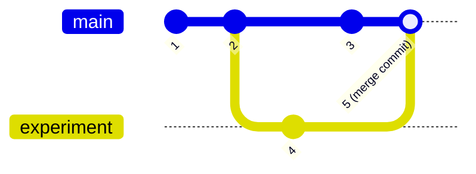
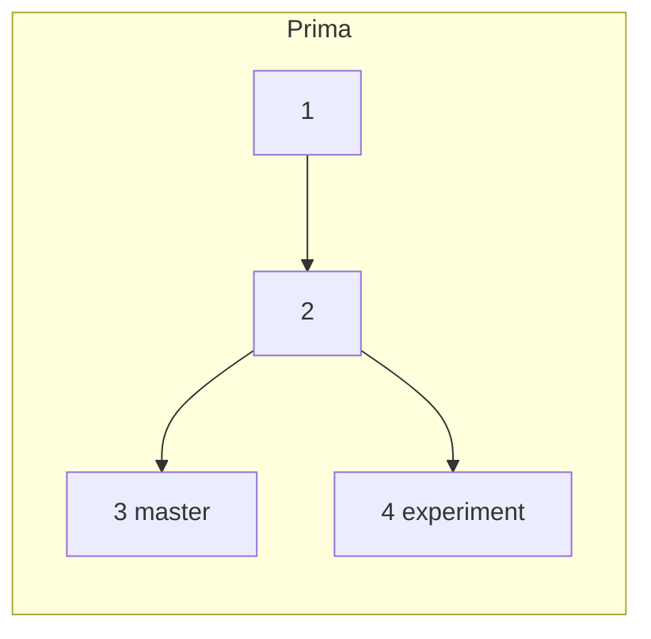
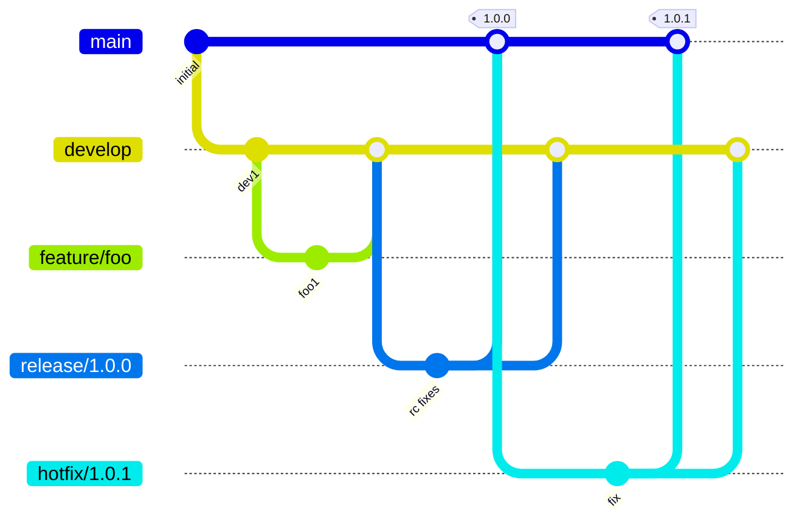
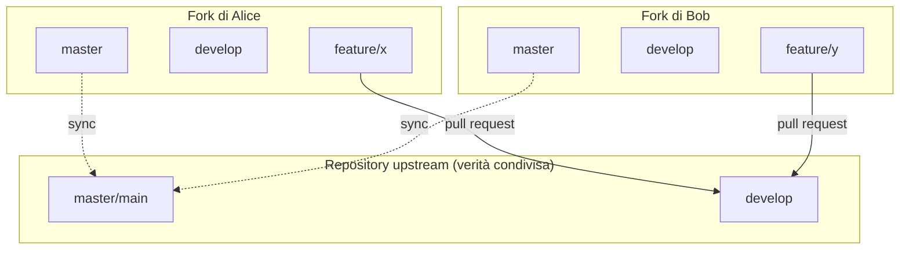

# Git avanzato e workflow DVCS

## Tag annotati vs leggeri

Git supporta due tipi di tag: i **tag leggeri** (*lightweight*, opzione di default) sono semplicemente un nome assegnato a un oggetto (di solito un commit), pensati per annotazioni private o temporanee; i **tag annotati** (prodotti con le opzioni `-a` non firmato, `-s`, o `-u`) creano un nuovo oggetto Git, contengono un messaggio, una data di creazione, nome ed email di chi ha taggato, ed eventualmente una firma — sono pensati per le release. Alcuni comandi (in particolare `git describe`) ignorano i tag leggeri per default.

## Firmare i commit

Le persone "per bene" firmano i propri commit, certificandone l'autorship (i commit firmati appaiono con un segno di spunta verde su GitHub). Se non si possiede ancora una firma: creazione con `gpg --gen-key`, elenco con `gpg --list-keys`, distribuzione con `gpg --keyserver hkp://pool.sks-keyservers.net --send-keys`. Una volta ottenuta la chiave privata, si configura Git per usarla impostando `user.signingkey`:
```bash
git config --global user.signingkey <YOUR_KEY_ID>
```

## Stashing

Situazione classica: si sta lavorando su un progetto, con la directory di lavoro in uno stato inconsistente, ma qualcosa deve essere risolto urgentemente su un altro branch — non si vogliono commit "a metà", ma non si vuole nemmeno perdere il lavoro fatto. `git stash` salva lo stato "sporco" della working directory su uno stack di modifiche non finite, riapplicabile in qualsiasi momento (anche su branch diversi da quello di origine).

| Comando | Effetto |
|---|---|
| `git stash` | Sposta tutte le modifiche pendenti (staged o no) nello stash |
| `git stash list` | Mostra tutti gli stash accumulati |
| `git stash apply [stash@{N}] [--index]` | Riapplica (senza rimuovere) l'ultimo stash, o lo stash N-esimo se specificato; con `--index` ripristina anche lo stato di staging originale |
| `git stash drop stash@{N}` | Elimina lo stash N-esimo |
| `git stash pop` | Riapplica e rimuove il più recente stash (equivalente a `apply` + `drop stash@{0}`) |

## Riconciliazione classica dei branch: il merge

Nel merge classico, i branch divergenti vengono riconciliati attraverso un **merge commit** che ha due genitori, preservando l'intera storia di entrambi i rami.



## Rebase avanzato

Il merge non è il solo modo per riunire branch divergenti. A volte si vuole, ad esempio, simulare che un commit sia stato sviluppato *dopo* un altro (perché si trovava su una parte separata della codebase), oppure evitare che il merge registri esplicitamente la creazione e la riunione di una linea di sviluppo (storia del progetto difficile da leggere per troppi merge, o perché la separazione era in realtà un piccolo esperimento di successo). Il **rebase** permette di alterare la storia del progetto cambiando il genitore (ri-basando) di commit esistenti.


Dopo `git checkout experiment && git rebase master`, il commit 4 viene "ripiantato" (4') sopra il commit 3, come se fosse stato sviluppato dopo di esso. Un successivo `git checkout master && git merge experiment` risulta in un **fast-forward**: master avanza semplicemente fino a 4' senza creare un merge commit.

### Rebase avanzato con `--onto`
Scenario: esistono due branch `server` (con commit 4, 10) e `client` (con commit 8, 9), entrambi derivati da un punto comune, e si vuole lasciare `server` invariato ma ribasare `client` su `master`. L'opzione `--onto` permette di "trapiantare" intere porzioni di storia:
```bash
git rebase --onto destination start end
# Prende i commit da start a end (esclusi quelli già in start) e li ri-applica a partire da destination
git rebase --onto master server client
```
Si legge: prendi tutti i commit da `server` (escluso) a `client` (incluso), rimuovili e riapplicali a partire da `master`.

### Pull con rebase
`git pull` è un'operazione non atomica equivalente a `git fetch && git merge FETCH_HEAD`. Non c'è motivo per cui la riconciliazione debba essere necessariamente un merge: può anche essere un rebase (`git fetch && git rebase FETCH_HEAD`). Entrambe le modalità sono supportate: `git pull --rebase=false` (comportamento di default nelle vecchie versioni di Git) e `git pull --rebase=true` (riunisce tramite rebase). Le versioni recenti di Git richiedono una configurazione esplicita: `git config --global pull.rebase [true/false]`. Attenzione: il rebase è più sensibile a file modificati nella worktree — soluzione tipica `git stash && git pull --rebase=true && git stash pop`, o la scorciatoia `git pull --rebase=true --autostash`.

### I pericoli del rebase
**Non fare il rebase di commit che esistono fuori dal proprio repository.** Il rebase riscrive la storia del progetto, generando storie incompatibili: i push remoti possono essere rifiutati; pushare con `--force` riscrive la storia da remoto e può eliminare i commit di altre persone. `git pull --rebase` è sicuro se i commit locali non sono mai stati pushati su nessun remoto — è in realtà buona norma impostarlo come default: `git config --global pull.rebase true`.

### Rebase o merge?
La scelta dipende da cosa si vuole concettualmente: se si vuole un **record di ciò che è effettivamente accaduto**, si usa il merge (la storia viene preservata, anche con commit "disordinati"); se si vuole **raccontare la storia di come il progetto è stato costruito**, si usa il rebase (la storia viene modificata, i commit risultano più puliti). Sintetizzando: il rebase è il libro, il merge è la storia di come il libro è stato scritto.

## Compattazione: lo squashing

Lo **squashing** è la pratica di riassemblare più commit in uno solo: permette di dimenticare commit "sperimentali", unire modifiche temporanee in un'unica unità, semplificare la storia. Altera la storia (come il rebase) e può essere eseguito tramite merge o manualmente.

**Squashing manuale**: con `git reset --soft HEAD~4` si riportano indietro il puntatore di branch e l'indice di 4 commit, mantenendo però tutte le modifiche nella working tree; un successivo `git commit` crea un nuovo commit unico che racchiude tutte le modifiche dei 4 commit precedenti (che a quel punto, se non referenziati altrove, diventano irraggiungibili e candidati alla garbage collection).

**Squash con branch (squash-merge)**: per preservare temporaneamente i commit "scartati" prima di eseguire lo squash, si può: creare un branch temporaneo che punta all'ultimo commit (`git branch target`); riportare il branch principale indietro (`git reset --hard HEAD~4`); eseguire `git merge --squash target && git commit`, che applica tutte le modifiche di `target` come un singolo nuovo commit; infine rimuovere il branch temporaneo (`git branch -D target`).

**Squash, merge o rebase?** Lo squashing causa un'alterazione della storia ancora maggiore del rebase. Si usa il merge quando si vuole mantenere la storia, tracciando cosa è accaduto; il rebase solo quando si è gli unici proprietari dei commit, per favorire la linearità; lo squash quando alcuni commit sono in pratica "tentativi" o punti nel tempo a cui non si vuole tornare in ogni caso.

## Riscrivere la storia: rebase interattivo

Il rebase può essere usato in modalità interattiva (opzione `-i`) per riscrivere la storia: si ferma dopo ogni commit per permettere modifiche (es. editare il messaggio o aggiungere file). `git rebase -i <tree-ish>` considera tutti i commit dal tree-ish fino all'attuale HEAD; l'elenco dei commit viene mostrato in un editor di testo, ogni riga è un comando da eseguire su quel commit, eseguiti in sequenza dall'alto verso il basso.

Comandi principali:

| Comando | Effetto |
|---|---|
| `pick` / `p` | Usa il commit senza modifiche (viene comunque "ripiantato", essendo un rebase) |
| `reword` / `r` | Usa il commit ma modifica il messaggio |
| `edit` / `e` | Usa il commit ma si ferma per ulteriori modifiche (amend) |
| `squash` / `s` | Usa il commit ma lo fonde nel precedente |
| `fixup` / `f` | Come `squash`, ma scarta il messaggio di log di questo commit |
| `drop` / `d` | Rimuove il commit |

Esempio: dato l'output di `git rebase -i HEAD~7` con una lista di commit nell'ordine inverso a quello mostrato da `git log`, si possono cambiare i comandi e riordinare i commit (es. trasformare alcuni `pick` in `reword`, `drop`, `squash`). Al salvataggio dell'editor, Git riporta indietro fino all'ultimo commit della lista e processa i comandi, eventualmente fermandosi sulla riga di comando per consentire modifiche (con possibilità di splittare un commit applicando più commit separati delle stesse modifiche); una volta soddisfatti, si esegue `git rebase --continue`.

### La regola d'oro della riscrittura della storia
*Non pushare il proprio lavoro finché non si è soddisfatti.* Una delle regole cardine di Git è che, dato che gran parte del lavoro avviene localmente, si ha grande libertà di riscrivere la propria storia in locale; tuttavia, una volta pushato il lavoro, la situazione è completamente diversa e va considerato come definitivo, a meno di buoni motivi per cambiarlo.

## Cherry-picking

Selezionare e importare un singolo commit (o un intervallo di commit) da un altro branch:
```bash
git cherry-pick <tree-ish>     # preleva <tree-ish> e lo aggiunge a HEAD (se è un branch, preleva il suo ultimo commit)
git cherry-pick from..to       # preleva l'intervallo di commit dal ref "from" al ref "to"
```
Utile per applicare fix o patch in sviluppo su altri branch.

## Caccia ai bug: la bisezione

La **bisezione** (bisection) è una tecnica per trovare il commit che ha introdotto un bug:
1. `git bisect start`
2. Si marca un commit come "good" e un altro come "bad" per identificare il range di ricerca (checkout di una revisione col bug → `git bisect bad`; checkout di una revisione senza bug → `git bisect good`).
3. Git esegue una ricerca binaria sulla storia dei commit, facendo automaticamente checkout dei commit intermedi.
4. Per ogni commit si verifica se il bug è presente o no, marcandolo con `git bisect good`/`git bisect bad`.
5. A un certo punto Git indica il commit che ha introdotto il bug.

**Bisezione automatica**: dopo i punti 1-2, si scrive un comando che ritorna 0 se il bug è presente, e un codice tra 1 e 127 (escluso 125, che significa "non testabile") altrimenti; si esegue `git bisect run <comando> <argomenti>`, e Git porta automaticamente al commit che ha introdotto il bug.

## Submodule

Usare un repository dentro un altro repository. Usi tipici: templating; aggregazione (un "progetto master" che funge da contenitore di più altri progetti); una dipendenza diretta da una libreria non rilasciata o in sviluppo; situazioni in cui il progetto non può essere gestito con uno strumento di gestione delle dipendenze integrato gerarchico (niente Gradle, Maven o simili — se un build tool può gestire le dipendenze, è meglio lasciarglielo fare).

**Aggiungere un submodule**: `git submodule add <REPO_URL> <DESTINATION>` (preferire HTTPS: SSH richiede autorizzazione con chiave pubblica e gli host hanno limitazioni). Crea/modifica il file `.gitmodules` nella root del repository, crea uno speciale file `<DESTINATION>`; entrambi devono essere tracciati; clona lo stato attuale del repository esterno in `<DESTINATION>`. I contenuti dei submodule non sono tracciati direttamente ma "linkati"; un progetto può avere più submodule, anche annidati.

**Importare un repository con submodule**: un clone semplice NON inizializza i submodule. `git clone --recurse-submodules <URL> <DESTINATION>` esegue il clone e inizializza recursivamente i submodule; se il repository è già stato clonato in modo semplice: `git submodule update --init --recursive`.

**Lavorare con i submodule**: `git submodule update --remote --recursive` aggiorna recursivamente tutti i submodule (va eseguito anche dopo un pull, perché il pull non aggiorna i submodule di default). Le modifiche dentro i submodule vanno trattate come se fossero su un repository separato. `git submodule foreach <comando>` esegue un comando su tutti i moduli (es. `git submodule foreach git pull`); il comportamento recursivo si ottiene con `--recurse-submodules`.

**Spostare e rimuovere submodule**: con versioni moderne di Git (dal 2022) si possono usare `git mv path/to/submodule` e `git rm path/to/submodule`. Nelle versioni legacy, non esiste un comando unico built-in: occorre (1) de-inizializzare il submodule (`git submodule deinit -f -- sub/module/path`), (2) pulire la worktree del submodule (`rm -rf .git/modules/sub/module/path`, altrimenti sarà impossibile re-aggiungere il modulo in futuro perché il repository appare corrotto), (3) rimuovere i file dalla working tree (`git rm -f sub/module/path`) — attenzione a non usare lo slash finale nel path del submodule in questi comandi.

## Chi ha fatto questo? `git blame`

Mostra quale revisione e quale autore ha modificato per ultimo ogni riga di un file:
```bash
git blame foo               # mostra chi ha modificato ogni riga di foo
git blame -L 16,42 foo       # solo le righe 16-42
```
È possibile usare un'espressione regolare come argomento di `-L` per trovare chi ha fatto qualcosa di specifico.

## Recuperare commit perduti

Scenario: si fa checkout di un commit più vecchio, si crea un nuovo branch da lì (`git checkout HEAD~4 && git checkout -b very-important`) e si aggiungono diversi commit "estremamente importanti". Tornando su `master` e cancellando per errore il branch (`git branch -D very-important`), i commit non risultano più raggiungibili da nessun riferimento — come "riattaccarli"?

`git reflog` (i *reference logs*) tiene un diario di quando i branch e gli altri riferimenti sono stati aggiornati, anche per operazioni che non si vedono nel normale `git log`:
```
c5c29c1 (HEAD -> master, ...) HEAD@{0}: checkout: moving from 2aa2cbd... to master
2aa2cbd HEAD@{1}: checkout: moving from master to HEAD~1
c5c29c1 HEAD@{2}: commit: add git blame
...
```
Formato: `hash (etichette) reference: operazione (stato): dettagli`. Qualsiasi tree-ish del reflog (es. `HEAD@{6}`) può essere usato per fare checkout, permettendo di recuperare commit altrimenti "perduti" anche dopo la cancellazione del branch che li referenziava.

## Git Hooks

Script che si eseguono quando si verificano determinati eventi, memorizzati in `.git/hooks`. Non fanno parte del codice del repository, quindi non possono essere committati o pushati (vanno distribuiti separatamente, es. tramite uno script di setup o un tool dedicato). Gli eventi determinano anche il nome del file hook: `applypatch-msg`, `commit-msg` (particolarmente utile per imporre un formato ai messaggi di commit), `fsmonitor-watchman`, `pre-applypatch`, `pre-commit`, `pre-merge-commit`, `pre-push`, `pre-rebase`, `pre-receive`, `prepare-commit-msg`, `post-update`, `push-to-checkout`, `update`.

---

## Workflow con DVCS: scegliere un modello di branching

La scelta del workflow di gestione dei branch dipende da diversi fattori: quanto è grande il team, quanto è complesso il progetto, se i membri del team lavorano insieme nello spazio-tempo (colocati o distribuiti), se i membri del team si fidano reciprocamente. Con grande potere viene grande responsabilità, ma il potere non vale nulla senza controllo.

### Trunk-based(-like) development
Un singolo branch condiviso come "verità", con merge frequenti. Adatto a: team piccoli, progetti a bassa complessità, team colocati, alta fiducia reciproca — tipico dei progetti di piccole aziende.

### Git flow (classico)
Branch multipli, ma un solo repository condiviso come "verità". Adatto a: team grandi, progetti ad alta complessità, preferibilmente team colocati, alta fiducia reciproca — tipico dei progetti di grandi aziende.



**Tipi di branch in Git Flow**:
- **Feature branch**: nasce da `develop`, muore in `develop`. Dovrebbe restare aggiornato con `develop`; possono coesistere più feature branch in sviluppo.
- **Release branch**: nasce da `develop`, muore sia in `master` che in `develop`. Contiene le modifiche pre-release (correzione di numeri di versione hardcoded, changelog, ecc.).
- **Hotfix branch**: nasce da `master`, muore sia in `master` che in `develop`. Serve a correggere errori che hanno raggiunto la linea principale (mainline).

### Fork vs branch
In Git, linee di sviluppo separate sono semplicemente branch separati; tuttavia ogni persona possiede una copia dell'intero repository. I servizi di hosting Git possono identificare copie dello stesso progetto appartenenti a utenti diversi: queste copie si chiamano **fork**. I branch su un fork possono essere proposti per il merge su un altro fork tramite una **merge request** (anche detta **pull request**, secondo l'host). Le pull request facilitano la revisione del codice — necessaria quando lo sviluppatore non si fida del contributore, ma comunque molto utile in generale. Lavorare con le pull request non è parte di Git in sé e richiede supporto da parte dell'host (GitHub, GitLab e Bitbucket le supportano tutte).

### Single branch, multiple forks
Un solo branch, ma copie indipendenti multiple del repository. Adatto a: dimensione del team sconosciuta, progetti a bassa complessità, team distribuiti, basso livello di fiducia reciproca — tipico dei piccoli progetti open source.

### Git flow su fork multipli
Branch multipli, copie indipendenti multiple del repository. Adatto a: dimensione del team sconosciuta, progetti ad alta complessità, team distribuiti, basso livello di fiducia reciproca — tipico dei progetti open source complessi.



## Documentare i repository: GitHub Pages

La documentazione di un progetto è parte del progetto: deve restare nello stesso repository, ma deve essere accessibile anche a non-sviluppatori. **GitHub Pages** è il modo automatizzato fornito da GitHub per pubblicare pagine web a partire da testo Markdown (un linguaggio di markup leggibile dall'uomo, facile da imparare); supporta nativamente Jekyll, un framework Ruby per la generazione di siti statici.

**Configurazione**: due possibilità — (1) selezionare un branch dedicato a ospitare le pagine: si crea un branch orfano con `git checkout --orphan <branchname>`, si scrive il sito (un file Markdown per pagina), si pusha il nuovo branch; (2) usare una cartella `docs/` nella root di un branch qualsiasi (es. `master`). Una volta pronto, si abilita GitHub Pages nelle impostazioni del repository.

**URL di GitHub Pages**: le pagine di un repository sono disponibili a `https://<username>.github.io/<reponame>`; le pagine personali dell'utente a `https://<username>.github.io/` (generate da un repository chiamato `<username>.github.io`); le pagine di un'organizzazione a `https://<organization>.github.io/` (generate da un repository chiamato `<organization>.github.io`).

## Nota sulla Quality Assurance multi-linguaggio

Per progetti che coinvolgono più piattaforme/linguaggi (requisito tipico del progetto d'esame), è utile sapere che esistono strumenti di linting, analisi statica e coverage specifici per ciascun ecosistema JVM:

| Linguaggio | Linter/style checker | Pattern problematici | Testing | Coverage |
|---|---|---|---|---|
| Java | Checkstyle, PMD | PMD, SpotBugs | JUnit/Jupiter (JUnit 5) | JaCoCo |
| Kotlin | IDEA Inspection, Ktlint | Detekt, IDEA Inspection | JUnit5, Kotest | JaCoCo/Kover |
| Scala | Scalafmt, Scalastyle | Scalafix, Wartremover | JUnit5, ScalaTest | JaCoCo, Scoverage |

Il principio resta lo stesso visto per Gradle: la QA va integrata nel build system (è accettabile far fallire la build se i criteri di qualità non sono soddisfatti), distinguendo tra analisi **statica** (stile/coerenza, pattern problematici, violazioni del DRY — senza eseguire il codice) e **dinamica** (testing a livello di unità, integrazione, end-to-end; la coverage indica quanto codice NON è testato, non la qualità di quanto è testato).
