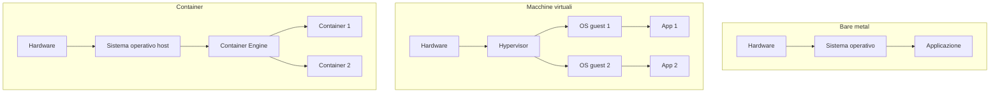

# Containerizzazione e Orchestrazione (Docker)

## Premesse: il deployment del software

Il **deployment** del software è l'insieme di tutte le attività che rendono un sistema software disponibile per l'uso (Pressman, *Software Engineering: A Practitioner's Approach*). L'esigenza generale dell'ingegneria del software è governare il deployment dei sistemi software su un'infrastruttura: un **sistema software** è composto da più componenti software interagenti (ogni componente corrisponde tipicamente a un processo), ciascuno con i propri requisiti computazionali; l'**infrastruttura** è il substrato hardware/software disponibile che supporta l'esecuzione dei componenti (hardware: CPU, memoria, storage, rete; software: sistema operativo, driver, runtime, librerie); il **deployment** consiste nell'istanziare ordinatamente i componenti sull'infrastruttura, soddisfacendo i requisiti computazionali di ciascuno e ottimizzando lo sfruttamento delle risorse infrastrutturali.

### Cosa si deploya
Si distinguono due categorie di task computazionali: i **task a vita breve** (*jobs*), che terminano naturalmente (es. elaborazione/generazione di dati, simulazioni) — sono algoritmi puri che accettano dati in input e/o producono dati in output, senza richiedere intervento esterno per terminare; il workflow tipico è: l'utente fornisce codice e dati di input, avvia il task, è interessato a ottenere i dati di output (il parallelismo può velocizzare i calcoli). I **task a vita lunga** (*services*), invece, non sono pensati per terminare automaticamente (a meno di un arresto esplicito) — sono cicli infiniti in attesa di richieste, da servire il prima possibile; l'interattività è un aspetto chiave (i client interagiscono col servizio, che reagisce alle loro richieste; i client possono essere umani o altri componenti software); il workflow tipico è: l'utente fornisce codice e uno script di automazione del deployment, avvia il task, è interessato a interagire col servizio (shell, GUI, browser...); il parallelismo qui supporta la replicazione (tolleranza ai guasti, load balancing, scalabilità).

### Contesto di esecuzione e necessità di incapsulamento
Indipendentemente dalla durata, i task computazionali possono richiedere risorse di vario tipo: capacità hardware specifiche (CPU veloci/multi-core, GPU per parallelismo, RAM, storage grande/veloce, connessioni di rete veloci), sistemi operativi o architetture specifiche, piattaforme runtime specifiche (JVM, Python, .NET...), componenti infrastrutturali specifici (database, reverse proxy, load balancer, broker...), librerie specifiche (CUDA, numpy...).

Perché non configurare semplicemente macchine "bare-metal" per ospitare i task? Le motivazioni per l'incapsulamento sono: il bisogno di **multi-tenancy** (condivisione delle risorse computazionali — si hanno meno macchine che applicazioni, e si vuole disaccoppiare le applicazioni dalle macchine; componenti diversi possono avere requisiti HW/SW incompatibili); il bisogno di **isolamento** (prevenire interazioni spurie tra tenant diversi, requisito comune in scenari multi-tenant); il bisogno di **formalizzare/controllare/riprodurre** l'ambiente computazionale delle applicazioni (la formalizzazione è un prerequisito per l'automazione, l'automazione abilita controllo e scala); il bisogno di **automatizzare il deployment** in ambienti di produzione/test (beneficio immediato per gli ingegneri); il bisogno di **flessibilità** nel ri-deployment e di **scalabilità** (minimizzazione dello sforzo per l'avvio o il trasferimento delle applicazioni).

Serve quindi un'abstraction che incapsuli applicazioni e ambiente computazionale in un'unica unità — l'**incapsulamento** è l'occultamento dei dettagli implementativi di un componente ai suoi client, che interagiscono solo tramite un'interfaccia chiara.

## Come ottenere l'incapsulamento: VM vs container



**Macchine virtuali e hypervisor (VMH)**: l'hypervisor gira sull'OS (o come OS) di una macchina bare-metal, abstraendo le peculiarità hardware/software; le VM hanno risorse hardware/software virtualizzate, diverse da quelle dell'host. L'hypervisor può istanziare più VM sulla stessa macchina fisica, partizionando le risorse reali in anticipo; ogni VM esegue il proprio OS e può ospitare più applicazioni (agli occhi dell'utente, la VM è indistinguibile da una macchina bare-metal). Le VM possono essere sospese, "fotografate" (snapshot in un file contenente l'intero filesystem), riprese, ed eventualmente migrate. Sono unità di incapsulamento a grana grossa: pesanti (GB), lente da avviare/eseguire/migrare/fotografare, comunemente incapsulano più componenti a livello applicativo (database, server e tutti i loro runtime/librerie). Tecnologie diffuse: VMWare, VirtualBox, KVM, Xen, Hyper-V, QEMU, Proxmox.

**Container e container engine (CE)**: il CE gira sull'OS di una macchina bare-metal/virtuale, abstraendo runtime, storage e ambiente di rete — CPU, memoria, kernel del sistema operativo, driver e hardware non sono virtualizzati. Si possono istanziare più container sulla stessa macchina, condividendo dinamicamente le risorse reali (con supporto all'overbooking); ogni container condivide il kernel dell'OS dell'host, pur avendo i propri runtime, storage e funzionalità di rete (agli occhi dell'utente, il container è un processo che gira sopra un OS minimale). Ogni container è istanza di un'**immagine**, un template read-only con istruzioni di deployment; le differenze rispetto a quell'immagine costituiscono lo stato del container, che può essere fotografato in un file di dimensione minima. I container sono unità di incapsulamento a grana fine: leggeri (MB), veloci da avviare/eseguire/fotografare, comunemente incapsulano un singolo componente a livello applicativo (es. un'istanza di database, un'istanza di web server — l'applicazione finale dovrebbe consistere di più container che comunicano tra loro). Tecnologie diffuse: Docker, LXC, LXD, Podman.

I container forniscono isolamento del runtime senza replicazione del sistema operativo — si potrebbero descrivere come "macchine virtuali leggere", anche se concettualmente sono più vicini a processi confinati che a vere VM.

### Scalare al livello cluster
Un **cluster** è un insieme di macchine configurate in modo simile (detti **nodi**), interconnesse via rete per sfruttarne congiuntamente la potenza computazionale. Gli utenti vogliono deployare le proprie applicazioni sul cluster tramite un singolo punto di accesso (es. una dashboard web o una CLI); il deployment deve allocare i task sul cluster efficientemente, soddisfacendo i requisiti computazionali, bilanciando il carico tra i nodi e facendo corrispondere i requisiti alle capacità effettive dei nodi. Tecnologie IaaS (Infrastructure-as-a-Service) supportano il deployment di task sul cluster come VM (es. OpenStack, VSphere); gli **orchestratori di container** supportano il deployment come container (es. Kubernetes, Docker Swarm).

### Perché i container?
Rispetto alle VM: incapsulamento più fine; più rapidi da avviare, fermare, fotografare, migrare; più modulari e scalabili; utili per DevOps e CI/CD; molto probabilmente, sono il futuro del cloud computing.

### Containerizzazione vs orchestrazione
La **containerizzazione** è il processo di incapsulare un'applicazione in un container; l'**orchestrazione** è il processo di deployare uno o più container su una o più macchine. La containerizzazione è un prerequisito per l'orchestrazione; sono coinvolte due sintassi distinte: una per containerizzare (creare immagini), una per orchestrare (deployare container).

### Abstraction principali

| Livello | Concetto | Descrizione |
|---|---|---|
| Incapsulamento | Container | Sandbox per eseguire un processo e il suo ambiente computazionale |
| Incapsulamento | Image | Template per creare container |
| Incapsulamento | Layer | Singolo step, cacheable, nella creazione di un'immagine |
| Incapsulamento | Host | Macchina che ospita i container |
| Incapsulamento | Registry | Repository di immagini (eventualmente esterno rispetto all'host) |
| Incapsulamento | Network | Rete virtuale per connettere i container (tra loro e con l'host) |
| Incapsulamento | Volume | Ponte per condividere dati tra container e host |
| Incapsulamento | Engine (daemon) | Software sull'host che gestisce container, immagini, volumi, layer, reti |
| Orchestrazione | Cluster | Insieme di macchine unite dallo stesso orchestratore |
| Orchestrazione | Node | Una macchina nel cluster (ognuna agisce da host, eseguendo il container engine) |
| Orchestrazione | Service | Insieme di replicas dello stesso container |
| Orchestrazione | Stack | Insieme di servizi inter-relazionati |
| Orchestrazione | Secret | Informazione cifrata da rendere disponibile sui container |

### Le componenti di Docker
**Docker** è la tecnologia di containerizzazione più famosa, in realtà composta da diversi componenti: **Docker Engine** (il container engine che gestisce container e immagini localmente), **Docker CLI** (l'interfaccia a riga di comando — quella che si usa effettivamente), **Docker Desktop** (una GUI per Docker Engine, principalmente per ispezione), **Docker Hub** (il registry di default per le immagini Docker, disponibile online), **Docker Compose** (orchestrazione di container su una singola macchina), **Docker Swarm** (orchestrazione di container su un cluster di macchine).

## Configurare Docker localmente

1. Installare Docker (https://docs.docker.com/engine/install/, di solito disponibile via package manager).
2. [Solo Linux] Aggiungere il proprio utente al gruppo `docker`: `sudo usermod -aG docker $USER` (richiede logout/login).
3. Abilitare e avviare il servizio Docker (su Linux: `sudo systemctl enable docker; sudo systemctl start docker`; su macOS/Windows: avviare Docker Desktop).
4. Testare l'installazione: `docker run hello-world`.
5. Esplorare i sottocomandi disponibili con `docker --help` — struttura generale del comando: `docker <resource> <command> <options> <args>` (a volte, se ovvio, `<resource>` può essere omesso).

## Eseguire container

```bash
docker pull adoptopenjdk      # 1. scarica un'immagine
docker run adoptopenjdk       # 2. esegue un container
```
Ogni immagine fornisce un comando di default; eseguendo senza opzioni si lancia tale default in un terminale non interattivo. La modalità interattiva si ottiene con `-i`; un comando custom dentro il container si specifica scrivendolo dopo il nome dell'immagine (es. `docker run -i adoptopenjdk bash`, con eventuali parametri a seguire); l'opzione `-t` esegue in uno pseudo-tty (sempre usata insieme a `-i`); `--rm` rimuove il container dopo l'uso.

### Interazione col mondo esterno
Un container Docker gira isolato rispetto all'host e agli altri container: variabili d'ambiente, porte di rete e cartelle del filesystem non sono condivise di default. La condivisione deve essere esplicita, tramite opzioni dopo `docker run`: passaggio di variabili d'ambiente (`-e <nome>=<valore>`); montaggio di volumi (`-v <host>:<guest>:<opzioni>`, dove `<host>` è il percorso/nome del volume sull'host e `<guest>` la posizione di montaggio nel container, con opzioni come `rw`/`ro`); pubblicazione di porte (`-p <host>:<guest>`).

### Gestire le immagini
Ogni immagine ha un ID univoco e può avere un tag associato. `docker images` (o `docker image ls`) elenca le immagini scaricate; `docker image prune` rimuove le immagini non utilizzate; `docker image rm` rimuove immagini per nome; `docker image tag` associa un tag a un'immagine.

## Creare immagini Docker

Le immagini Docker si scrivono in un **Dockerfile**: ogni comando dentro il file genera un nuovo layer; lo stack finale di layer crea l'immagine finale; il comando `docker build` interpreta i comandi del Dockerfile producendo la sequenza di layer; modifiche a un layer non invalidano i layer precedenti.

```dockerfile
# Pulls an image from docker hub with this name. Alternatively, "scratch" can be used for an empty container
FROM alpine:latest
# Runs a command
RUN apk update; apk add nodejs npm
# Copies a file/directory from the host into the image
COPY path/to/my/nodejs/project /my-project
# Sets the working directory
WORKDIR /my-project
# Runs a command
RUN npm install
# Adds a new environment variable
ENV SERVICE_PORT=8080
# Exposes a port
EXPOSE 8080
# Configures the default command to execute
CMD npm run service
```
Si costruisce con `docker build -t <tag> PATH`, dove `PATH` è il percorso host che contiene il Dockerfile. Tipicamente la cartella conterrà anche un file `.dockerignore` (lista di percorsi da escludere dal contesto di build, es. `node_modules/`) e i file del progetto stesso (es. `package.json`, `index.mjs` per un'applicazione Node/Express che legge la porta da una variabile d'ambiente `SERVICE_PORT`).

### Layer e caching
Ogni riga del Dockerfile genera un nuovo layer, che è un diff rispetto al precedente: Docker tiene traccia di cosa viene aggiunto all'immagine a ogni passo. Quando il Dockerfile viene buildato, Docker verifica se quel layer è già stato costruito in passato: in tal caso riusa il layer dalla cache e salta l'esecuzione del comando corrispondente. Quando il container viene eseguito, i layer dell'immagine sono read-only, e il container ha un layer read-write sopra di essi: quando il container viene fermato, il layer read-write viene scartato e i layer dell'immagine vengono mantenuti — lo spazio occupato dal container è quindi minimo.

### Naming, publishing e CI
Il naming delle immagini avviene tramite tag, assegnabili al momento della build con `-t` (ripetibile per assegnare più tag): `docker build -t "myImage:latest" -t "myImage:0.1.0" /path/to/Dockerfile`. `latest` identifica di solito la versione più recente. Le immagini si pubblicano nei registry: il più famoso, gratuito per immagini pubbliche, è Docker Hub (registry di default per pull e push); richiede registrazione e login (`docker login docker.io`), poi `docker push <image name>`.

Come ogni altro software, le immagini Docker custom dovrebbero essere costruite in CI: diversi integratori usano container come ambienti di build (è possibile costruire un container usando un container — non c'è limite intrinseco al nesting). Esempi: Docker-in-Docker (`docker run --privileged --rm -it docker:dind`), oppure usare la CLI Docker in un container (`docker run -it --rm docker:cli`).

## Volumi

I **volumi** sono ponti tra il filesystem dell'host e quello del container, utili per: condividere dati tra host e container, persistere i dati dei container, condividere dati tra container.

| Tipo | Descrizione |
|---|---|
| **Bind mount** | Una directory dell'host viene montata nel container (`<host path>:<guest path>`, entrambi percorsi assoluti, es. `docker run -v /home/user/my-project:/my-project ...`). I dati scritti su `<guest path>` sono accessibili su `<host path>` anche dopo che il container è stato fermato/eliminato. |
| **Named volume** | Drive virtuali gestiti da Docker, creati con `docker volume create <name>`, montati come `<name>:<guest path>`; la durata dei loro contenuti è indipendente da qualsiasi container; sono di fatto directory sul filesystem dell'host gestite da Docker (`/var/lib/docker/volumes/<name>/_data`). |
| **Tmpfs mount** [solo Linux] | Filesystem temporaneo, vive solo quanto il container; montato come `tmpfs:<guest path>`; utile per dati temporanei (non per condivisione/persistenza); creato con l'opzione `--tmpfs <guest path>` di `docker run`. |

**Esempio: i dati dei container sono effimeri** — aprendo una shell in un container Alpine, creando un file in `/data`, uscendo, e riaprendo un *nuovo* container, il file non esiste più: il secondo `docker run` ha creato un nuovo container con un nuovo layer read-write vuoto.

**Bind mount tra container**: si possono lanciare più container che scrivono concorrentemente in una cartella condivisa dell'host tramite bind mount (es. 10 container Alpine che scrivono ciascuno un file con dati casuali in `./shared/`). Da notare: i file risultano posseduti da `root` sia dentro che fuori dal container (anche se l'utente host non ha privilegi di superuser, potrebbe non riuscire a eliminarli); i bind mount richiedono percorsi assoluti (da cui la necessità di `$(pwd)`).

**Named volume**: si crea con `docker volume create my-volume` e si referenzia con `-v my-volume:/data ...`. I dati sono accessibili sia da un altro container attaccato allo stesso volume, sia direttamente dall'host ispezionando il filesystem nel percorso indicato da `docker volume inspect my-volume` (campo `Mountpoint`, tipicamente `/var/lib/docker/volumes/<name>/_data`).

**Pulizia dei volumi**: i volumi NON vengono eliminati automaticamente quando i container vengono rimossi; vanno eliminati esplicitamente con `docker volume rm <volume name>` (attenzione: elimina tutti i dati contenuti).

### Container "sudo-powered"
A volte si vuole far accedere un container al Docker daemon del proprio host (utile per container che a loro volta creano/eliminano altri container, gestiscono immagini, ecc.). Si può sfruttare un bind mount per condividere il socket del Docker daemon con il container: il daemon è un servizio in ascolto su un socket Unix, reificato come file (`/var/run/docker.sock`); il comando `docker` è solo una CLI che legge/scrive su quel socket. Basta creare un container con la CLI Docker installata e condividere il socket dell'host tramite bind mount:
```bash
docker run -it --rm -v /var/run/docker.sock:/var/run/docker.sock --name sudo docker:cli sh
```
Dentro quel container si può eseguire `docker` normalmente per governare il daemon dell'host (es. `docker ps`).

## Reti

Docker può virtualizzare le funzionalità di rete dei container (interfacce di rete, indirizzi IP, porte di livello 4), utile per far comunicare i container con qualsiasi entità esterna (tipicamente altri container o l'host). Le reti sono entità virtuali gestite da Docker, che imitano la nozione di rete di livello 3; agli occhi del singolo container sono interfacce di rete virtuali, e nel complesso delimitano lo scope di comunicazione dei container.

| Driver | Descrizione |
|---|---|
| `none` | Nessuna funzionalità di rete: il container è isolato. Utile per container che non devono esporre servizi né accedere a Internet (situazione rara). |
| `host` | Nessuna isolazione tra container e host: il container usa direttamente le funzionalità di rete dell'host (stesso IP — alta probabilità di collisione di porte). |
| `bridge` (default) | Rete virtuale interna all'host, che fa comunicare più container tra loro. Ogni container riceve un IP privato (tipicamente nel range `172.x.y.z`), contattabile dall'host. |
| `overlay` | Rete virtuale che si estende su più host, facendo comunicare container su nodi diversi dello stesso cluster. |

**Esempio bridge network**: creando un container con `--network bridge` (default) si può ispezionare il suo IP con `docker inspect <nome> | grep IPAddress` e contattarlo dal browser dell'host. Da notare: il container non è risolvibile per hostname dall'host (nessuna risoluzione DNS host-specifica per i container); non è contattabile per IP da un altro host nella stessa LAN (le reti bridge sono specifiche dell'host).

**Scenario non banale a due container** (es. Docker-in-Docker + CLI sulla stessa rete `my-network`):
```bash
docker network create --driver bridge my-network
docker run --privileged -d --rm --network my-network --name dind --hostname docker:dind dockerd --host=tcp://0.0.0.0:2375
docker run -it --rm --network my-network --hostname cli docker:cli
# dentro cli: ping dind funziona (risoluzione DNS interna alla rete)
# dentro cli: docker ps funziona solo se il daemon è raggiungibile sull'hostname "docker" atteso dall'immagine docker:cli
```
È buona norma usare sempre lo stesso valore per `--name` e `--hostname`, per evitare confusione.

### Esposizione delle porte
Quando un container espone un servizio su una porta di livello 4, questa non è accessibile dall'esterno a meno che non sia esplicitamente esposta. In fase di creazione dell'immagine, il comando `EXPOSE` nel Dockerfile dichiara le porte esposte per default (es. `EXPOSE 8080`); le porte esposte si vedono in `docker ps` (colonna PORTS). In fase di esecuzione, l'opzione `-P` mappa tutte le porte `EXPOSE`d a porte casuali dell'host; l'opzione `-p <host port>:<guest port>` controlla esplicitamente la mappatura (es. `docker run -d --rm -p 8888:8080 my-service`).

## Orchestrazione con Docker Compose

Operare manualmente i container è laborioso ed error-prone. **Docker Compose** aumenta il livello di abstrazione sulla singola macchina: partendo da una specifica dello "stack" fornita dall'utente (un insieme di container, immagini, ambiente, dipendenze), Compose può avviare ordinatamente i container creando tutte le reti/volumi richiesti, e arrestarli gracefully quando necessario. L'unica cosa che l'utente deve fare è creare un file `docker-compose.yml` seguendo la specifica ufficiale.

### Esempio di sintassi
```yaml
version: 3.9
services:
  frontend:
    image: example/webapp
    depends_on:
      - backend           # avviato DOPO che backend è "healthy"
    environment:
      SERVICE_PORT: 8043
      DB_HOST: backend
      DB_PORT: 3306
    ports:
      - "443:8043"
    networks:
      - front-tier
      - back-tier
    configs:
      - source: httpd-config
        target: /etc/httpd.conf
    secrets:
      - server-certificate
      - db-credentials

  backend:
    image: example/database
    healthcheck:
      test: ["CMD", "command", "which", "should", "fail", "if", "db not healthy"]
      interval: 1m30s
      timeout: 10s
      retries: 3
      start_period: 40s
    volumes:
      - db-data:/etc/data
    networks:
      - back-tier
    secrets:
      - db-credentials

volumes:
  db-data:
    driver_opts:
      type: "none"
      o: "bind"
      device: "/path/to/db/data/on/the/host"

configs:
  httpd-config:
    file: path/to/http/configuration/file/on/the/host

secrets:
  server-certificate:
    file: path/to/certificate/file/on/the/host
  db-credentials:
    external: true
    name: my-db-creds

networks:
  front-tier: {}
  back-tier: {}
```

### Concetti a livello di orchestrazione
Uno **stack** è un insieme di servizi, reti, volumi, secret e config inter-relazionati, tutti definiti in un unico file `docker-compose.yml`, tutti creati/eliminati/aggiornati/avviati/fermati insieme. Un **service** è una definizione astratta di una risorsa computazionale che può essere scalata o sostituita indipendentemente dagli altri componenti dell'applicazione; è supportato da un insieme di container, eseguiti dall'orchestratore secondo requisiti di replicazione e vincoli di posizionamento; tutti i container di un servizio sono creati identicamente con gli stessi argomenti.

I **config** sono file contenenti dati di configurazione che possono essere iniettati nei servizi al momento dell'istanziazione, permettendo di configurare il comportamento dei servizi senza dover (ri)costruire una (nuova) immagine; sono file read-only montati nei container come dei volumi read-only.

I **secret** sono config contenenti dati sensibili da mantenere riservati (Docker rende più difficile l'ispezione del loro contenuto). Sia config che secret possono essere creati a livello di stack a partire da un file locale (o, per i secret, da una variabile d'ambiente dell'host), oppure creati manualmente con `docker config create`/`docker secret create` e referenziati come `external: true` in più file `docker-compose.yml`. Nota importante: agli occhi del container, secret e config sono semplicemente file read-only montati su un certo percorso (di default i secret in `/run/secrets/<secret_name>`) — l'applicazione containerizzata deve essere programmata per leggerli da quel percorso (idealmente configurabile, es. tramite variabili d'ambiente).

I **volumi** in Compose non differiscono da quelli già discussi; possono essere creati a livello di stack da una cartella locale dell'host, da uno share NFS remoto, oppure manualmente con `docker volume create` e referenziati come `external: true`. Le **reti** in Compose analogamente non differiscono da quelle discusse; il driver `overlay` è la scelta di default in Swarm.

### Comandi Docker Compose
`docker compose up` avvia lo stack (lo crea se non presente, lo aggiorna se presente ma non aggiornato, non fa nulla se già aggiornato) — flag utili: `-d` (modalità detached), `--wait` (attende che i servizi siano running/healthy, implica detached). `docker compose down` ferma lo stack — flag utili: `--remove-orphans` (rimuove container di servizi non più definiti nel file Compose), `-v` (rimuove anche i volumi nominati e quelli anonimi). Tutti i comandi assumono la presenza di un `docker-compose.yml` nella directory di lavoro corrente.

### Esempio funzionante: WordPress + MariaDB
```yaml
version: "3.9"
services:
  db:
    image: mariadb:latest
    command: '--default-authentication-plugin=mysql_native_password'
    volumes:
      - db_data:/var/lib/mysql
    restart: always
    networks:
      - back-tier
    environment:
      MYSQL_ROOT_PASSWORD: "..Password1.."
      MYSQL_DATABASE: wordpress_db
      MYSQL_USER: wordpress_user
      MYSQL_PASSWORD: ",,Password2,,"
    healthcheck:
      test: [ "CMD", "healthcheck.sh", "--su-mysql", "--connect", "--innodb_initialized" ]
      start_period: 1m
      interval: 1m
      timeout: 5s
      retries: 3
  wordpress:
    depends_on:
      - db
    image: wordpress:latest
    volumes:
      - wordpress_data:/var/www/html
    ports:
      - "8000:80"
    restart: always
    networks:
      - back-tier
    environment:
      WORDPRESS_DB_HOST: db:3306
      WORDPRESS_DB_USER: wordpress_user
      WORDPRESS_DB_PASSWORD: ",,Password2,,"
      WORDPRESS_DB_NAME: wordpress_db
volumes:
  db_data: {}
  wordpress_data: {}
networks:
  back-tier: {}
```
Nota: le password in chiaro nell'`environment` sono insicure. Versione più sicura, usando i **secret** invece delle variabili d'ambiente in chiaro:
```yaml
services:
  db:
    environment:
      MYSQL_ROOT_PASSWORD_FILE: /run/secrets/db_root_password
      MYSQL_PASSWORD_FILE: /run/secrets/db_password
    secrets:
      - db_root_password
      - db_password
  wordpress:
    environment:
      WORDPRESS_DB_PASSWORD_FILE: /run/secrets/db_password
    secrets:
      - db_password
secrets:
  db_password:
    file: db_password.txt
  db_root_password:
    file: db_root_password.txt
```

### Docker Compose per il testing
Compose è utile anche per il testing del software, ad esempio quando il sistema sotto test si appoggia su componenti infrastrutturali (database, message broker, cache...). Workflow tipico: (1) avviare il componente; (2) eseguire il sistema sotto test; (3) fermare il componente — Compose può essere abbinato a un framework di test per automatizzare il processo (es. metodi `@BeforeClass`/`@AfterClass` in JUnit che invocano comandi `docker compose` tramite `ProcessBuilder` per avviare/fermare un'istanza di MariaDB usata da un repository SQL, testando poi le operazioni CRUD del repository).

## Orchestrazione con Docker Swarm

### Costruire il cluster
In un cluster Docker Swarm esistono due tipi di nodi: i **manager**, che coordinano il cluster tramite il protocollo di consenso RAFT (possono anche fare da worker), e i **worker**, che eseguono semplicemente container. Per impostare un cluster: (1) inizializzare la modalità Swarm su un nodo a scelta (diventerà il primo manager); (2) opzionalmente, far entrare altri nodi come worker; (3) opzionalmente, promuovere alcuni worker a manager (operazione possibile solo da un client connesso a un nodo manager; è meglio avere più manager per ridondanza, in numero dispari, es. 3, 5, 7).

```bash
# sul primo nodo
docker swarm init
# output: comando da eseguire sugli altri nodi per entrare nel cluster
# docker swarm join --token <SECRET_TOKEN> <NODE_ADDRESS>:2377

# su ciascun altro nodo
docker swarm join --token <SECRET_TOKEN> <NODE_ADDRESS>:2377

# dal nodo manager
docker node ls                          # ispeziona la composizione del cluster
docker node promote <NODE_ID>           # promuove un worker a manager
docker node demote <NODE_ID>            # retrocede un manager a worker
docker node rm <NODE_ID>                # rimuove un nodo dal cluster
docker swarm leave --force              # lascia lo swarm
```

**Possibili problemi**: un firewall che blocca la comunicazione tra nodi (sintomo: `docker swarm join` resta in attesa o fallisce per timeout — vanno aperte le porte tipiche 2377/tcp, 7946/tcp, 7946/udp, 4789/udp); oppure, su Windows/Mac, il Docker daemon gira su una macchina virtuale con un IP diverso da quello della macchina fisica (va configurato il redirect del traffico Swarm dall'IP reale verso l'IP della VM, e usare l'IP reale quando altri nodi eseguono il join).

### Deployare stack su Swarm
```bash
docker stack deploy -c <COMPOSE_FILE_PATH> <STACK_NAME>   # da un client connesso a un nodo manager
docker stack ls
docker stack ps <STACK_NAME>
docker stack services <STACK_NAME>
docker stack rm <STACK_NAME>
```
La semantica del deployment di uno stack su Swarm differisce da Compose: servizi diversi possono essere allocati su nodi diversi; i servizi possono essere replicati su nodi diversi; le reti devono usare il driver `overlay` per supportare la comunicazione inter-nodo tra container.

### Esempio: Portainer
**Portainer** è una dashboard web per l'amministrazione del cluster (funziona sia con Docker Swarm che con Kubernetes), composta da due servizi: `webservice` (la dashboard) e `agent` (un servizio eseguito su ogni nodo, che espone l'API Docker al webservice).
```yaml
version: '3.2'
services:
  agent:
    image: portainer/agent:latest
    volumes:
      - /var/run/docker.sock:/var/run/docker.sock
      - /var/lib/docker/volumes:/var/lib/docker/volumes
    networks:
      - agents_network
    deploy:
      mode: global    # una (e solo una) replica per nodo
  webservice:
    image: portainer/portainer-ce:latest
    command: -H tcp://tasks.agent:9001 --tlsskipverify
    ports:
      - "443:9443"
      - "9000:9000"
    volumes:
      - portainer_data:/data
    networks:
      - agents_network
    deploy:
      mode: replicated
      replicas: 1
      placement:
        constraints:
          - node.role == manager
networks:
  agents_network:
    driver: overlay
    attachable: true
volumes:
  portainer_data:
```
Distribuzione: `docker stack deploy -c portainer.yml portainer`, poi accesso a `https://localhost` su un nodo manager. Tramite l'interfaccia si possono osservare: nodi del cluster (Dashboard); stack/servizi in esecuzione (Services); container in esecuzione (Containers); volumi e reti presenti.

### Etichettare i nodi e vincoli di posizionamento
I nodi possono essere etichettati con coppie chiave=valore (es. `capabilities.cpu=yes`, `capabilities.web=yes`, `capabilities.storage=yes`), programmaticamente (`docker node update --label-add KEY=VALUE NODE_ID`) o via Portainer. Le etichette si usano per definire **vincoli di posizionamento** (un servizio può essere deployato solo su nodi con determinate etichette) o **preferenze di posizionamento** (le replicas di un servizio vengono distribuite tra i nodi con determinate etichette).

```yaml
services:
  db:
    deploy:
      placement:
        constraints:
          - node.labels.capabilities.storage==yes
  wordpress:
    deploy:
      placement:
        constraints:
          - node.labels.capabilities.web==yes
```

**Esposizione delle porte su Swarm**: quando un servizio espone una porta ed è deployato su Swarm, il servizio è esposto su tutti i nodi manager del cluster (oltre che dal nodo che effettivamente lo ospita) — è quindi raggiungibile da diversi URL corrispondenti ai diversi nodi.

### Replicazione dei servizi
I servizi possono essere replicati per scalabilità, load balancing, tolleranza ai guasti. Due tipi: **global** (una replica esattamente per ogni nodo) e **replicated** (N replicas, default N=1):
```yaml
services:
  service-name:
    deploy:
      mode: replicated
      replicas: N
      placement:
        constraints:
          - node.role == manager
          - node.labels.mylabel=myvalue
        preferences:
          - spread: node.labels.mylabel
        max_replicas_per_node: M
```
Si leggono N replicas del servizio, ciascuna deployata su un nodo manager con l'etichetta `mylabel=myvalue`; le replicas vengono distribuite equamente tra i nodi ammissibili, con non più di M replicas sullo stesso nodo. Le richieste verso un servizio replicato vengono inoltrate alle replicas in modo non deterministico (round-robin via il load balancer interno di Swarm).

**Volumi su Swarm**: i volumi sono sempre locali rispetto al nodo su cui è deployato il container corrente — se un servizio replicato dichiara un volume condiviso, ogni replica avrà la propria copia locale del volume sul nodo dove gira, e condividere dati realmente tra le replicas richiede strategie aggiuntive (es. storage di rete/NFS, o un volume esterno condiviso a livello di infrastruttura).
