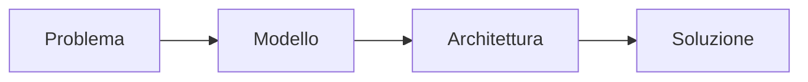
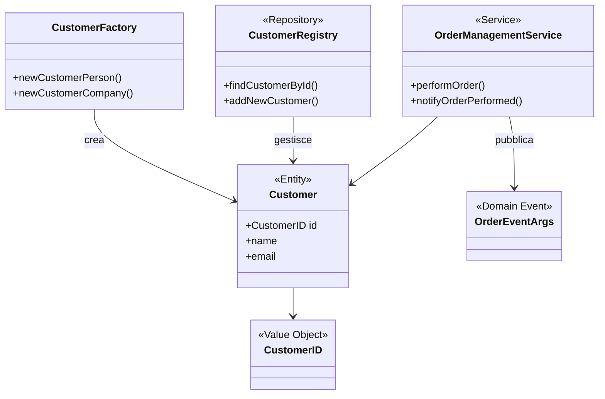
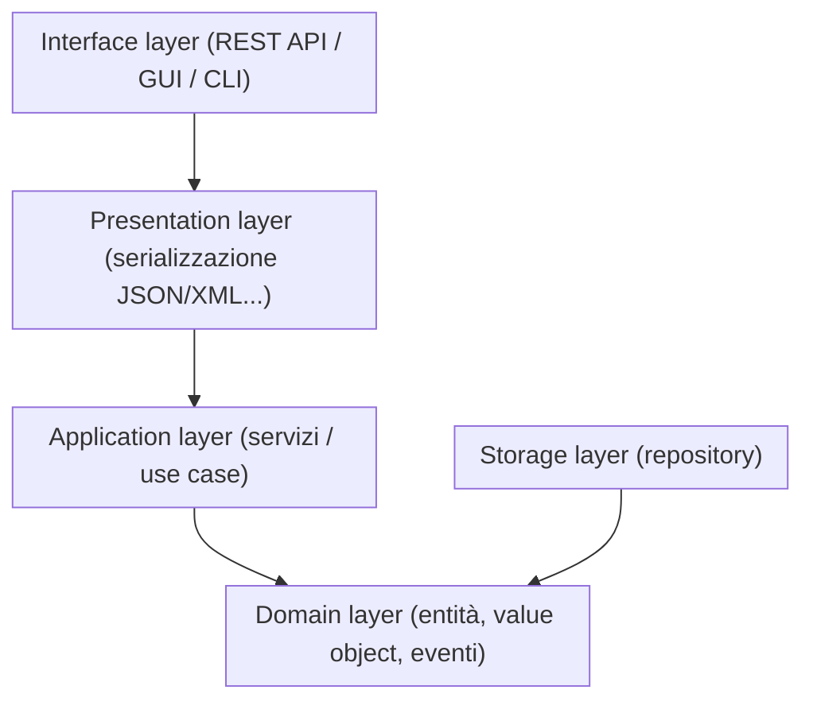
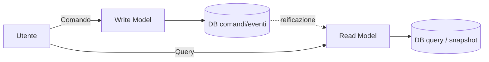

# Domain Driven Design (DDD)

## Motivazione e contesto

Si conosce già programmazione, OOP, design pattern, architetture e best practice — ma manca un **criterio** per scegliere quando e quali adottare. Il workflow di progettazione consigliato è: **Problema → Modello → Architettura → Soluzione**. La domanda chiave è: come si deriva il modello dal problema?

**Domain Driven Design (DDD)** è uno dei possibili approcci alla progettazione del software: un insieme di principi, best practice e pattern unificati sotto una filosofia comune, focalizzati sul *processo* di design oltre che sul risultato. Benefici principali:
- enfatizza l'aderenza al problema reale;
- produce un modello (e quindi una soluzione) su misura per il business;
- armonizza la comunicazione fra manager, tecnici e utenti;
- favorisce software manutenibile ed estensibile.

## Concetti principali del DDD

- **Dominio**: una sfera di conoscenza, influenza o attività ben definita (es. un'università, un'azienda, l'algebra lineare). Il focus è su come dominio ed esperti percepiscono le cose, **non** su come li percepiscono gli sviluppatori.
- **Contesto**: una porzione del dominio con un confine chiaro, che si appoggia a un sottoinsieme dei concetti del dominio, dove le parole hanno un significato unico e preciso, distinguibile dagli altri contesti.
- **Modello**: l'insieme di astrazioni software che mappano i concetti rilevanti del dominio (classi, interfacce, ecc.).
- **Linguaggio Ubiquo (Ubiquitous Language)**: un linguaggio strutturato attorno al modello di dominio, usato da tutte le persone coinvolte (esperti e sviluppatori) e riflesso nel software, in modo da preservarne la semantica. Presupposto: persone diverse (specialmente da contesti diversi) chiamano le stesse cose in modo diverso; viene tipicamente reificato in un glossario.

### Workflow concettuale del DDD

1. Identificare il dominio e dargli un nome.
2. Identificare i contesti principali nel dominio (interagendo con gli esperti).
3. Identificare il significato reale delle parole rilevanti e tracciarle in un glossario, senza dare per scontato il proprio "buon senso"; attenzione a **omonimi** (stesso nome, significati diversi) e **sinonimi** (nomi diversi, stesso significato), che possono variare tra contesti.
4. Aderire al linguaggio, usarlo, farlo proprio: il codice deve rispecchiare il linguaggio.
5. Disegnare una **context map** che tracci i contesti principali e i loro punti di contatto.
6. Modellare il software attorno al linguaggio ubiquo (regola pratica: 1 concetto → 1 interfaccia).
7. Scegliere il building block più adatto per ciascun concetto, in base alla natura del concetto/delle sue istanze.
8. Il building block scelto guida il design del tipo corrispondente.
9. La scelta di un building block può portare a identificarne altri (es. un'entità può richiedere value object come identificatori, repository per essere salvata, factory per essere creata).

## I building block del DDD

| Building block | Definizione | Caratteristiche chiave |
|---|---|---|
| **Entity** | Oggetto con un'identità esplicita | identità che non cambia mai nel ciclo di vita; può essere mutabile (stateful); equality basata sull'identità; `equals`/`hashCode` confrontano (almeno) l'identificatore |
| **Value Object** | Oggetto senza identità | identificato dai propri attributi; equality basata sugli attributi; deve essere stateless/immutabile (es. `record` Java, `data class` Kotlin/Scala/Python) |
| **Aggregate Root** | Entità composta che aggrega entità/value object correlati | garantisce la coerenza degli oggetti che contiene; fa da facciata verso l'esterno; gli oggetti esterni non dovrebbero referenziare i componenti interni di un altro aggregato (eccezione: riferimenti agli ID) |
| **Factory** | Oggetto dedicato alla creazione di altri oggetti | incapsula la logica di creazione (rendendola evolvibile/sostituibile); facilita l'enforcement degli invarianti; tipicamente identity-less e stateless |
| **Repository** | Oggetto che media la persistenza/recupero di altri oggetti | nasconde la tecnologia di storage (possibile ORM); gestisce CRUD su aggregate root; tipicamente identity-less ma **stateful** (può contenere connessioni DB) |
| **Service** | Oggetto funzionale che incapsula la logica di business | "cablano" insieme aggregate/entity/value object; espongono funzionalità coarse-grained; facciata sul dominio; tipicamente identity-less e stateless |
| **Domain Event** | Oggetto value-like che cattura un evento rilevante nel dominio | tipicamente time-stamped, immutabile; forte relazione con observer pattern, event sourcing e CQRS; consiglio pratico: usare nomi neutri (es. `OrderEventArgs` invece di `OrderPerformedEvent`, perché lo stesso tipo può rappresentare eventi diversi: emesso, confermato, cancellato...) |

Esempio guida: in un dominio "negozio", `Customer` è un'**Entity** (ha un `CustomerID`), `TaxCode`/`VatNumber` sono **Value Object**, `CustomerFactory` crea i clienti, `CustomerRegistry` è la **Repository**, `OrderManagementService` è il **Service** che gestisce l'esecuzione di un ordine e pubblica `OrderEventArgs`.

## Pattern DDD: gestione dei contesti

- **Bounded Context**: il confine di un contesto e del suo modello deve essere esplicito (per ragioni tecniche, fisiche e organizzative).
- **Context Map**: una mappa di tutti i contesti del dominio, dei loro confini e punti di contatto (dipendenze, omonimi, "falsi amici"), che dà la visione d'insieme del dominio.

Best practice: identificare chiaramente i confini, evitare la diffusione di responsabilità su un singolo contesto (un responsabile/team per contesto), non modificare il modello per problemi esterni al contesto (piuttosto creare nuovi contesti), garantire la coesione del contesto con test automatizzati (unit/integration) eseguiti il più spesso possibile.

### Pattern di integrità del modello

Quando il dominio evolve, anche il modello deve evolvere, ma il dominio cambia tipicamente in modo context-specific; i contesti sono delimitati ma non isolati, quindi i cambiamenti possono propagarsi. Ogni relazione fra due contesti ha tipicamente un'estremità **upstream** (fornisce funzionalità) e una **downstream** (dipende dall'upstream). I pattern (alternativi, scelti in base a fiducia reciproca e facilità di comunicazione tra i team) sono:

| Pattern | Quando | Idea chiave |
|---|---|---|
| **Shared Kernel** | stesso team/organizzazione/prodotto | si fattorizza una parte comune del modello condivisa tra i contesti; mantenerla il più piccola possibile |
| **Customer–Supplier** | team diversi, buona fiducia/comunicazione | l'upstream fa da fornitore, il downstream da cliente; collaborano per massimizzare l'integrazione; il fornitore avvisa prima di cambiare il modello |
| **Conformist** | team diversi, comunicazione scarsa, qualche fiducia | il downstream si conforma reattivamente ai cambiamenti dell'upstream |
| **Anti-corruption layer** | team diversi, scarsa fiducia/comunicazione (es. codice legacy) | il downstream si "difende" creando un layer che reverse-engineerizza e adatta il modello upstream (es. spesso le repository sono anti-corruption layer per la tecnologia DB) |

## Architettura a layer (esagonale)

Il DDD non impone un'architettura specifica, ma le architetture a layer si prestano bene a preservare l'integrità del modello. Lo stile di riferimento è l'**architettura esagonale**, dove i layer più esterni dipendono da quelli più interni (mai il contrario):

1. **Domain layer**: il modello di dominio (entità, value object, eventi, aggregati); nessuna dipendenza da altri layer; deve supportare un'ampia gamma di applicazioni.
2. **Application layer**: servizi che implementano la business logic per un caso d'uso specifico; dipende dal domain layer.
3. **Presentation layer**: conversione da/verso formati di rappresentazione (JSON, XML, HTML...); dipende dal domain layer (e talvolta dall'application layer).
4. **Storage layer**: persistenza dei dati di dominio (qui si implementano le repository); dipende dal domain layer.
5. **Interface layer** (ReST API, MOM, View): permette l'accesso da entità esterne (GUI, HTTP, ecc.).

Il layering può essere imposto a livello di codice mappando i layer su moduli (es. sotto-progetti Gradle, moduli Maven), ciascuno con le proprie dipendenze di build (es. `:domain`, `:application`, `:storage`, `:presentation`, `:web-api`...).

## Aspetti avanzati: Event Sourcing e CQRS

**Event Sourcing**: invece di memorizzare solo lo stato corrente di un'entità mutabile, si memorizza il **flusso di variazioni** (eventi di dominio time-stamped) che hanno portato a quello stato; lo stato corrente si ottiene "riproducendo" gli eventi. Si sposa perfettamente col DDD, dato che gli eventi di dominio sono cittadini di prima classe.

- **Vantaggi**: i dati storici possono essere analizzati (manutenzione predittiva, ottimizzazione...); situazioni passate possono essere "rigiocate" (replay, utile per debug e misurazioni); abilita il rilevamento di eventi complessi; abilita il CQRS.
- **Limiti**: vengono generati molti dati da immagazzinare; ricostruire lo stato corrente costa tempo.

**CQRS (Command-Query Responsibility Segregation)**: pattern avanzato per applicazioni altamente scalabili, che sfrutta event sourcing e architettura a layer per ottenere soluzioni reattive ed eventually-consistent. Separa il domain/application layer in:
- **Write model** (command model): accetta **comandi** che alterano lo stato del sistema (vengono validati e salvati su un DB dedicato);
- **Read model** (view/query model): accetta **query** che osservano lo stato del sistema in un dato istante (restituisce uno snapshot).

La **reificazione** dei comandi (calcolo dello stato al tempo *t* applicando i comandi registrati fino a *t*) può avvenire in tre modalità non mutuamente esclusive: **eager** (subito alla ricezione), **pull** (al momento della lettura), **push** (periodicamente in background).

## Esercizi proposti (repository `unibo-spe/ddd-exercise`)

1. **Simple Store**: dominio con clienti (persone/aziende, identificati da codice fiscale/partita IVA), prodotti (con prezzo in valuta e disponibilità) e ordini; gestione di valute e tassi di cambio. Da modellare in Java/Kotlin con entità, value object, repository, factory e servizi, organizzati secondo l'architettura esagonale; sketch di test e implementazione.
2. **Trivial CQRS**: un semplice "Counter" (long, inizialmente 0) che pubblica un evento `Variation` a ogni cambiamento. Obiettivo: passare a event sourcing (memorizzare le variazioni invece dello snapshot) e implementare CQRS separando `CounterReader` (read-model) da `CounterWriter` (write-model).
3. **Anti-corruption layer**: dominio "Tables" (contenitori 2D di `Row`, righe con valori stringa); implementare funzionalità di import/export CSV con librerie terze (Apache Commons CSV oppure OpenCSV) tramite interfacce agnostiche rispetto alla libreria specifica, senza "corrompere" il modello di dominio; stessi test per provare l'equivalenza delle due implementazioni.
