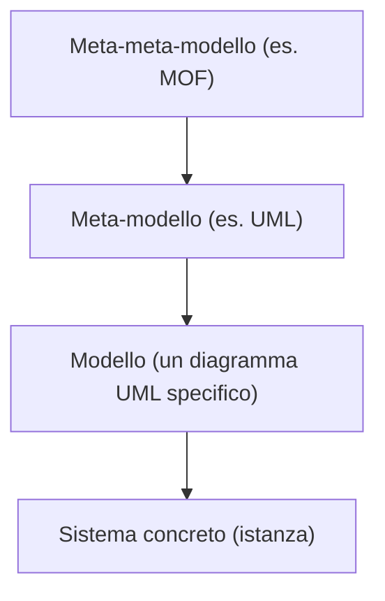
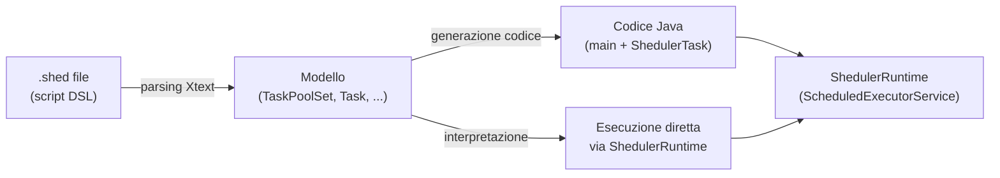

# Model Driven Development (MDD)

## Obiettivi della lezione

Comprendere il meta-modelling, comprendere i Domain Specific Language (DSL) e fare pratica di model-driven development con **Xtext**.

## Nomenclatura del meta-modelling

Per ragionare in termini di MDD è necessario distinguere quattro livelli, ciascuno espresso nel linguaggio del livello superiore:

0. **(Meta-)Linguaggio**: sintassi astratta + semantica.
1. **Modello**: descrive le entità possibili in un dominio; astrae un certo numero di sistemi simili radicati nel dominio; ogni sistema concreto è un'istanza del modello da cui è stato progettato (il modello è un *template* per più sistemi).
2. **Meta-modello**: il linguaggio astratto con cui si descrivono i modelli (es. **UML**, *Unified Modeling Language*, è il meta-modello dietro la programmazione orientata agli oggetti).
3. **Meta-meta-modello**: il linguaggio astratto con cui si descrive il meta-modello (es. **MOF**, *Meta-Object Facility*, è il meta-meta-modello dietro UML secondo l'OMG, *Object Management Group*).



**Perché i meta-modelli sono importanti**: sono la prima cosa da identificare quando ci si approccia a una nuova tecnologia — se si afferra il meta-modello, si afferra l'essenza della tecnologia (spesso condivisa da molte altre tecnologie simili). Esempio: dopo aver imparato le basi della OOP (classi, metodi, oggetti) si impara facilmente qualunque altro linguaggio OOP, chiedendosi semplicemente come ciascun elemento del meta-modello sia espresso nel nuovo linguaggio. Anche quando si modella un dominio (es. con il DDD) si sta sempre sfruttando un qualche meta-modello, consapevolmente o no.

## Model-Driven *whatever* (engineering / development / architecture)

I nomi sono tanti e simili, ma le idee chiave si possono riassumere in due punti:
1. il workflow di ingegneria del software dovrebbe partire dalla modellazione attenta del dominio (es. con il DDD), invece che concentrarsi subito su algoritmi e strutture dati;
2. la produzione dell'implementazione eseguibile dovrebbe essere automatizzata il più possibile (es. generando codice dai modelli), invece di scrivere codice a mano.

**Generazione di codice dai modelli**: presuppone che il modello sia espresso in un linguaggio formale (interpretabile da una macchina — la formalità è prerequisito dell'automazione): 1) il modello viene parsato da una macchina, 2) trasformato in un altro linguaggio formale (es. un linguaggio OO), 3) il modello trasformato viene reso in un file (es. codice sorgente). UML ha sintassi e semantica formali, ma raramente sono imposte dagli strumenti software, ed è comunque focalizzato sul software (utile solo per gli ingegneri del software).

## Domain Specific Languages (DSL)

Un **DSL** è un linguaggio di programmazione/descrizione/specifica mirato a una classe di problemi specifica (non a tutti i problemi possibili), a differenza dei **linguaggi general purpose (GPL)** che mirano al maggior numero possibile di classi di problemi. I DSL possono fungere da meta-modello "su misura" per un dato dominio.

Esempi di DSL già noti: espressioni regolari (text processing), SQL (query su DB), CSS (stile pagine web), HTML (contenuto pagine web), DOT (visualizzazione grafi, implementazione tipica Graphviz), PlantUML (visualizzazione diagrammi UML), Gherkin (test BDD, "Given/When/Then", implementazione tipica Cucumber — linguaggio quasi naturale che permette a stakeholder e ingegneri di concordare specifiche comportamentali), VHDL (descrizione di hardware: "variabili" sono segnali, "funzioni" sono circuiti, tradotto in circuiti reali da strumenti come Xilinx Vivado), DSL per contabilità finanziaria (descrivere tasse, contributi pensionistici, calcoli finanziari in modo dichiarativo).

### Benefici dell'adozione di un DSL
1. Comunicare con gli esperti di dominio nel loro linguaggio.
2. Permettere agli esperti di dominio di scrivere essi stessi le specifiche (il modello) del sistema, riducendo le ambiguità.
3. Concentrarsi sul dominio piuttosto che sull'implementazione.
4. Nascondere i dettagli implementativi agli esperti di dominio.

### DSL vs. GPL

| Aspetto | GPL | DSL |
|---|---|---|
| Dominio | qualsiasi | confine chiaro |
| Costrutti sintattici | molti e componibili | pochi e statici |
| Espressività | Turing-completo | spesso meno che Turing-completo |
| Personalizzabilità | massimizzata | minimizzata/confinata/assente |
| Definito da | aziende o comitati | team di esperti di dominio |
| Base utenti | grande, anonima, diffusa | piccola, accessibile, locale |
| Evoluzione | lenta, ben strutturata | veloce |
| Deprecazione | molto lenta | rapida, spesso brusca |

I DSL non sostituiscono i GPL: sono complementari.

## DSL Engineering

La **semantica** di un DSL (come funziona, a differenza della sintassi, come appare) si dà tipicamente attraverso tre aspetti: 1) conversione in codice eseguibile (traduzione o interpretazione), 2) che sfrutta un **execution engine** (libreria con le funzionalità del DSL), 3) il quale a sua volta si appoggia su una piattaforma software (es. JVM, .NET).

**Conversione in codice eseguibile** — due approcci principali:
- **Traduzione**: lo script DSL viene tradotto in un linguaggio per cui esiste già un execution engine sulla piattaforma target. Si parla di *code generation/transpilation* se il target è alto livello (es. Xtend e TypeScript sono GPL ma trasposti rispettivamente in Java e JS), di *compilazione* se il target è basso livello (es. Java compilato in bytecode JVM).
- **Interpretazione**: l'execution engine parsa ed esegue lo script DSL direttamente (*runtime interpretation/compilation* se l'engine compila lo script DSL in codice eseguibile — es. 2P-Kt, un GPL interpretato da un engine custom scritto in Kotlin che gira sulla JVM).

In entrambi i casi servono: un parser per la sintassi del DSL e un execution engine per la piattaforma target.

### DSL esterni vs. interni

- **DSL esterno**: sintassi totalmente custom, richiede un parser dedicato (es. tutti gli esempi visti sopra, e lo Sheduler DSL con Xtext).
- **DSL interno (embedded)**: la sintassi è un sottoinsieme di un GPL preesistente abbastanza flessibile da permettere personalizzazione (es. Kotlin, Groovy, Scala con costrutti ad hoc: trailing-lambda, infix notation, operator overloading). Esempi: il Kotlin DSL di Gradle (`build.gradle.kts`), SBT. I DSL interni semplificano l'ingegnerizzazione (niente parser/toolkit custom da scrivere e mantenere, si riusano quelli del GPL), ma l'integrazione col GPL è stretta: il DSL può sfruttarne i costrutti (desiderabile) ma resta tecnologicamente e sintatticamente legato ad esso (indesiderabile).

In ogni caso, interno o esterno, tradotto o interpretato, il DSL necessita di un execution engine — non diverso da una qualunque libreria che supporta un dato dominio.

## MDD in pratica: strumenti

- **Eclipse Xtext**: lo strumento più diffuso per MDD ed in particolare per DSL esterni.
- **JetBrains MPS**: principale concorrente di Xtext.
- **Langium**: un clone di Xtext basato su TypeScript.
- **ANTLR**: solo generazione di parser (Java, JS, Python, .NET, C++).
- **Language Server Protocol (LSP)**: protocollo standard de-facto fra IDE, fornisce funzionalità IDE "as-a-service", rendendo più facile supportare più IDE per lo stesso linguaggio — caratteristica imprescindibile per qualunque tool MDD.

**Xtext** è un framework per MDD (in particolare DSL esterni) che fornisce un linguaggio per definire linguaggi, che è esso stesso un linguaggio di meta-modellazione: meta-modellazione e definizione del DSL avvengono simultaneamente. Genera automaticamente l'intera infrastruttura del linguaggio: interfacce/classi del modello (compatibili EMF), parser, validatore (con regole pluggable), stub del transpiler, scoping (con regole pluggable), supporto IDE via LSP, syntax highlighting, stub di test.

## Esempio guidato: il linguaggio "Sheduler" (task scheduling)

Dominio: gli utenti vogliono pianificare l'esecuzione di comandi su una macchina (via shell), specificando il momento dell'esecuzione in modo relativo (es. "fra 5 minuti"), assoluto (es. "domani alle 12:00"), prima/dopo un altro task, o periodicamente; i task possono essere interdipendenti.

Passi del progetto (repository: `github.com/unibo-spe/sheduler-lang`):
1. definire il dominio e contemporaneamente la sintassi del DSL con il linguaggio di meta-modellazione di Xtext (file `.xtext`);
2. aggiungere regole di scoping e validazione tramite il framework Xtext;
3. progettare e implementare l'execution engine (in Java, sfruttando `ScheduledExecutorService` per la pianificazione e `ProcessBuilder` per l'esecuzione dei comandi via shell);
4. creare un generatore di codice Java a partire dal DSL.

### Struttura del progetto Xtext

```
sheduler-lang/
├── it.unibo.spe.mdd.sheduler/        ← dominio + linguaggio (Sheduler.xtext, GenerateSheduler.mwe2)
├── it.unibo.spe.mdd.sheduler.ide/    ← supporto IDE via LSP (generato)
└── it.unibo.spe.mdd.sheduler.web/    ← playground web (generato)
```

I due file chiave nel progetto principale: `Sheduler.xtext` (grammatica/modello del dominio) e `GenerateSheduler.mwe2` (configura la generazione automatica di scoping, validazione, generazione codice, test). Task Gradle rilevanti: `generateXtextLanguage` (genera l'infrastruttura del linguaggio, eseguito automaticamente prima della compilazione), `shadowJar` (jar eseguibile per il server LSP), `jettyRun` (avvia il playground web per testare il linguaggio interattivamente).

La grammatica Xtext (estratto semplificato) definisce: `TaskPoolSet` (insieme di `pool`), `TaskPool` (insieme di `Task`), `Task` (comando, entry point shell, tempo relativo/assoluto/before/after, periodicità). Da questa grammatica, Xtext genera automaticamente le interfacce/classi del modello (es. `Task`, `TaskPool`, `AbsoluteTime`, `RelativeTime`...).

**Regole di validazione**: si definiscono nella classe generata `ShedulerValidator`, con metodi annotati `@Check` (il nome del metodo non conta, conta solo il tipo del parametro e l'annotazione). `@CheckType` può essere `FAST` (ad ogni modifica), `NORMAL` (default, al salvataggio) o `EXPENSIVE` (su richiesta esplicita). Si usa `error(...)` o `warning(...)` per segnalare problemi (es. validare che una data abbia mese 1-12, giorno 1-31, ecc.).

**Regole di scoping**: si definiscono nella classe generata `ShedulerScopeProvider`, sovrascrivendo `getScope(EObject context, EReference reference)`: per ogni riferimento (es. `before`/`after` di un `Task`) si seleziona quali oggetti del modello sono ammissibili come valore (es. solo task dello stesso pool, escludendo i task anonimi).

**Execution engine**: si individuano le classi `ShedulerRuntime` (incapsula `ScheduledExecutorService` per pianificare) e `ShedulerTask` (incapsula comando, shell, delay, periodo, dipendenze before/after, esecuzione via `ProcessBuilder`).



### Esercizi proposti

1. **Regole di validazione custom**: warning per overflow nella conversione di tempi relativi/assoluti, warning se un `AbsoluteTime` è nel passato/presente, errori per `ClockTime` non valido (ore 0-23, minuti/secondi 0-59...), errori per `TimeSpan` non validi, errori per nomi duplicati di task/pool, vietare periodicità sui task schedulati before/after un altro task.
2. **Regole di scoping custom**: i riferimenti `before`/`after` di un `Task` devono puntare solo a task dello stesso `TaskPool`, mai a pool diversi, e mai a task anonimi.
3. **Scrivere un generatore di codice** per il DSL Sheduler (classe `ShedulerGenerator`, metodo `doGenerate`, che produce `ShedulerRuntime.java`, `ShedulerTask.java` e un file con il `main` che assembla i task definiti).
4. **Scrivere un interprete** per il DSL Sheduler: niente generazione di codice, solo un `main` che fa il parsing del file `.shed`, converte ogni `Task` in `ShedulerTask` e lo esegue via `ShedulerRuntime`.
5. **Supporto alle dipendenze tra task** (before/after): il parser le supporta già, va aggiornato l'execution engine (e di conseguenza generatore e interprete).
