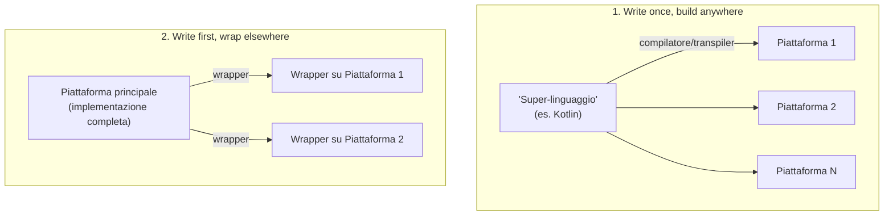

# Multi-platform Programming

## Cosa sono le "piattaforme software"?

Concetto sfumato, spesso citato ma raramente definito con precisione. Intuizione: **il substrato su cui girano le applicazioni software**. Non sono solo i sistemi operativi (es. JabRef è un'app Java che gira sulla JVM, che a sua volta è un'applicazione per l'OS; Draw.io è un'app web che gira sul browser, che è un'applicazione per l'OS). Non sono nemmeno semplicemente i linguaggi di programmazione (es. un'app Scala può chiamare codice Java). La definizione di lavoro adottata è:

> **Piattaforma software** = qualunque cosa abbia una **API** che permetta di scrivere applicazioni, più il **runtime** che ne supporta l'esecuzione.

- **API** (Application Programming Interface): specifica formale dell'insieme di funzionalità offerte da un (sotto)sistema software per uso esterno, inclusi input, output e pre/post-condizioni ambientali (metafora client-server implicita). Esempi: le interfacce pubbliche di un modulo OOP, i comandi accettati da una CLI, le route accettate da un servizio Web.
- **Runtime**: l'insieme di risorse computazionali che sostengono l'esecuzione di un (sotto)sistema software ("i runtime supportano le API"). Esempi: qualunque interprete (JVM, CLR, CPython, V8) con la sua standard library e il suo sistema di tipi; qualunque sistema operativo con le sue system call; qualunque servizio Web con i suoi protocolli.

**Piattaforme notevoli**: JVM (Java, Kotlin, Scala, Clojure...), .NET CLR (C#, VB.NET, F#...), Python 3, NodeJS/V8 (JavaScript, TypeScript...), ogni browser (JavaScript).

**Caratteristiche pratiche di una piattaforma**: standard library, decisioni di design predefinite (es. global lock in Python, event loop in JavaScript), convenzioni organizzative/stilistiche/tecniche, convenzioni di packaging/import/repository software (es. classpath per la JVM, NPM per JS, Pip+PyPI per Python), comunità di utenti.

### Confronto fra piattaforme (JVM, Python, NodeJS)

| Aspetto | JVM | Python | NodeJS |
|---|---|---|---|
| Standard library | molto ricca (multithreading, IO non bloccante, GUI, collezioni...) | una delle più ricche in assoluto | molto limitata, arricchita da moduli Node |
| Decisioni di design | tutto è (indirettamente) `Object`; ogni oggetto è un lock potenziale; metodi virtuali di default | tutto è istanza di `object`; Global Interpreter Lock (GIL); metodi magici (`__str__`, `__eq__`...); niente overloading | OOP a prototipi; single-thread + event loop; programmazione asincrona in stile continuation-passing |
| Convenzioni | Maven standard directory layout; PascalCase/camelCase | layout alla Kenneth Reitz; PEP8 (PascalCase/snake_case); duck typing | struttura libera, ma richiede `package.json` |
| Packaging | `.jar` (zip di classi compilate); classpath; Maven Central | `.whl`; pip installa in una cartella dell'ambiente; PyPI | moduli (file con `export`); tarball `.tar.?z`; npm/npmjs.com |
| Comunità tipica | Android, back-end Web, desktop, ricerca (Web semantico, sistemi multi-agente) | data science, back-end Web, desktop, sysadmin | front-end/back-end Web, GUI |

## Come la piattaforma influenza lo sviluppatore

La scelta della piattaforma impatta su tutte le fasi: **design** (si tende a scegliere la piattaforma che minimizza l'**abstraction gap** — lo spazio fra il problema e le funzionalità già offerte dalla piattaforma: più grande è lo spazio, più sforzo serve), **implementazione** (si sfrutta l'API della piattaforma e le librerie terze disponibili — la disponibilità di librerie vincola le soluzioni), **testing** (idealmente testare contro più versioni della piattaforma e più OS, dato che le piattaforme "virtuali" possono comportarsi diversamente a seconda dell'OS), **rilascio** (packaging e repository sono specifici della piattaforma, quindi anche la release lo è).

La scelta della piattaforma è anche una **decisione di business**: le piattaforme hanno comunità di utenti, e un progetto beneficia di una comunità più ampia. La **coerenza** è la chiave del successo: scegliere coerentemente la comunità target rispetto all'obiettivo del software, e la piattaforma rispetto alla comunità target. Benefici generali della coerenza: abstraction gap minore, più librerie terze disponibili, audience potenziale più ampia, più facile trovare supporto, problemi di terze parti risolti più rapidamente.

**Caso particolare: il software per la ricerca scientifica**. I ricercatori scrivono software per elaborare dati, creare esperimenti in-silico, studiare sistemi software, creare strumenti per la propria ricerca o per la comunità (così nascono molti tool FOSS). Le istituzioni di ricerca non sono software house: il personale dedica solo una frazione del tempo allo sviluppo, molti artefatti sono "usa e getta", lo sforzo è discontinuo, i team piccoli, l'impegno è raramente istituzionale. Lo sviluppo orientato alla ricerca dovrebbe massimizzare audience e impatto minimizzando sforzo di sviluppo e manutenzione: una community più ampia favorisce la riproducibilità scientifica (requisito chiave) e amplia l'impatto (più citazioni potenziali).

## Silos tecnologici e necessità del multi-platform

Un **silo** (in IT) è un componente/sistema/ecosistema con scarsa interoperabilità esterna. Le piattaforme sono silos (piuttosto ampi): far interoperare software di due piattaforme diverse non è banale (es. inter-piattaforma: programma Python che chiama una libreria nativa), mentre è più facile farlo nella stessa piattaforma (es. intra-piattaforma: programma Kotlin che chiama una libreria Java).

Le comunità di ricerca spesso coincidono con comunità di piattaforma (es. reti neurali → Python; IA simbolica → JVM/Prolog; sistemi multi-agente → JVM; Web semantico → JVM/Python): la ricerca inter-comunità ha bisogno di interoperabilità tra silos diversi, altrimenti viene rallentata. **La programmazione multi-piattaforma è un abilitatore per la ricerca inter-comunità.**

Obiettivo ideale: far girare lo stesso strumento software su più piattaforme. Obiettivo più ragionevole: creare più artefatti (uno per piattaforma) che condividano lo stesso design e funzionamento. Obiettivo pratico: **progettare e scrivere il software una volta, poi portarlo su più piattaforme**.

## Due approcci alla programmazione multi-piattaforma



### 1. Write once, build anywhere

Si sviluppa con un "super-linguaggio" che ha (a) un generatore di codice per più piattaforme (compilatore/transpiler) e (b) la stessa standard library implementata su tutte quelle piattaforme. Workflow: 1) si progetta/implementa/testa la maggior parte del progetto nel super-linguaggio (parte platform-agnostic, detta "common"); 2) si completano/ottimizzano gli aspetti platform-specific con codice e librerie dedicate; 3) si compilano artefatti specifici per piattaforma; 4) si pubblicano su repository specifici per piattaforma.

Analisi: con *N* piattaforme supportate, le funzionalità platform-agnostic richiedono sforzo indipendente da *N*, quelle platform-specific richiedono sforzo proporzionale a *N* — conviene minimizzare il codice specifico massimizzando quello comune (sia per il codice principale che per i test). Punto chiave (*takeaway*): l'abstraction gap del codice comune è grande quanto quello della piattaforma con il gap più ampio fra tutte quelle supportate. Strategia pratica per ogni nuova funzionalità: 1) provare a realizzarla solo con la std-lib comune; 2) se non possibile, massimizzare la parte platform-agnostic permettendo di "agganciare" gli aspetti platform-specific; 3) per ciò che non può essere puramente agnostico: progettare un'interfaccia platform-agnostic e implementarla *N* volte (una per piattaforma target).

### 2. Write first, wrap elsewhere

Si assume che esista una piattaforma "principale" il cui codice possa essere chiamato dalle altre piattaforme target, e che il software sia stato progettato in modo platform-agnostic. Workflow: 1) si implementa, testa e rilascia interamente per la piattaforma principale; 2) per ogni altra piattaforma: si riprogetta/riscrive il codice API specifico, lo si implementa chiamando il codice della piattaforma principale, si riscrivono i test, si costruiscono pacchetti specifici che "wrappano" il pacchetto/runtime principale; 3) si pubblica su repository specifici.

Analisi: con *N* piattaforme, è fondamentale separare nettamente il codice API da quello implementativo; lo sforzo per scrivere l'API è praticamente lo stesso su tutte le piattaforme, quindi lo sforzo globale cresce **sub-linearmente** con *N* (è comunque un compito manuale, ma meno costoso che reimplementare *N* volte lo stesso design). Il wrapper della i-esima piattaforma chiama solo il codice API della piattaforma principale.

## Approccio 1 in pratica: Kotlin Multiplatform

Kotlin (linguaggio JetBrains nato per "uso pratico", in crescita dall'adozione Android di Google, ispirato a Java/C#/Scala/Groovy) funge da "super-linguaggio" per il "write once, build anywhere": esistono compilatori Kotlin per più piattaforme e la standard library è implementata per ciascuna di esse.

**Piattaforme (target) supportate**: JVM (la prima e meglio supportata; si può puntare a una specifica versione JDK, consigliata l'11), JavaScript (con sotto-target Browser e/o Node, runtime diversi), Native (più sotto-target: Windows via MinGW, Linux, iOS, macOS — richiede strumenti Apple come XCode —, Android — richiede l'SDK; **niente cross-compilazione**).

La build multi-piattaforma Kotlin è supportata **solo** via **Gradle**, che abilita e al contempo vincola il workflow (struttura di progetto predefinita, partizionamento del codice imposto, task ad-hoc per compilazione/testing/deploy specifici o agnostici).

### Struttura del progetto

Kotlin impone una netta segregazione fra parte agnostica e parte specifica:
- **`commonMain`**: codice platform-agnostic, dipende solo dalla std-lib comune e da librerie multipiattaforma terze.
- **`commonTest`**: test platform-agnostic, dipende dal `commonMain` e da una libreria di test multipiattaforma (es. `kotlin.test`, Kotest).
- Per ogni target *T* (es. `jvm`, `js`...): **`<T>Main`** (codice specifico, dipende da `commonMain` + std-lib specifica + librerie terze specifiche) e **`<T>Test`** (test specifici).

```
<root>/
├── build.gradle.kts
├── settings.gradle.kts
└── src/
    ├── commonMain/kotlin/   # codice platform-agnostic
    ├── commonTest/kotlin/   # test platform-agnostic
    ├── jvmMain/{java,kotlin,resources}/
    ├── jvmTest/{java,kotlin,resources}/
    ├── jsMain/kotlin/
    └── jsTest/kotlin/
```

### Configurazione della build (estratto concettuale)

```kotlin
plugins { kotlin("multiplatform") version "1.9.10" }
repositories { mavenCentral() }
kotlin {
    jvm { withJava() }
    js {
        nodejs { /* ... */ }
        browser { /* ... */ }
    }
    sourceSets {
        val commonMain by getting { dependencies { api(kotlin("stdlib-common")) } }
        val jvmMain by getting { dependencies { api(kotlin("stdlib-jdk8")) } }
        val jsMain by getting { dependencies { api(kotlin("stdlib-js")) } }
        // + commonTest, jvmTest, jsTest...
        all { languageVersion = "1.8"; apiVersion = "1.8" }
    }
}
```

**Task Gradle rilevanti**: `<T>MainClasses`/`<T>TestClasses` (compilano main/test per la piattaforma *T*), `<T>Jar` (compila e impacchetta in JAR), `<T>Test` (esegue i test), `compileProductionExecutableKotlinJs` (compila il JS in un progetto Node), `assemble` (crea tutti i JAR), `test`/`check`/`build` (i consueti task aggregati Gradle).

### Il meccanismo `expect`/`actual`

Nel codice comune si può dichiarare una funzione/tipo **`expect`** (solo firma, niente corpo): il compilatore obbliga a fornire una corrispondente definizione **`actual`** per ogni piattaforma target, altrimenti la compilazione fallisce.

```kotlin
// commonMain: solo la firma
expect fun parseCsvFile(path: String, separator: Char = ',', delimiter: Char = '"', comment: Char = '#'): Table

// jvmMain (Csv.jvm.kt): implementazione reale, usa File/BufferedReader della JVM
actual fun parseCsvFile(path: String, separator: Char, delimiter: Char, comment: Char): Table =
    FileParser(File(path), Configuration(separator, delimiter, comment)).parse().let(::tableOf)

// jsMain (Csv.js.kt): implementazione reale, usa il modulo fs di Node
actual fun parseCsvFile(path: String, separator: Char, delimiter: Char, comment: Char): Table =
    readFileSync(path, js("{encoding: 'utf8'}")).parseAsCSV(separator, delimiter, comment)
```

**Workflow consigliato (top-down)**: 1) disegnare un design platform-agnostic per le entità di dominio (tenendo conto della std-lib comune ridotta, separando interfacce da classi, usando classi astratte con template method per massimizzare il codice comune, usando `expect` per le factory agnostiche); 2) valutare l'abstraction gap per ciascuna piattaforma target; 3) per ciascuna piattaforma, estendere il design agnostico colmando il gap, implementando le interfacce con classi specifiche e usando `actual` per le factory specifiche.

### Esempio guidato: libreria CSV multi-piattaforma

Dominio (parte comune): `Row` (riga generica, `Iterable<String>`), `Header` (riga speciale con nomi colonne), `Record` (riga speciale con valori, riferimento all'`Header`), `Table` (insieme di `Header` + `Record`, `Iterable<Row>`). Implementazioni concrete (`internal`, nascoste dietro le interfacce pubbliche): `AbstractRow`, `DefaultHeader`, `DefaultRecord`, `DefaultTable`. Per separare API e implementazione si tengono le interfacce pubbliche e le classi `internal`, esponendo **metodi factory** a livello di package (convenzione: `<concetto>Of(args)`, es. `headerOf`, `recordOf`, `tableOf`), tipicamente sovraccaricati per accettare sia `Iterable` che `vararg`.

Per parsing/formattazione si introducono `Formatter`/`Parser` (interfacce comuni) con implementazioni `DefaultFormatter` e `AbstractParser` (classe template-method, con hook `beforeParsing`/`afterParsing` e il metodo astratto `sourceAsLines()`), più funzioni di estensione (`Iterable<Row>.formatAsCSV()`, `String.parseAsCSV()`) tutte realizzabili in codice comune.

Per leggere/scrivere **file** (operazione non presente nella std-lib comune) si usa `expect fun parseCsvFile(...)`: sul JVM si implementa con `java.io.File`/`BufferedReader` (abstraction gap quasi nullo, si riusa direttamente la std-lib Java); su JS si usa il modulo Node `fs` (`readFileSync`/`writeFileSync`), dichiarato tramite **external declarations** (`@JsModule`, `external fun`, tipo speciale `dynamic` per rappresentare oggetti JS senza vincoli di tipo, `definedExternally` per parametri opzionali) — qui l'abstraction gap è non trascurabile.

Per testare in modo platform-agnostic la creazione di file temporanei, si dichiara `expect fun createTempFile(...)` nel `commonTest`, implementata in `actual` su JVM (`File.createTempFile`) e su JS (modulo `os`, funzione `tmpdir()`).

**Output della build multi-piattaforma**: il `jvmMain` produce un JAR JVM-compliant (importabile come dipendenza in progetti JVM, non contiene le dipendenze — serve un plugin per il fat-JAR); il `jsMain` produce o una libreria Kotlin (`.klib`) o un progetto NodeJS completo (con dead-code-elimination, DCE, che rimuove il codice non raggiungibile da `main`/non esportato).

### Mapping Kotlin → Java

| Costrutto Kotlin | Equivalente Java |
|---|---|
| `class`/`interface` | `class`/`interface` identici |
| Proprietà (`val`/`var`) | metodi getter/setter (a meno di `@JvmField`, che le espone come campi pubblici) |
| Funzioni top-level in `X.kt` | metodi `static` della classe `XKt` (a meno di `@file:JvmName`) |
| `object X` | classe con costruttore privato + campo `static final INSTANCE` |
| `companion object` | campo `static final Companion` (a meno di `@JvmStatic` sui singoli membri, che li rende `static` veri) |
| funzioni `vararg` | metodi varargs Java |
| funzioni di estensione | metodo Java ordinario con un parametro extra (il receiver) — niente più chaining fluente comodo |
| parametri opzionali | non esistono in Java (mitigazione: `@JvmOverloads` genera overload, ma non tutte le combinazioni) |

### Mapping Kotlin → JavaScript

Il codice JS generato non è pensato per essere letto da umani; la DCE elimina tutto ciò che non è esplicitamente esportato con `@JsExport` (richiede l'opt-in `kotlin.js.ExperimentalJsExport`). Poiché JS non supporta l'overloading, i nomi dei membri vengono "mangled" — si controlla il nome esposto con `@JsName`. I tipi numerici Kotlin (tranne `Long`) mappano su `Number`; `Long` non ha equivalente nativo ed è emulato da una classe Kotlin; `String`→`String`, `Any`→`Object`, `Array`→`Array`, le collezioni Kotlin non hanno un tipo JS specifico, `Throwable`→`Error`. Il tipo `dynamic` bypassa il type system e viene tradotto "1 a 1" (compilazione ok, errore solo a runtime). Le funzioni `vararg` diventano funzioni che accettano un array (non vere varargs JS).

### CI/CD multi-piattaforma e repository per piattaforma

Workflow concettuale tipico: 1) controllo di stile (es. KtLint), 2) rilevamento automatico di bug (es. Detekt), 3) per ogni OS × ogni piattaforma target × ogni versione rilevante della piattaforma: verificare che main/test compilino e che i test passino, 4) in caso di rilascio: per ogni piattaforma, assemblare e pubblicare l'archivio sul repository principale di quella piattaforma. Impostare una pipeline del genere richiede molto lavoro Gradle/GitHub Actions; si consiglia di partire da template esistenti (es. `template-kt-mpp-project`) o plugin Gradle dedicati (es. `kt-mpp`).

**Repository principali per piattaforma**: JVM/Kotlin Multiplatform → Maven Central Repository; JS → NPM; Android → Google Play; macOS/iOS → App Store (o Homebrew); Windows → Microsoft Store (o Chocolatey/Scoop); Linux → dipende dalla distro (es. AUR per Arch, Flathub inter-distro); Python → PyPI; .NET → NuGet.

## Approccio 2 in pratica: il caso JPype (Python ↔ Java)

L'interprete Python stesso è scritto in C/C++; il codice Python efficiente è spesso scritto in C++ e "wrappato". Analogamente, si può scrivere codice in Java (anch'esso, in fondo, software C++ via JVM) e "wrappare" l'API per Python. Tecnologie di bridging: **JPype** (chiama codice JVM da Python come libreria nativa), Jython (interprete Python basato su JVM), Py4J (bridge RPC), Pyjnius (simile a JPype, basato su Cython). Si sceglie JPype perché ancora mantenuto, compatibile con CPython "vanilla", ben documentato, con buona interoperabilità con i tipi JVM.

### Uso base

```python
import jpype
jpype.startJVM(classpath=["/path/to/my.jar"])  # avvia la JVM

import jpype.imports
from java.lang import System
System.out.println("Hello World!")  # le classi Java si usano come oggetti Python
```

### Modello di bridging (sintesi)

Le classi Java appaiono come classi Python (ma sono "chiuse": non modificabili). Le eccezioni Java estendono le eccezioni Python (gestibili con `try/except`, classe base `JException`). I primitivi Python mappano sui primitivi Java (con cast espliciti quando serve, es. `jpype.JInt`, `JLong`...). Le stringhe Java sono simili a quelle Python (entrambe immutabili) ma vanno convertite quando usate come chiavi di dizionario. Gli array Java mappano su liste Python ma a dimensione fissa (uno slice restituisce una *view*, non una copia). Le collezioni Java sono "overloadate" con sintassi Python dove possibile (`Iterable`→`__iter__`, `Collection`→`__len__`, `Map`→`__getitem__`/`__setitem__`, `List`→`__getitem__`/`__setitem__`). Le interfacce Java possono essere implementate in Python (via decoratori JPype); le classi astratte/aperte Java **non** possono essere estese da Python; le lambda Python possono essere castate a interfacce funzionali Java.

**Selezione dell'overload**: JPype sceglie l'overload Java più adatto in base al tipo Python (es. un intero Python può convertire a `int`/`long`/`short`, ma `int` è il match esatto). In caso di **ambiguità** (es. una lista Python convertibile sia a `Iterable` che a `String[]`), JPype lancia un errore e bisogna castare esplicitamente al tipo desiderato (es. `from java.lang import Iterable as JIterable`).

### Rendere "Pythonico" il codice wrappato

Il codice wrappato di default non è amichevole per uno sviluppatore Python medio (richiederebbe di conoscere sia Java che JPype). Si rende Pythonico tramite: metodi factory per costruire istanze, struttura di package semplificata (es. `io.github.gciatto.csv.Csv` → `jcsv.Csv`), proprietà al posto di getter/setter, `snake_case` invece di `camelCase`, metodi magici dove possibile (`__len__`, `__getitem__`...), parametri opzionali al posto degli overload. Si usa il decoratore `@jpype.JImplementationFor("nome.classe.Java")` per fornire implementazioni Python custom dei tipi Java (con il metodo speciale `__jclass_init__` chiamato una sola volta per configurare la classe; le implementazioni delle superclassi sono ereditate dalle sottoclassi).

```python
@jpype.JImplementationFor("java.util.List")
class _JList:
    def __getitem__(self, ndx): return self.get(ndx)      # supporta list[i]
    def append(self, obj): return self.add(obj)            # supporta list.append(obj)
    # __len__, __iter__, __contains__ ereditati da _JCollection/_JIterable
```

L'esempio guidato **`jcsv`** (wrapper Pythonico della libreria `io.github.gciatto.csv` vista sopra) mostra: import dei tipi Java come simboli Python (`Table = _csv.Table`...), funzioni dedicate (`parse_csv_string`, `parse_csv_file`, `format_as_csv`), una factory `header(*args)` che simula più overload Java in un'unica funzione Python, e customizzazioni successive di `Row`/`Record`/`Table` per supportare `len()`, `table[i]`, `value in record`, proprietà come `.header`/`.values`/`.records`.

**Distribuire un JAR insieme al pacchetto Python**: il `build.gradle.kts` automatizza la generazione di un *fat-JAR* (`csv.jar`, contenente tutte le dipendenze) copiato dentro `jcsv/jvm/`; il file `jcsv/jvm/__init__.py` carica JPype e avvia la JVM puntando a quel classpath; `jcsv/__init__.py` importa `jcsv.jvm` per forzare l'avvio della JVM all'uso del modulo. Per garantire che una JVM sia disponibile sul sistema target, si può aggiungere come dipendenza Python il pacchetto `jdk4py` (JVM scaricabile e installabile via `pip`), configurando JPype per usare quel percorso (`jpype.startJVM(jvmpath=...)`).

I test unitari del wrapper Pythonico sono essenziali: prevengono la corruzione dell'API quando il JAR viene aggiornato, e coprono customizzazioni/factory che non sono testate dai test della libreria JVM sottostante.
