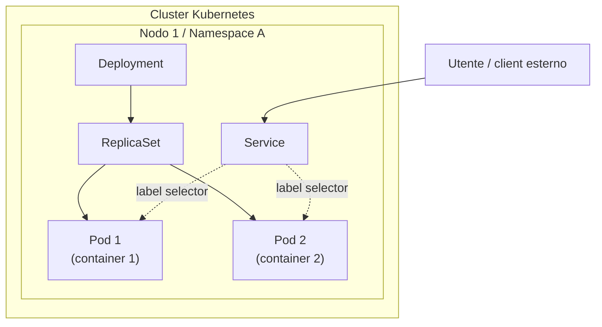
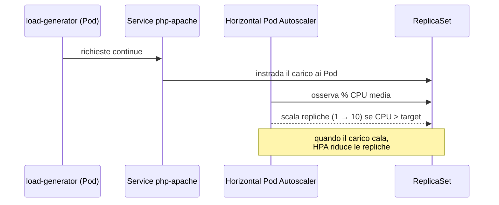

# Kubernetes

> Nota: questo modulo del corso si apre con un richiamo riassuntivo dei temi del corso e della cultura DevOps (già trattati nel modulo 1 "DevOps" e qui omessi perché duplicati) per poi introdurre **Kubernetes** come argomento nuovo, a complemento/confronto con Docker Swarm visto nel modulo sulla containerizzazione.

## Cos'è Kubernetes

Sviluppato originariamente da Google, dal 2014 Kubernetes è diventato uno dei progetti open source più grandi e diffusi al mondo. È un **orchestratore di container** progettato per sistemi distribuiti adatti a sviluppatori cloud di ogni scala, pensato per supportare sistemi software affidabili e scalabili:
- **Affidabilità (reliability)**: i servizi non devono fallire, devono mantenere disponibilità anche durante i rollout software.
- **Scalabilità (scalability)**: i servizi possono adattare la propria capacità all'utilizzo, senza dover riprogettare il sistema distribuito (sia scale-up che scale-down).
- **Sistema distribuito**: i pezzi software che compongono il servizio possono girare su macchine diverse, connesse fra loro, e coordinare il proprio comportamento via rete.

### Caratteristiche chiave

- **Immutabilità**: come Docker Swarm, anche Kubernetes è un orchestratore di container — i container sono un modo dichiarativo di impacchettare ed eseguire applicazioni, possono essere deployati ovunque e sono pensati per essere stateless (sostituibili in ogni momento). Perché Docker Swarm non basta? Non supporta deployment di produzione su larga scala, mentre Kubernetes sì, nativamente.
- **Tutto è un oggetto di configurazione dichiarativo**: a differenza di Swarm (legato all'ecosistema Docker, gestito tramite `docker-compose.yml` e i comandi `docker stack`), Kubernetes aderisce al principio "tutto è un oggetto", con una gamma più ampia di oggetti per modellare l'ambiente di produzione, gestiti tramite lo strumento esterno **`kubectl`**, e può funzionare su diversi container runtime (Docker, containerd, CRI-O...).
- **Scaling automatico**: Swarm scala le repliche solo dopo un intervento manuale; Kubernetes può scalare su e giù automaticamente (in base a metriche come uso di CPU/memoria) o manualmente; anche la crescita del cluster può essere automatica (solo su alcuni cloud provider). Repliche e metriche sono anch'esse oggetti risorsa.
- **Monitoring integrato**: Swarm richiede strumenti terzi (Prometheus, Grafana); Kubernetes offre un monitoring di base integrato (richiede l'installazione del plugin **Metrics Server**, che copre CPU/memoria di nodi e container), estendibile con strumenti terzi.
- **Sicurezza**: Swarm ha un controllo d'accesso semplice basato su TLS (richiede accesso diretto a un nodo del cluster, non configurabile per singolo caso d'uso — serve una dashboard terza come Portainer); Kubernetes ha un controllo granulare basato su **RBAC** (Role-Based Access Control), configurabile per caso d'uso; le risorse si gestiscono da remoto con `kubectl` (nessun bisogno di accedere a un nodo), configurato con credenziali utente specifiche (token di accesso via TLS); le risorse del cluster possono essere divise logicamente in **namespace** (non visibili tra loro, ciascuno con la propria configurazione RBAC, assegnabile a team diversi).

### Le metriche in Kubernetes

Il **Metrics Registry** è il componente del Control Plane che espone le API per osservare le metriche del cluster (il **Metrics Server** ne è l'implementazione integrata, sostituibile con server di metriche esterni). Tre tipi di metriche: **Resource Metrics** (memoria/CPU degli oggetti risorsa), **Custom Metrics** (altre informazioni sugli oggetti risorsa), **External Metrics** (metriche non legate alle risorse Kubernetes, es. numero di richieste HTTP in ingresso). Le risorse CPU si esprimono in **millicpu/millicore** (1/1000 di core: `0.1 = 10% = 100m`); la memoria in byte, con suffissi (E, P, T, G, M, k) o potenze di due (Ei, Pi, Ti, Gi, Mi, Ki) — es. `128974848 = 129e6 = 129M ≈ 123Mi`.

## Architettura e oggetti principali



- **Pod**: la più piccola unità deployabile in Kubernetes. Esegue uno o più container; ha senso mettere più container nello stesso pod solo se sono "simbiotici" (es. un server web e un sincronizzatore git che lo aggiorna), **non** ad esempio un server web e il suo database (che vanno su pod/nodi diversi). I container nello stesso pod condividono: namespace di rete (porte), indirizzo IP, hostname, storage (volumi), IPC, PID.

```yaml
apiVersion: v1
kind: Pod
metadata:
  name: hello-world
spec:
  containers:
    - name: hello
      image: busybox:latest
      command: ['sh', '-c', 'echo "Hello, Kubernetes!" && sleep 3600']
      resources:
        requests: { memory: "64Mi", cpu: "250m" }
        limits:   { memory: "128Mi", cpu: "500m" }
      ports:
        - containerPort: 80
```

- **Deployment**: oggetto di livello superiore tramite cui si gestiscono i Pod (l'utente non li gestisce direttamente). Esiste per gestire il rilascio di nuove versioni dell'applicazione, evitare downtime durante l'aggiornamento di un Pod, e collega `ReplicaSet` e `Pod`. La connessione fra Deployment e Pod avviene tramite il campo **`selector`** (etichette univoche che identificano i Pod gestiti).
- **ReplicaSet**: l'oggetto che gestisce il numero di Pod (di norma non gestito direttamente, ma tramite un Deployment); permette di scalare su/giù il numero di repliche. Poiché il Deployment gestisce un ReplicaSet, si può scalare dinamicamente con `kubectl scale deployment <name> --replicas=<numero>`.
- **Service**: realizza la **service discovery**: è il punto d'ingresso dell'applicazione, redirige le richieste ai Pod nei nodi del cluster (necessario perché i Pod sono effimeri: possono spostarsi tra nodi e il loro IP può cambiare); raggruppa i Pod via **label selector**. Tre tipi principali:

| Tipo | Descrizione |
|---|---|
| `ClusterIP` (default) | espone il servizio su un IP interno al cluster, raggiungibile solo dall'interno |
| `NodePort` | espone il servizio sull'IP del nodo con una porta fissa |
| `LoadBalancer` | espone il servizio esternamente tramite un load balancer (non offerto direttamente da Kubernetes) |

### Altri oggetti per il deployment (oltre a Deployment)

| Oggetto | Scopo |
|---|---|
| **Job** | esegue task una tantum, di breve durata (es. una migrazione di database) |
| **CronJob** | azioni pianificate regolarmente (backup, generazione di report...) |
| **StatefulSet** | come un Deployment, ma mantiene un'identità "appiccicosa" (sticky) per ciascun Pod: i Pod non sono intercambiabili, ciascuno mantiene un identificatore persistente attraverso eventuali riallocazioni |
| **DaemonSet** | assicura che tutti (o alcuni) i nodi eseguano una copia di un Pod; quando si aggiungono/rimuovono nodi, i Pod vengono aggiunti/rimossi di conseguenza |

### Controllo degli accessi

Applicato tramite l'oggetto risorsa **Service Account**, che: rappresenta un'identità distinta nel cluster, è legato a un namespace specifico, garantisce l'accesso al server API di Kubernetes, concede permessi tramite RBAC agli utenti, può essere usato per configurare l'autenticazione in `kubectl`.

## In pratica: installazione e uso

Installare un cluster Kubernetes pronto per la produzione è complesso; esistono diversi strumenti dedicati (`kubeadm`, `kubespray`, `kops`, `k3s`...). Per scopi didattici/di test si usa **Minikube**: un cluster Kubernetes a singolo nodo, funzionante su Windows/Linux/macOS, eseguibile in VM, container o bare-metal a scelta — **non adatto alla produzione**. Viene fornito con plugin integrabili (Metrics Server, Kubernetes Dashboard...).

```bash
minikube start --driver='virtualbox' --extra-config=kubelet.housekeeping-interval=10s
# --driver specifica dove installare l'infrastruttura (virtualbox, kvm2, qemu2, vmware, docker, none, ssh, podman...)
```

Comandi Minikube utili: `minikube start/stop/delete/status`, `minikube dashboard` (espone la dashboard integrata su localhost), `minikube addons list/enable/disable`.

**`kubectl`**, il tool a riga di comando per interagire con i cluster Kubernetes, una volta installato si verifica con `kubectl cluster-info`. La sua configurazione (cluster noti, utenti, **contesti**) risiede in `~/.kube/config` (ispezionabile con `kubectl config view`). Un **contesto** dichiara quale utente usare per connettersi a un cluster specifico; si può avere più contesti definiti, ma uno solo attivo alla volta (si cambia con `kubectl config use-context`).

### Esempio guidato: testare l'autoscaling

1. Abilitare il Metrics Server (disabilitato di default): `minikube addons enable metrics-server`, verificabile con `kubectl top nodes`.
2. Deployare un'applicazione di esempio (un semplice server PHP) tramite **Deployment + Service**:

```yaml
apiVersion: apps/v1
kind: Deployment
metadata: { name: php-apache }
spec:
  selector: { matchLabels: { run: php-apache } }
  template:
    metadata: { labels: { run: php-apache } }
    spec:
      containers:
      - name: php-apache
        image: registry.k8s.io/hpa-example
        resources: { limits: { cpu: 500m }, requests: { cpu: 200m } }
---
apiVersion: v1
kind: Service
metadata: { name: php-apache, labels: { run: php-apache } }
spec:
  ports: [{ port: 80 }]
  selector: { run: php-apache }
```
```bash
kubectl apply -f https://k8s.io/examples/application/php-apache.yaml
```

3. Creare un **Horizontal Pod Autoscaler (HPA)**:
```bash
kubectl autoscale deployment php-apache --cpu=50% --min=1 --max=10
```
Osserva l'uso medio di CPU dei Pod e scala su/giù per mantenerlo al 50%, fra un minimo di 1 e un massimo di 10 repliche.

4. Simulare un carico elevato con un Pod "generatore di carico" creato al volo:
```bash
kubectl run -it load-generator --rm --image=busybox:latest -- /bin/sh -c "while sleep 0.01; do wget -q -O - http://php-apache; done"
```
5. Osservare l'HPA in tempo reale: `kubectl get hpa php-apache --watch` — si vede il numero di repliche crescere mano a mano che l'uso di CPU sale oltre il target (50%), e ridiscendere quando il carico si esaurisce.


